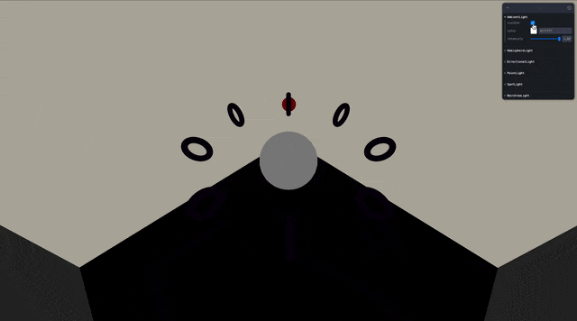
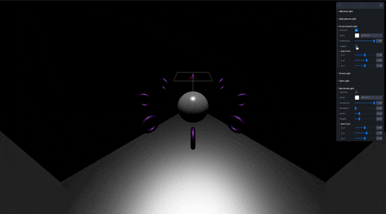
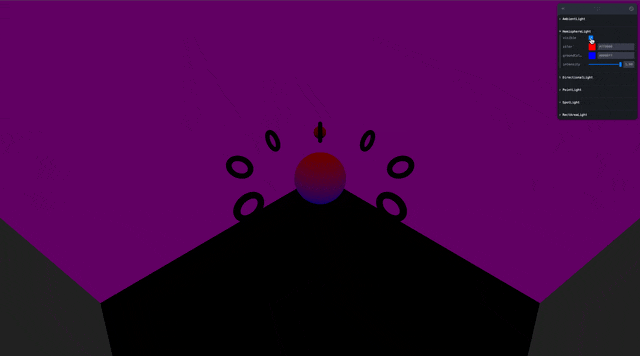
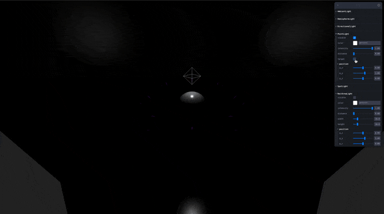
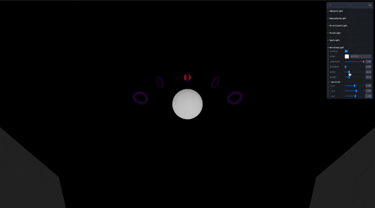
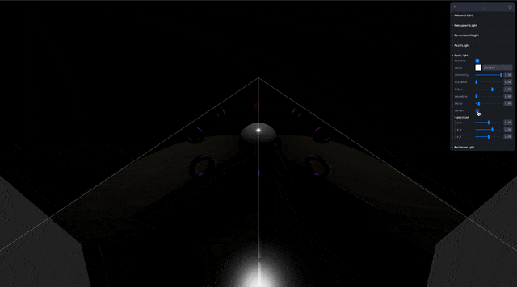

## 🎓 강의를 기반으로 학습하는 과정입니다

> R3F 에대한 강의로 3D 웹 개발에 대하여 입문과정을 알려준다

[](https://www.youtube.com/watch?v=Sg6OcVxe64k&list=PLe6NQuuFBu7HUeJkowKRkLWwkdOlhwrje&index=10)

## 📔 Core

### 📝 Light 란?

빛의 특성을 가진 Object3D 이다.

공통 부분인 색, 조도, 타입, 그림자 등을 가지고 있다

> [!WARNING]  
> Three js 는 지속적인 업데이트 중으로 해당 사항이 변할 수 있다  
> 작성일 : 2023.10.29

### 📝 Light

이벤트를 관리하는 용도로 사용된다

#### 🍝 Code(Light)

```js
import { Object3D } from '../core/Object3D.js';
import { Color } from '../math/Color.js';

class Light extends Object3D {

    constructor( color, intensity = 1 ) {
        super();
        this.isLight = true;
        this.type = 'Light';
        this.color = new Color( color );
        this.intensity = intensity;
    }

    dispose() { }

    copy( source, recursive ) { }

    toJSON( meta ) { }
}

export { Light };
```

#### ✨ Constructor(Light)

| Parameter | Type | Note |
| :-- | :-- | :-- |
| color | Integer | 빛의 16진수 색상입니다. 기본값은 0xFFFFFF(흰색)입니다. |
| intensity | Float | 빛의 조도의 숫자 값입니다. 기본값은 1 입니다. |

#### 🎩 Properties(Light)

| Property | Type | Note |
| :-- | :-- | :-- |
| color | Color | 빛의 색상. 생성자가 설정되지 않으면 기본값은 0xFFFFFF 입니다. |
| intensity | Float | 빛의 조도. 빛의 조도의 단위이며 빛의 종류에 따라 다릅니다. 기본값은 1.0 입니다 |
| isLight | Boolean | 주어진 객체가 Light 유형인지 확인하는 읽기 전용 플래그입니다. |

#### 🪄 Method(Light)

| Method | Props | Return | Note |
| :-- | :-- | :-- | :-- |
| dispose | ( ) | undefined | 이 클래스를 확장하는 클래스에 대한 추상 처리 메서드입니다. 일회용 GPU 관련 리소스가 있는 하위 클래스로 구현됩니다. |
| copy | ( source : Light ) | this | 빛의 색상 및 강도 값을 복사합니다. |
| toJSON | ( meta : Object ) | Object | 빛을 three.js JSON 개체/장면 형식으로 변환합니다. |

<details>
<summary>🚀 참고 사이트</summary>

---
| Three.js 공식 사이트 | Three.js 깃허브|
| :--: | :--: |
| [](https://threejs.org/docs/#api/en/lights/Light) | [](https://github.com/mrdoob/three.js/blob/master/src/lights/Light.js) |
|🔗 Link : <https://threejs.org/docs/#api/en/lights/Light> | 🔗 Link : <https://github.com/mrdoob/three.js/blob/master/src/lights/Light.js> |

</details>

## 📔 Light 종류

| 명칭 | 모양 | 이미지 |
| :-- | :-- | :-- |
| [AmbientLight](#📝-ambientlight) | 기본 조명 |  |
| [DirectionalLight](#📝-directionallight) | 직광 조명 |  |
| [HemisphereLight](#📝-hemispherelight) | 환경 조명 |  |
| [PointLight](#📝-pointlight) | 발광 조명 |  |
| [RectAreaLight](#📝-rectarealight) | 평면 조명 |  |
| [SpotLight](#📝-spotlight) | 스팟 조명 |  |

### 📝 AmbientLight
>
> 기본 조명

모든 물체에 어느방향이든 빛이 조명된다.

### 👀 Preview(ConeGeometry)


#### ✨ Constructor(AmbientLight)

| Parameter | Type | Note |
| :-- | :-- | :-- |
| color | Integer | 빛의 16진수 색상입니다. 기본값은 0xFFFFFF(흰색)입니다. |
| intensity | Float | 빛의 조도의 숫자 값입니다. 기본값은 1 입니다. |

#### 🎩 Properties(AmbientLight)

| Property | Type | Note |
| :-- | :-- | :-- |
| isAmbientLight | Boolean | 주어진 객체가 AmbientLight 유형인지 확인하는 읽기 전용 플래그입니다. |

#### 🍝 Code(AmbientLight)

```jsx
function MyAmbientLight() {
    const { visible, color, intensity } = useControls({
        AmbientLight: folder({
            visible: false,
            color: "#FFFFFF",
            intensity: { value: 1, min: 0, max: 1, step: 0.001 },
        })
    })
    return (
        <>
            <ambientLight
                visible={visible}
                color={color}
                intensity={intensity} />
        </>
    )
}
```

### 📝 DirectionalLight
>
> 직광 조명

특정한 방향으로 전체적인 빛을 생성한다.

### 👀 Preview(DirectionalLight)


#### ✨ Constructor(DirectionalLight)

| Parameter | Type | Note |
| :-- | :-- | :-- |
| color | Integer | 빛의 16진수 색상입니다. 기본값은 0xFFFFFF(흰색)입니다. |
| intensity | Float | 빛의 조도의 숫자 값입니다. 기본값은 1 입니다. |

#### 🎩 Properties(DirectionalLight)

| Property | Type | Note |
| :-- | :-- | :-- |
| castShadow | Boolean | 실제 조명으로 설정하면 동적 그림자가 생성됩니다. 기본값은 false 입니다. |
| isDirectionalLight | Boolean | 주어진 객체가 DirectionalLight 유형인지 확인하는 읽기 전용 플래그입니다. |
| position | Vector3 | 조명의 위치를 나타넨다 기본값은  Object3D.DEFAULT_UP (0, 1, 0) 으로 설정된다 |
| shadow | DirectionalLightShadow | 조명의 그림자를 계산하는 데 사용되는 설정입니다. |
| target | Object3D | DirectionalLight는 해당 위치에서 target.position을 가리킵니다. 대상의 기본 위치는 (0, 0, 0)입니다. |

#### 🍝 Code(DirectionalLight)

```jsx
function MyDirectionalLight() {
    const { visible, color, intensity, target, p_x, p_y, p_z } = useControls({
        DirectionalLight: folder({
            visible: false,
            color: "#FFFFFF",
            intensity: { value: 1, min: 0, max: 1, step: 0.001 },
            target: false,
            position: folder({
                p_x: { value: 0, min: -10, max: 10, step: 0.001 },
                p_y: { value: 2, min: -10, max: 10, step: 0.001 },
                p_z: { value: 0, min: -10, max: 10, step: 0.001 },
            }),
        })
    })

    const light = useRef()

    const helper = useHelper(light, THREE.DirectionalLightHelper)

    useFrame((state) => {
        const myBall = state.scene.getObjectByName("myBall")
        if (target)
            myBall.children[0].getWorldPosition(light.current.target.position)
        if (helper)
            helper.current.visible = visible ? true : false
    }, [])

    return (
        <>
            <directionalLight
                visible={visible}
                ref={light}
                color={color}
                intensity={intensity}
                position={[p_x, p_y, p_z]}
            />
        </>
    )
}
```

### 📝 HemisphereLight
>
> 환경 조명

시스템의 배경환경의 빛을 만든다

### 👀 Preview(HemisphereLight)


#### ✨ Constructor(HemisphereLight)

| Parameter | Type | Note |
| :-- | :-- | :-- |
| skyColor | Integer | sky에 대한 빛의 16진수 색상입니다. 기본값은 0xFFFFFF입니다. |
| groundColor | Integer | ground에 대한 빛의 16진수 색상입니다. 기본값은 0xFFFFFF입니다. |
| intensity | Float | 빛의 조도의 숫자 값입니다. 기본값은 1 입니다. |

#### 🎩 Properties(HemisphereLight)

| Property | Type | Note |
| :-- | :-- | :-- |
| color | Float | 생성자에 전달된 sky의 빛색 입니다. 기본값은 0xFFFFFF으로 설정된 새 색상입니다. |
| groundColor | Float | 생성자에 전달된 ground의 빛색 입니다. 기본값은 0xFFFFFF으로 설정된 새 색상입니다. |
| isHemisphereLight | Boolean | 주어진 객체가 HemisphereLight 유형인지 확인하는 읽기 전용 플래그입니다. |
| position | Vector3 | 조명의 위치를 나타넨다 기본값은 Object3D.DEFAULT_UP (0, 1, 0) 으로 설정된다 |

#### 🍝 Code(HemisphereLight)

```jsx
function MyHemisphereLight() {
    const { visible, color, groundColor, intensity } = useControls({
        HemisphereLight: folder({
            visible: false,
            color: "#FF0000",
            groundColor: "#0000FF",
            intensity: { value: 1, min: 0, max: 1, step: 0.001 },
        })
    })
    return (
        <>
            <hemisphereLight
                visible={visible}
                color={color}
                groundColor={groundColor}
                intensity={intensity} />
        </>
    )
}
```

### 📝 PointLight
>
> 발광 조명

구형태로 빛을 방출하는 빛이다

### 👀 Preview(PointLight)


#### ✨ Constructor(PointLight)

| Parameter | Type | Note |
| :-- | :-- | :-- |
| color | Integer | 빛의 16진수 색상입니다. 기본값은 0xFFFFFF(흰색)입니다. |
| intensity | Float | 빛의 조도의 숫자 값입니다. 기본값은 1 입니다. |
| distance | Float | 빛의 최대 범위. 기본값은 0(제한 거리 없음)입니다. |
| decay | Float | 빛의 거리에 따라 빛이 어두워지는 정도입니다. 기본값은 2입니다. |

#### 🎩 Properties(PointLight)

| Property | Type | Note |
| :-- | :-- | :-- |
| castShadow | Boolean | 실제 조명으로 설정하면 동적 그림자가 생성됩니다. 기본값은 false 입니다. |
| decay | Float | 빛의 거리에 따라 빛이 어두워지는 정도입니다. 기본값은 2입니다. 정상적인 작동을 위해서는 수정을 하면 안됩니다. |
| distance | Float | 빛의 최대 범위. 기본값은 0(제한 거리 없음)입니다.  |
| intensity | Float | candela로 측정된 조도 입니다. 기본값은 1 입니다. 강도를 변경하면 조명의 세기도 변경됩니다. |
| power | Float | 빛의 양. lumens (lm) 단위로 측정된 빛의 광도입니다. 빛의 양을 변경하면 빛의 강도도 변경됩니다. |
| shadow | PointLightShadow | 조명의 그림자를 계산하는 데 사용되는 설정입니다. |

#### 🍝 Code(PointLight)

```jsx
function MyPointLight() {
    const { visible, color, intensity, distance, target, p_x, p_y, p_z } = useControls({
        PointLight: folder({
            visible: false,
            color: "#FFFFFF",
            intensity: { value: 1, min: 0, max: 1, step: 0.001 },
            distance: { value: 0, min: 0, max: 50, step: 0.001 },
            target: false,
            position: folder({
                p_x: { value: 0, min: -10, max: 10, step: 0.001 },
                p_y: { value: 2, min: -10, max: 10, step: 0.001 },
                p_z: { value: 0, min: -10, max: 10, step: 0.001 },
            }),
        })
    })

    const light = useRef()
    const helper = useHelper(light, THREE.PointLightHelper, 0.5)

    useFrame((state) => {
        const myBall = state.scene.getObjectByName("myBall")
        if (target)
            myBall.children[0].getWorldPosition(light.current.position)
        if (helper)
            helper.current.visible = visible ? true : false
    }, [])

    return (
        <>
            <pointLight
                visible={visible}
                ref={light}
                color={color}
                intensity={intensity}
                distance={distance}
                position={[p_x, p_y, p_z]}
            />
        </>
    )
}
```

### 📝 RectAreaLight
>
> 평면 조명

평면 모양의 빛을 생성한다.

### 👀 Preview(RectAreaLight)


#### ✨ Constructor(RectAreaLight)

| Parameter | Type | Note |
| :-- | :-- | :-- |
| color | Integer | 빛의 16진수 색상입니다. 기본값은 0xFFFFFF(흰색)입니다. |
| intensity | Float | 빛의 조도의 숫자 값입니다. 기본값은 1 입니다. |
| width | Float | 빛의 폭. 기본값은 10입니다. |
| height | Float | 빛의 높이. 기본값은 10입니다. |

#### 🎩 Properties(RectAreaLight)

| Property | Type | Note |
| :-- | :-- | :-- |
| height | Float | 빛을 발산하는 높이 입니다. |
| intensity | Float | 빛의 강도. nits(cd/m^2) 단위로 측정된 빛의 luminance(brightness)입니다. 기본값은 1입니다. 강도를 변경하면 조명의 세기도 변경됩니다. |
| isRectAreaLight | Boolean | 주어진 객체가 RectAreaLight 유형인지 확인하는 읽기 전용 플래그입니다. |
| power | Float | 빛의 양. lumens (lm) 단위로 측정된 빛의 광도입니다. 빛의 양을 변경하면 빛의 강도도 변경됩니다. 빛의 양을 변경하면 빛의 강도도 변경됩니다. |
| width | Float | 빛을 발산하는 폭 입니다. |

#### 🍝 Code(RectAreaLight)

```jsx
function MyRectAreaLight() {
    const { visible, color, intensity, distance, width, height, p_x, p_y, p_z } = useControls({
        RectAreaLight: folder({
            visible: false,
            color: "#FFFFFF",
            intensity: { value: 1, min: 0, max: 1, step: 0.001 },
            distance: { value: 0, min: 0, max: 50, step: 0.001 },
            width: { value: 10, min: 0, max: 50, step: 0.001 },
            height: { value: 10, min: 0, max: 50, step: 0.001 },
            position: folder({
                p_x: { value: 0, min: -10, max: 10, step: 0.001 },
                p_y: { value: 2, min: -10, max: 10, step: 0.001 },
                p_z: { value: 0, min: -10, max: 10, step: 0.001 },
            }),
        })
    })

    const light = useRef()
    return (
        <>
            <rectAreaLight
                visible={visible}
                ref={light}
                color={color}
                intensity={intensity}
                distance={distance}
                width={width}
                height={height}
                position={[p_x, p_y, p_z]}
            />
        </>
    )
}
```

### 📝 SpotLight
>
> 스팟 조명

촬영장 조명을 생성합니다

### 👀 Preview(SpotLight)


#### ✨ Constructor(SpotLight)

| Parameter | Type | Note |
| :-- | :-- | :-- |
| color | Integer | 빛의 16진수 색상입니다. 기본값은 0xFFFFFF(흰색)입니다. |
| intensity | Float | 빛의 조도의 숫자 값입니다. 기본값은 1 입니다. |
| distance | Float | 빛의 최대 범위. 기본값은 0(제한 거리 없음)입니다. |
| angle | Radians | 빛이 분산되는 각도입니다. 최대값은 Math.PI/2입니다 |
| penumbra | Float | 빛번짐으로 감쇠되는 스포트라이트 원뿔의 비율입니다. 0과 1 사이의 값을 사용합니다. 기본값은 0입니다. |
| decay | Float | 빛의 거리에 따라 빛이 어두워지는 정도입니다. |

#### 🎩 Properties(SpotLight)

| Property | Type | Note |
| :-- | :-- | :-- |
| angle | Float | 해당 방향에서 스포트라이트의 최대 범위(radians)입니다. 최대 각으로는 Math.PI/2 이하여야 합니다. 기본값은 Math.PI/3입니다. |
| castShadow | Boolean | 실제 조명으로 설정하면 동적 그림자가 생성됩니다. 기본값은 false 입니다. |
| decay | Float | 빛의 거리에 따라 빛이 어두워지는 정도입니다. 기본값은 2입니다. 정상적인 작동을 위해서는 수정을 하면 안됩니다. |
| distance | Float | 빛의 최대 범위. 기본값은 0(제한 거리 없음)입니다. |
| intensity | Float | candela로 측정된 조도 입니다. 기본값은 1 입니다. 강도를 변경하면 조명의 세기도 변경됩니다. |
| isSpotLight | Boolean | 지정된 객체가 SpotLight 유형인지 확인하는 읽기 전용 플래그입니다. |
| penumbra | Float | 빛번짐으로 감쇠되는 스포트라이트 원뿔의 비율입니다. 0과 1 사이의 값을 사용합니다. 기본값은 0.0입니다. |
| position | Vector3 | 조명의 위치를 나타넨다 기본값은 Object3D.DEFAULT_UP (0, 1, 0) 으로 설정된다 |
| power | Float | 빛의 양. lumens (lm) 단위로 측정된 빛의 광도입니다. 빛의 양을 변경하면 빛의 강도도 변경됩니다. |
| shadow | SpotLightShadow | 조명의 그림자를 계산하는 데 사용되는 설정입니다. |
| target | Object3D | Spotlight는 해당 위치에서 target.position을 가리킵니다. 대상의 기본 위치는 (0, 0, 0)입니다. |
| map | Texture | 빛의 색 및 모양을 조절하는 데 사용되는 텍스처입니다. 스폿라이트 색상은 알파 값에 해당하는 비율로 이 텍스처의 RGB 값과 혼합됩니다. 쿠키와 같은 마스킹 효과는 픽셀 값(0, 0, 0, 1-cookie_value)을 사용하여 재현됩니다. 경고: .castShadow가 false인 경우 .map은 비활성화됩니다. |

#### 🍝 Code(SpotLight)

```jsx
function MySpotLight() {
    const { visible, color, intensity, distance, angle, penumbra, decay, target, p_x, p_y, p_z } = useControls({
        SpotLight: folder({
            visible: false,
            color: "#FFFFFF",
            intensity: { value: 1, min: 0, max: 1, step: 0.001 },
            distance: { value: 0, min: 0, max: 50, step: 0.001 },
            angle: { value: Math.PI / 3, min: 0, max: Math.PI / 2, step: 0.001 },
            penumbra: { value: 0, min: 0, max: 1, step: 0.001 },
            decay: { value: 2, min: 0, max: 10, step: 0.001 },
            target: false,
            position: folder({
                p_x: { value: 0, min: -10, max: 10, step: 0.001 },
                p_y: { value: 2, min: -10, max: 10, step: 0.001 },
                p_z: { value: 0, min: -10, max: 10, step: 0.001 },
            }),
        })
    })

    const light = useRef()
    const helper = useHelper(light, THREE.SpotLightHelper)

    useFrame((state) => {
        const myBall = state.scene.getObjectByName("myBall")
        if (target)
            myBall.children[0].getWorldPosition(light.current.target.position)
        if (helper)
            helper.current.visible = visible ? true : false
    }, [])

    return (
        <>
            <spotLight
                visible={visible}
                ref={light}
                color={color}
                intensity={intensity}
                distance={distance}
                angle={angle}
                penumbra={penumbra}
                decay={decay}
                position={[p_x, p_y, p_z]}
            />
        </>
    )
}
```
