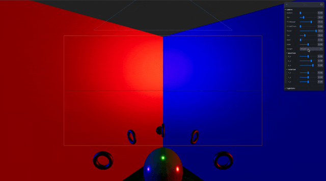
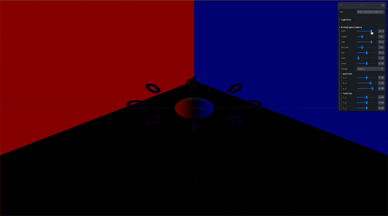

## 🎓 강의를 기반으로 학습하는 과정입니다

> R3F 에대한 강의로 3D 웹 개발에 대하여 입문과정을 알려준다

[](https://www.youtube.com/watch?v=Sg6OcVxe64k&list=PLe6NQuuFBu7HUeJkowKRkLWwkdOlhwrje&index=11)

## 📔 Core

### 📝 Camera

카메라의 특성을 가진 Object3D 이다.

카메라의 종류에 따라 화면에 비추는게 달라진다

> [!WARNING]  
> Three js 는 지속적인 업데이트 중으로 해당 사항이 변할 수 있다  
> 작성일 : 2023.10.30

#### 🍝 Code(Camera)

```js
import { WebGLCoordinateSystem } from '../constants.js';
import { Matrix4 } from '../math/Matrix4.js';
import { Object3D } from '../core/Object3D.js';

class Camera extends Object3D {
    constructor() {
        super();
        this.isCamera = true;
        this.type = 'Camera';
        this.matrixWorldInverse = new Matrix4();
        this.projectionMatrix = new Matrix4();
        this.projectionMatrixInverse = new Matrix4();
        this.coordinateSystem = WebGLCoordinateSystem;
    }

    copy( source, recursive ) { }

    getWorldDirection( target ) { }

    updateMatrixWorld( force ) { }

    updateWorldMatrix( updateParents, updateChildren ) { }

    clone() { }
}

export { Camera };
```

#### 🎩 Properties(Camera)

| Property | Type | Note |
| :-- | :-- | :-- |
| isCamera | Boolean |주어진 객체가 Camera 유형인지 확인하는 읽기 전용 플래그입니다. |
| layers | Layers | 카메라가 속한 레이어입니다. 이는 Object3D에서 상속된 속성입니다. |
| matrixWorldInverse | Matrix4 | matrixWorld의 역행렬입니다. MatrixWorld는 카메라의 월드 변형을 가진 매트릭스를 포함합니다. |
| projectionMatrix | Matrix4 | 투영(회전변환) 매트릭스입니다. |
| projectionMatrixInverse | Matrix4 | 투영(회전변환) 매트릭스의 역행렬입니다. |

#### 🪄 Method(Camera)

| Method | Props | Return | Note |
| :-- | :-- | :-- | :-- |
| clone | ( ) | Camera | 이 카메라와 같은 프로퍼티를 가진 새 카메라를 리턴합니다. |
| copy | ( source : Camera, recursive : Boolean ) | this | 원본 카메라에서 이 카메라로 프로퍼티를 복사합니다. |
| getWorldDirection | ( target : Vector3 ) | Vector3 | target — Vector3으로 결과가 복사될 것입니다. 카메라가 바라보고 있는 월드 공간 방향을 나타내는 Vector3를 리턴합니다. (참고: 카메라가 자신의 바로 아래를 내려다보면, z축 좌표는 음수값입니다).  |

<details>
<summary>🚀 참고 사이트</summary>

---
| Three.js 공식 사이트 | Three.js 깃허브|
| :--: | :--: |
| [](https://threejs.org/docs/#api/en/cameras/Camera) | [](https://github.com/mrdoob/three.js/blob/master/src/cameras/Camera.js) |
|🔗 Link : <https://threejs.org/docs/#api/en/cameras/Camera> | 🔗 Link : <https://github.com/mrdoob/three.js/blob/master/src/cameras/Camera.js> |

</details>

### 📝 ArrayCamera

카메라을 가진 배열이다 이다.

효율적인 렌더링을 위한 카메라의 목록을 가진다.

> [!WARNING]  
> Three js 는 지속적인 업데이트 중으로 해당 사항이 변할 수 있다  
> 작성일 : 2023.10.30

#### 🍝 Code(ArrayCamera)

```js
import { PerspectiveCamera } from './PerspectiveCamera.js';

class ArrayCamera extends PerspectiveCamera {

    constructor( array = [] ) {
        super();
        this.isArrayCamera = true;
        this.cameras = array;
    }
}

export { ArrayCamera };
```

#### 🎩 Properties(ArrayCamera)

| Property | Type | Note |
| :-- | :-- | :-- |
| cameras | Array | 카메라 배열. |
| isArrayCamera | Boolean | 주어진 객체가 ArrayCamera 유형인지 확인하는 읽기 전용 플래그입니다. |

#### 🪄 Method(ArrayCamera)
>
> [!WARRING]  
> `PerspectiveCamera` 를 참조

<details>
<summary>🚀 참고 사이트</summary>

---
| Three.js 공식 사이트 | Three.js 깃허브|
| :--: | :--: |
| [](https://threejs.org/docs/#api/en/cameras/ArrayCamera) | [](https://github.com/mrdoob/three.js/blob/master/src/cameras/ArrayCamera.js) |
|🔗 Link : <https://threejs.org/docs/#api/en/cameras/ArrayCamera> | 🔗 Link : <https://github.com/mrdoob/three.js/blob/master/src/cameras/ArrayCamera.js> |

</details>

## 📔 Camera 종류

| 명칭 | 모양 | 이미지 |
| :-- | :-- | :-- |
| [PerspectiveCamera](#📝-perspectivecamera) | 원근감 방식의 카메라 |  |
| [OrthographicCamera](#📝-orthographiccamera) | 평면 방식의 카메라  |  |

### 📝 PerspectiveCamera

원근감 방식의 카메라 입니다

### 👀 Preview(PerspectiveCamera)


#### 🍝 Code(PerspectiveCamera)

```js
import { Camera } from './Camera.js';
import * as MathUtils from '../math/MathUtils.js';

class PerspectiveCamera extends Camera {
    constructor( fov = 50, aspect = 1, near = 0.1, far = 2000 ) {
        super();
        this.isPerspectiveCamera = true;
        this.type = 'PerspectiveCamera';
        this.fov = fov;
        this.zoom = 1;
        this.near = near;
        this.far = far;
        this.focus = 10;
        this.aspect = aspect;
        this.view = null;
        this.filmGauge = 35;
        this.filmOffset = 0;
        this.updateProjectionMatrix();
    }

    copy( source, recursive ) { }

    setFocalLength( focalLength ) { }

    getFocalLength() { }

    getEffectiveFOV() { }

    getFilmWidth() { }

    getFilmHeight() { }

    setViewOffset( fullWidth, fullHeight, x, y, width, height ) { }

    clearViewOffset() { }

    updateProjectionMatrix() { }

    toJSON( meta ) { }

}

export { PerspectiveCamera };
```

#### ✨ Constructor(PerspectiveCamera)

| Parameter | Type | Note |
| :-- | :-- | :-- |
| fov | Number | 카메라 절두체 수직 시야. |
| aspect | Number | 카메라 절두체 종횡비. |
| near | Number | 카메라 절두체 근평면. |
| far | Number | 카메라 절두체 원평면. |

#### 🎩 Properties(PerspectiveCamera)

| Property | Type | Note |
| :-- | :-- | :-- |
| aspect | Float | 카메라 절두체 종횡비, 대부분의 경우 화면 너비 / 화면 높이 입니다. 기본값은 1 (정사각형 화면)입니다. |
| far | Float | 카메라 절두체 원평면입니다. 기본값은 2000입니다. |
| filmGauge | Float | 큰 축에 사용되는 필름 크기입니다. 기본값은 35(밀리미터)입니다. .filmOffset을 0이 아닌 값으로 설정하지 않는 한 이 파라미터는 투영 매트릭스에 영향을 주지 않습니다. |
| filmOffset | Float | .filmGauge와 동일한 장치의 수평 오프센터 오프셋. 기본값은 0입니다. |
| focus | Float | 입체 투시 및 필드 깊이 효과에 사용되는 객체 거리. 이 파라미터는 StereoCamera를 사용하지 않는 한 투영 매트릭스에 영향을 주지 않습니다. 기본값은 10입니다. |
| fov | Float | 카메라 아래부터 위까지, 각도 단위로 표시되는 수직 시야입니다. 기본값은 50입니다. |
| isPerspectiveCamera | Boolean | 지정된 개체가 PerspectiveCamera 유형인지 확인하는 읽기 전용 플래그입니다. |
| near | Float | 카메라 절두체 근평면입니다. 기본값은 0.1입니다. |
| view | Object | 절두체 윈도우 상세 혹은 null값입니다?? .setViewOffset 메서드로 설정하고 .clearViewOffset로 제거됩니다. |
| zoom | number | 카메라의 확대 요소를 가져오거나 설정합니다. 기본값은 1입니다. |

#### 🪄 Method(PerspectiveCamera)

| Method | Props | Return | Note |
| :-- | :-- | :-- | :-- |
| clearViewOffset | ( ) | undefined | setViewOffset 메서드로 설정된 오프셋을 모두 제거합니다. |
| getEffectiveFOV | ( ) | Float | .zoom을 고려한 현재의 수직 시야각을 도 단위로 리턴합니다. |
| getFilmHeight | ( ) | Float | 필름에 있는 이미지의 높이를 리턴합니다. .aspect가 1보다 작거나 같으면(portraot 포맷) 결과는 .filmGauge와 동일합니다. |
| getFilmWidth | ( ) | Float | 필름에 있는 이미지의 너비를 리턴합니다. .aspect가 1보다 크거나 같으면(landscape 포맷) 결과는 .filmGauge와 동일합니다. |
| getFocalLength | ( ) | Float | .filmGauge에 대해 현재 .fov의 초점 길이를 리턴합니다. |
| setFocalLength | ( focalLength : Float ) | undefined | 현재 .filmGauge에 대해 초점 길이로 FOV를 설정합니다. |
| setViewOffset | ( fullWidth : Float, fullHeight : Float, x : Float, y : Float, width : Float, height : Float ) | undefined | fullWidth — 멀티뷰 설정의 최대너비<br/>fullHeight — 멀티뷰 설정의 최대높이<br/>x — 서브 카메라의 수평 오프셋<br/>y — 서브 카메라의 수직 오프셋<br/>width — 서브 카메라의 너비<br/>height — 서브 카메라의 높이 |
| updateProjectionMatrix | ( ) | undefined | 카메라 투영 매트릭스를 업데이트합니다. 파라미터 변경 후에 반드시 호출해야합니다. |
| toJSON | ( meta : Object ) | Object | meta -- 객체의 자식들의 이미지와 텍스쳐같은 메타데이터를 담고 있는 객체입니다. 카메라를 three.js JSON Object/Scene format으로 변환합니다. |

#### ⚡️ Action(PerspectiveCamera)

```jsx
function MyPerspectiveCamera() {
    const helper = useRef()
    useHelper(helper, THREE.CameraHelper)

    const { aspect, far, filmGauge, filmOffset, focus, fov, near, zoom, target, p_x, p_y, p_z, r_x, r_y, r_z} = useControls({
        camera: folder({
            aspect: { value: 0, min: 0, max: 1, step: 0.001 },
            far: { value: 10, min: 0.001, max: 50, step: 0.001 },
            filmGauge: { value: 35, min: 0, max: 50, step: 0.001 },
            filmOffset: { value: 0, min: 0, max: 1, step: 0.001 },
            focus: { value: 10, min: 0, max: 10, step: 0.001 },
            fov: { value: 50, min: 0, max: 179, step: 0.001 },
            near: { value: 0.1, min: 0.001, max: 20, step: 0.001 },
            zoom: { value: 0, min: -10, max: 10, step: 0.001 },
            target: { options: { camera: 0, helper: 1, ball: 2 } },
            position: folder({
                p_x: { value: 0, min: -10, max: 10, step: 0.001 },
                p_y: { value: 4, min: -10, max: 10, step: 0.001 },
                p_z: { value: 6, min: -10, max: 10, step: 0.001 },
            }),
            rotation: folder({
                r_x: { value: 0, min: - Math.PI, max: Math.PI, step: 0.001 },
                r_y: { value: 0, min: - Math.PI, max: Math.PI, step: 0.001 },
                r_z: { value: 0, min: - Math.PI, max: Math.PI, step: 0.001 },
            })
        })
    })

    useFrame((state) => {
        const myBall = state.scene.getObjectByName("myBall")

        if (target == 1) {
            state.camera.position.copy(helper.current.position)
            state.camera.setRotationFromEuler(helper.current.rotation)
        }
        else if (target == 2) {
            const position = new THREE.Vector3()
            state.camera.position.copy(myBall.children[0].getWorldPosition(position))
            state.camera.rotateY(THREE.MathUtils.degToRad(-50))
        }
    }, [])


    if (helper.current) {
        helper.current.aspect = aspect
        helper.current.far = far
        helper.current.filmGauge = filmGauge
        helper.current.filmOffset = filmOffset
        helper.current.focus = focus
        helper.current.fov = fov
        helper.current.near = near
        // helper.current.zoom = zoom
    }
    return (
        <>
            <PerspectiveCamera ref={helper} position={[p_x, p_y, p_z]}  rotation={[r_x,r_y,r_z]}/>
        </>
    )
}
```

### 📝 OrthographicCamera

평면 방식의 카메라 입니다

### 👀 Preview(OrthographicCamera)


#### 🍝 Code(OrthographicCamera)

```js
import { Camera } from './Camera.js';

class OrthographicCamera extends Camera {
    constructor( left = - 1, right = 1, top = 1, bottom = - 1, near = 0.1, far = 2000 ) {
        super();
        this.isOrthographicCamera = true;
        this.type = 'OrthographicCamera';
        this.zoom = 1;
        this.view = null;
        this.left = left;
        this.right = right;
        this.top = top;
        this.bottom = bottom;
        this.near = near;
        this.far = far;
        this.updateProjectionMatrix();
    }

    copy( source, recursive ) { }

    setViewOffset( fullWidth, fullHeight, x, y, width, height ) { }

    clearViewOffset() {  }

    updateProjectionMatrix() { }

    toJSON( meta ) { }

}

export { OrthographicCamera };
```

#### ✨ Constructor(OrthographicCamera)

| Parameter | Type | Note |
| :-- | :-- | :-- |
| left | Number | 카메라 절두체 좌평면. |
| right | Number | 카메라 절두체 우평면. |
| top | Number | 카메라 절두체 상평면. |
| bottom | Number | 카메라 절두체 하평면. |
| near | Number | 카메라 절두체 근평면. |
| far | Number | 카메라 절두체 원평면. |

#### 🎩 Properties(OrthographicCamera)

| Property | Type | Note |
| :-- | :-- | :-- |
| bottom | Float | 카메라 절두체 하평면. |
| far | Float | 카메라 절두체 원평면. 기본값은 2000입니다. near(근평면)의 현재 값보다 항상 더 커야합니다. |
| isOrthographicCamera | Boolean | 주어진 객체가 OrthographicCamera 유형인지 확인하는 읽기 전용 플래그입니다. |
| left | Float | 카메라 절두체 좌평면. |
| near | Float | 카메라 절두체 근평면. 기본값은 0.1입니다. 유효한 값의 범위는 0부터 far(원평면) 값 사이입니다. OrthographicCamera의 근평면은 0도 유효한 값입니다. |
| right | Float | 카메라 절두체 우평면. |
| top | Float | 카메라 절두체 상평면. |
| view | Object | setViewOffset를 참고하세요. 기본값은 null입니다. |
| zoom | number | 확대 요소를 가져오거나 설정합니다. 기본값은 1입니다.  |

#### 🪄 Method(OrthographicCamera)

| Method | Props | Return | Note |
| :-- | :-- | :-- | :-- |
| clearViewOffset | ( ) | undefined | setViewOffset 메서드로 설정된 오프셋을 모두 제거합니다. |
| setViewOffset | ( fullWidth : Float, fullHeight : Float, x : Float, y : Float, width : Float, height : Float ) | undefined | fullWidth — 멀티뷰 설정의 최대너비<br/>fullHeight — 멀티뷰 설정의 최대높이<br/>x — 서브 카메라의 수평 오프셋<br/>y — 서브 카메라의 수직 오프셋<br/>width — 서브 카메라의 너비<br/>height — 서브 카메라의 높이 |
| updateProjectionMatrix | ( ) | undefined | 카메라 투영 매트릭스를 업데이트합니다. 파라미터 변경 후에 반드시 호출해야합니다. |
| toJSON | ( meta : Object ) | Object | meta -- 객체의 자식들의 이미지와 텍스쳐같은 메타데이터를 담고 있는 객체입니다. 카메라를 three.js JSON Object/Scene format으로 변환합니다. |

#### ⚡️ Action(OrthographicCamera)

```jsx
function MyOrthographicCamera() {
    const helper = useRef()
    const aa = useHelper(helper, THREE.CameraHelper)

    console.log(helper)
    const { left, right, top, bottom, far, near, zoom, target, p_x, p_y, p_z, r_x, r_y, r_z } = useControls({
        OrthographicCamera: folder({
            left: { value: 10, min: -20, max: 20, step: 0.001 },
            right: { value: -10, min: -20, max: 20, step: 0.001 },
            top: { value: 10, min: -20, max: 20, step: 0.001 },
            bottom: { value: -10, min: -20, max: 20, step: 0.001 },
            far: { value: 50, min: 0.001, max: 100, step: 0.001 },
            near: { value: 1, min: 0.001, max: 20, step: 0.001 },
            zoom: { value: 0, min: -10, max: 10, step: 0.001 },
            target: { options: { camera: 0, helper: 1 } },
            position: folder({
                p_x: { value: 0, min: -10, max: 10, step: 0.001 },
                p_y: { value: 4, min: -10, max: 10, step: 0.001 },
                p_z: { value: 6, min: -10, max: 10, step: 0.001 },
            }),
            rotation: folder({
                r_x: { value: 0, min: - Math.PI, max: Math.PI, step: 0.001 },
                r_y: { value: 0, min: - Math.PI, max: Math.PI, step: 0.001 },
                r_z: { value: 0, min: - Math.PI, max: Math.PI, step: 0.001 },
            })
        })
    })

    return (
        <>
            {target == 0 &&
                <OrthographicCamera
                    makeDefault={true}
                    ref={helper}
                    zoom={1}
                    top={top}
                    bottom={bottom}
                    left={left}
                    right={right}
                    near={1}
                    far={far}
                    position={[p_x, p_y, p_z]}
                    rotation={[r_x, r_y, r_z]}
                />
            }
            {target == 1 &&
                <OrthographicCamera
                    ref={helper}
                    makeDefault={false}
                    zoom={1}
                    top={top}
                    bottom={bottom}
                    left={left}
                    right={right}
                    near={1}
                    far={far}
                    position={[p_x, p_y, p_z]}
                    rotation={[r_x, r_y, r_z]}
                />
            }
        </>
    )
}
```
