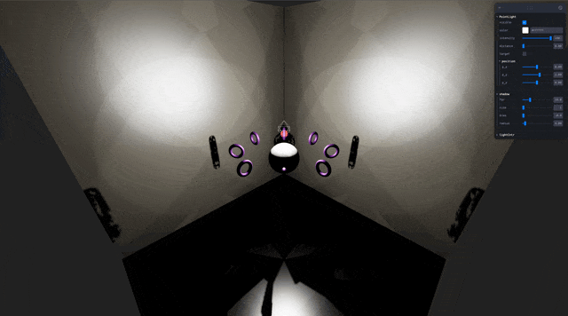
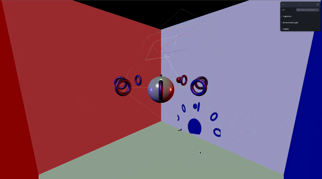
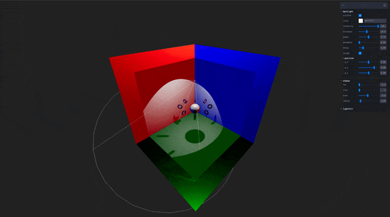

## 🎓 강의를 기반으로 학습하는 과정입니다

> R3F 에대한 강의로 3D 웹 개발에 대하여 입문과정을 알려준다

[](https://www.youtube.com/watch?v=Sg6OcVxe64k&list=PLe6NQuuFBu7HUeJkowKRkLWwkdOlhwrje&index=12)

## 📔 Core

### 📝 Camera

카메라의 특성을 가진 Object3D 이다.

카메라의 종류에 따라 화면에 비추는게 달라진다

> [!WARNING]  
> Three js 는 지속적인 업데이트 중으로 해당 사항이 변할 수 있다  
> 작성일 : 2023.10.30

#### 🍝 Code(Camera)

```js
import { Matrix4 } from '../math/Matrix4.js';
import { Vector2 } from '../math/Vector2.js';
import { Vector3 } from '../math/Vector3.js';
import { Vector4 } from '../math/Vector4.js';
import { Frustum } from '../math/Frustum.js';

const _projScreenMatrix = /*@__PURE__*/ new Matrix4();
const _lightPositionWorld = /*@__PURE__*/ new Vector3();
const _lookTarget = /*@__PURE__*/ new Vector3();

class LightShadow {
    constructor( camera ) {
        this.camera = camera;
        this.bias = 0;
        this.normalBias = 0;
        this.radius = 1;
        this.blurSamples = 8;
        this.mapSize = new Vector2( 512, 512 );
        this.map = null;
        this.mapPass = null;
        this.matrix = new Matrix4();
        this.autoUpdate = true;
        this.needsUpdate = false;
        this._frustum = new Frustum();
        this._frameExtents = new Vector2( 1, 1 );
        this._viewportCount = 1;
        this._viewports = [
            new Vector4( 0, 0, 1, 1 )
        ];
    }

    getViewportCount() { }

    getFrustum() { }

    updateMatrices( light ) { }

    getViewport( viewportIndex ) { }

    getFrameExtents() { }

    dispose() { }

    copy( source ) { }

    clone() { }

    toJSON() { }
}

export { LightShadow };
```

#### ✨ Constructor(LightShadow)

| Parameter | Type | Note |
| :-- | :-- | :-- |
| camera | Camera | 빛에 대한 카메라 값 |

#### 🎩 Properties(LightShadow)

| Property | Type | Note |
| :-- | :-- | :-- |
| autoUpdate | Boolean | 빛의 그림자를 자동으로 업데이트할 수 있습니다. 기본값은 true입니다. 동적 조명 또는 그림자가 필요하지 않은 경우 false로 설정할 수 있습니다. |
| camera | Camera | world 좌표에 대한 빛의 카메라 특성입니다. 이는 장면의 깊이 맵을 생성하는 데 사용됩니다. 빛의 관점에서 볼 때 다른 물체 뒤에 있는 물체는 그림자에 있게 됩니다. |
| bias | Float | 그림자 픽셀 크기, 어느 크기로 그림자의 픽셀을 그려줄지 설정하는 것. 기본값은 0입니다. 여기에서 아주 작은 조정(0.0001 정도)은 그림자의 아티팩트를 줄이는 데 도움이 될 수 있습니다. |
| blurSamples | Integer | VSM 섀도우 맵을 얼마나 흐리게 할지의 값 입니다. |
| map | WebGLRenderTarget | 내부 카메라를 사용하여 생성된 깊이 맵??. 픽셀 깊이를 넘어서는 위치는 그림자에 있습니다. 렌더링 중에 내부적으로 계산됩니다. |
| mapPass | WebGLRenderTarget | 내부 카메라를 이용하여 생성된 분포도?? 폐색은 깊이 분포를 기반으로 계산됩니다. 렌더링 중에 내부적으로 계산됩니다??. |
| mapSize | Vector2 | 그림자 맵의 너비와 높이를 정의하는 Vector2입니다. 기본값은 ( 512, 512 )입니다. |
| matrix | Matrix4 | 그림자 카메라 공간을 모델링하고 그림자 맵의 위치와 깊이를 계산합니다. Matrix4에 저장됩니다. 이는 렌더링 중에 내부적으로 계산됩니다. |
| needsUpdate | Boolean | true로 설정하면 다음 렌더링 호출에서 섀도우 맵이 업데이트됩니다. 기본값은 false입니다. |
| normalBias | Float | 그림자 맵을 쿼리하는 데 사용되는 위치가 개체 법선을 따라 오프셋되는 정도를 정의합니다??. 기본값은 0입니다.|
| radius | Float | 1보다 큰 값으로 설정하면 그림자의 가장자리가 흐려집니다. WebGLRenderer.shadowMap.type이 PCFSoftShadowMap으로 설정된 경우 반경은 효과가 없으며 대신 mapSize를 줄여 부드러움을 높이는 것이 좋습니다. WebGLRenderer.shadowMap.type이 BasicShadowMap으로 설정된 경우에는 아무런 효과가 없습니다. |

#### 🪄 Method(LightShadow)

| Method | Props | Return | Note |
| :-- | :-- | :-- | :-- |
| getFrameExtents | () | Vector2 | 모든 View Point를 포함하도록 그림자 맵을 확장하기 위해 렌더러에서 내부적으로 사용됩니다. |
| updateMatrices | ( light : Light ) | undefined | 렌더러에서 내부적으로 사용되는 카메라 및 그림자의 행렬을 업데이트합니다. |
| getFrustum | () | Frustum | 그림자 카메라 절두체를 가져옵니다. 렌더러가 내부적으로 `cull objects`을 위해 사용합니다. |
| getViewportCount | () | number | 이 그림자에 대해 렌더링해야 하는 ViewPort 수를 가져오기 위해 렌더러에서 내부적으로 사용됩니다. |
| dispose | () | undefined | 이 인스턴스에서 할당한 GPU 관련 리소스를 해제합니다.이 인스턴스가 앱에서 더 이상 사용되지 않을 때마다 이 메서드를 호출하는 것을 권장합니다. |
| copy | ( source : LightShadow ) | this | 소스의 모든 속성 값을 이 Light에 복사합니다. |
| clone | () | LightShadow | 이와 동일한 속성을 사용하여 새 LightShadow를 만듭니다. |
| toJSON | () | Object | 이 그림자를 json 파싱합니다. |

<details>
<summary>🚀 참고 사이트</summary>

---
| Three.js 공식 사이트 | Three.js 깃허브|
| :--: | :--: |
| [](https://threejs.org/docs/#api/en/lights/shadows/LightShadow) | [](https://github.com/mrdoob/three.js/blob/master/src/lights/LightShadow.js) |
|🔗 Link : <https://threejs.org/docs/#api/en/lights/shadows/LightShadowa> | 🔗 Link : <https://github.com/mrdoob/three.js/blob/master/src/lights/LightShadow.js> |

</details>

## 📔 Shadow 종류

| 명칭 | 모양 | 이미지 |
| :-- | :-- | :-- |
| [PointLightShadow](#📝-pointlightshadow) | PointLight에 대한 쉐도우 |  |
| [DirectionalLightShadow](#📝-directionallightshadow) | DirectionalLight에 대한 쉐도우 |  |
| [SpotLightShadow](#📝-spotlightshadow) | SpotLightShadow에 대한 쉐도우 |  |

> [!WARRING]  
> `Canvas`의 shadow 속성을 설정해주어야 한다

```jsx
 <Canvas shadows={?}>
```

| 설정 값 | 효과 |
| :-- | :-- |
| boolean | 그림자 효과를 설정할지 결정 |
| "variance" | 그림자의 효과를 자유롭게 지정 |
| "basic"  | 기본 그림자 설정 |
| "percentage" | 미실험 |
| "soft" " | 미실험 (그림자를 자연스럽게 만들어줌) |

### 📝 PointLightShadow

PointLight에 대한 쉐도우

### 👀 Preview(PointLightShadow)


#### 🍝 Code(PointLightShadow)

```js
import { LightShadow } from './LightShadow.js';
import { PerspectiveCamera } from '../cameras/PerspectiveCamera.js';
import { Matrix4 } from '../math/Matrix4.js';
import { Vector2 } from '../math/Vector2.js';
import { Vector3 } from '../math/Vector3.js';
import { Vector4 } from '../math/Vector4.js';

const _projScreenMatrix = /*@__PURE__*/ new Matrix4();
const _lightPositionWorld = /*@__PURE__*/ new Vector3();
const _lookTarget = /*@__PURE__*/ new Vector3();

class PointLightShadow extends LightShadow {

    constructor() {

        super( new PerspectiveCamera( 90, 1, 0.5, 500 ) );
        this.isPointLightShadow = true;
        this._frameExtents = new Vector2( 4, 2 );
        this._viewportCount = 6;
        this._viewports = [
            // positive X
            new Vector4( 2, 1, 1, 1 ),
            // negative X
            new Vector4( 0, 1, 1, 1 ),
            // positive Z
            new Vector4( 3, 1, 1, 1 ),
            // negative Z
            new Vector4( 1, 1, 1, 1 ),
            // positive Y
            new Vector4( 3, 0, 1, 1 ),
            // negative Y
            new Vector4( 1, 0, 1, 1 )
        ];

        this._cubeDirections = [
            new Vector3( 1, 0, 0 ), new Vector3( - 1, 0, 0 ), new Vector3( 0, 0, 1 ),
            new Vector3( 0, 0, - 1 ), new Vector3( 0, 1, 0 ), new Vector3( 0, - 1, 0 )
        ];

        this._cubeUps = [
            new Vector3( 0, 1, 0 ), new Vector3( 0, 1, 0 ), new Vector3( 0, 1, 0 ),
            new Vector3( 0, 1, 0 ), new Vector3( 0, 0, 1 ), new Vector3( 0, 0, - 1 )
        ];

    }

    updateMatrices( light, viewportIndex = 0 ) { }
}

export { PointLightShadow };
```

#### ✨ Constructor(PointLightShadow)

> [!NOTE]  
> PointLight를 참조하여 생성한다

#### 🎩 Properties(PointLightShadow)

| Property | Type | Note |
| :-- | :-- | :-- |
| isPointLightShadow | Boolean | 주어진 객체가 PointLightShadow 유형인지 확인하는 읽기 전용 플래그입니다. |

#### 🪄 Method(PointLightShadow)

| Method | Props | Return | Note |
| :-- | :-- | :-- | :-- |
| updateMatrices | ( light : Light, viewportIndex : number ) | undefined | 렌더러에서 내부적으로 사용되는 카메라 및 그림자의 행렬을 업데이트합니다. |

#### ⚡️ Action(PointLightShadow)

```jsx
function MyPointLightShadow() {
    const { visible, color, intensity, distance, target, p_x, p_y, p_z } = useControls({
        PointLight: folder({
            visible: true,
            color: "#FFFFFF",
            intensity: { value: 10, min: 0, max: 100, step: 0.001 },
            distance: { value: 0, min: 0, max: 50, step: 0.001 },
            target: false,
            position: folder({
                p_x: { value: 0, min: -10, max: 10, step: 0.001 },
                p_y: { value: 2, min: -10, max: 10, step: 0.001 },
                p_z: { value: 0, min: -10, max: 10, step: 0.001 },
            }),
        })
    })

    const { size, bias, radius, far, blurSamples } = useControls({
        shadow: folder({
            far: { value: 0, min: 0, max: 100, step: 0.1 },
            size: { value: 1, min: 1, max: 10, step: 1 },
            bias: { value: -0.0001, min: -0.001, max: 0.001, step: 0.0001 },
            radius: { value: 4, min: 0, max: 64, step: 0.01 },
            // blurSamples: { value: 1, min: 0.001, max: 1, step: 0.0001 },
        }),
    })

    const light = useRef()
    const helper = useHelper(light, THREE.PointLightHelper, 0.5)

    useFrame((state) => {
        const myBall = state.scene.getObjectByName("myBall")
        if (target)
            myBall.children[0].getWorldPosition(light.current.position)
        if (helper)
            helper.current.visible = visible ? true : false
    }, [])
    
    return (
        <>
            <pointLight
                castShadow
                ref={light}
                shadow-camera-visible={visible}
                shadow-mapsize={[512 * size, 512 * size]}
                shadow-bias={bias}
                shadow-radius={radius}
                shadow-camera-far={far}
                // shadow-blurSamples={blurSamples}
                visible={visible}
                color={color}
                intensity={intensity}
                position={[p_x, p_y, p_z]}
            />
        </>
    )
}
```

### 📝 DirectionalLightShadow

DirectionalLight에 대한 쉐도우

### 👀 Preview(DirectionalLightShadow)


#### 🍝 Code(DirectionalLightShadow)

```js
import { LightShadow } from './LightShadow.js';
import { OrthographicCamera } from '../cameras/OrthographicCamera.js';

class DirectionalLightShadow extends LightShadow {

    constructor() {
        super( new OrthographicCamera( - 5, 5, 5, - 5, 0.5, 500 ) );
        this.isDirectionalLightShadow = true;
    }

}

export { DirectionalLightShadow };
```

#### ✨ Constructor(DirectionalLightShadow)

> [!NOTE]  
> DirectionalLight를 참조하여 생성한다

#### 🎩 Properties(DirectionalLightShadow)

| Property | Type | Note |
| :-- | :-- | :-- |
| isDirectionalLightShadow | Boolean | 주어진 객체가 isDirectionalLightShadow 유형인지 확인하는 읽기 전용 플래그입니다. |

#### 🪄 Method(DirectionalLightShadow)

> [!NOTE]  
> LightShadow를 따름니다.

#### ⚡️ Action(DirectionalLightShadow)

```jsx

function MyDirectionalLightShadow() {
    const { visible, color, intensity, target } = useControls({
        DirectionalLight: folder({
            visible: true,
            color: "#FFFFFF",
            intensity: { value: 1, min: 0, max: 1, step: 0.001 },
            target: false,
        }),
    })
    const { top, right, left, bottom, size, bias, radius, far, blurSamples } = useControls({
        shadow: folder({
            far: { value: 20, min: 0, max: 30, step: 0.1 },
            left: { value: 3, min: -10, max: 10, step: 0.001 },
            right: { value: -3, min: -10, max: 10, step: 0.001 },
            top: { value: 3, min: -10, max: 10, step: 0.001 },
            bottom: { value: -3, min: -10, max: 10, step: 0.001 },
            size: { value: 1, min: 1, max: 10, step: 1 },
            bias: { value: 0.0001, min: 0.001, max: 0.01, step: 0.0001 },
            radius: { value: 1, min: 0, max: 16, step: 0.01 },
            // blurSamples: { value: 1, min: 0.001, max: 1, step: 0.0001 },
        }),
    })


    const light = useRef()
    const shadow = useRef()
    const { scene } = useThree()
    const helper = useHelper(light, THREE.DirectionalLightHelper)

    useFrame((state) => {
        const myBall = state.scene.getObjectByName("myBall")
        if (target)
            myBall.children[0].getWorldPosition(light.current.target.position)
        if (helper)
            helper.current.visible = visible ? true : false
    }, [])

    useEffect(() => {
        shadow.current = new THREE.CameraHelper(light.current.shadow.camera)
        scene.add(shadow.current)
        return (
            () => {
                scene.remove(shadow.current)
            }
        )
    }, [light.current, shadow.current])

    return (
        <>
            <directionalLight
                ref={light}
                shadow-camera-visible={visible}
                shadow-camera-top={top}
                shadow-camera-left={left}
                shadow-camera-bottom={bottom}
                shadow-camera-right={right}
                shadow-mapsize={[512 * size, 512 * size]}
                shadow-bias={bias}
                shadow-radius={radius}
                shadow-camera-far={far}
                // shadow-blurSamples={blurSamples}
                castShadow
                visible={visible}
                color={color}
                intensity={intensity}
                position={[0, 3, 0]}
            />
        </>
    )
}

```

### 📝 SpotLightShadow

SpotLight에 대한 쉐도우

### 👀 Preview(SpotLightShadow)


#### 🍝 Code(SpotLightShadow)

```js
import { LightShadow } from './LightShadow.js';
import * as MathUtils from '../math/MathUtils.js';
import { PerspectiveCamera } from '../cameras/PerspectiveCamera.js';

class SpotLightShadow extends LightShadow {

    constructor() {
        super( new PerspectiveCamera( 50, 1, 0.5, 500 ) );
        this.isSpotLightShadow = true;
        this.focus = 1;
    }

    updateMatrices( light ) { }

    copy( source ) { }

}

export { SpotLightShadow };
```

#### ✨ Constructor(SpotLightShadow)

> [!NOTE]  
> PointLight를 참조하여 생성한다

#### 🎩 Properties(SpotLightShadow)

| Property | Type | Note |
| :-- | :-- | :-- |
| focus | Number | 그림자 카메라의 초점을 맞추는 데 사용됩니다. 카메라의 시야는 스포트라이트 시야의 백분율로 설정됩니다. 범위는 [0, 1]입니다. 기본값은 1.0입니다. |
| isPointLightShadow | Boolean | 주어진 객체가 PointLightShadow 유형인지 확인하는 읽기 전용 플래그입니다. |

#### 🪄 Method(SpotLightShadow)

> [!NOTE]  
> LightShadow를 따름니다.

#### ⚡️ Action(SpotLightShadow)

```jsx

function MySpotLightShadow() {
    const { visible, color, intensity, distance, angle, penumbra, decay, target, p_x, p_y, p_z } = useControls({
        SpotLight: folder({
            visible: false,
            color: "#FFFFFF",
            intensity: { value: 100, min: 0, max: 100, step: 0.001 },
            distance: { value: 20, min: 0, max: 50, step: 0.001 },
            angle: { value: Math.PI / 4, min: 0, max: Math.PI / 2, step: 0.001 },
            penumbra: { value: 0, min: 0, max: 1, step: 0.001 },
            decay: { value: 2, min: 0, max: 10, step: 0.001 },
            target: false,
            position: folder({
                p_x: { value: 0, min: -10, max: 10, step: 0.001 },
                p_y: { value: 6, min: -10, max: 10, step: 0.001 },
                p_z: { value: 0, min: -10, max: 10, step: 0.001 },
            }),
        })
    })

    const { size, bias, radius, far, blurSamples } = useControls({
        shadow: folder({
            far: { value: 0, min: 0, max: 100, step: 0.1 },
            size: { value: 1, min: 1, max: 10, step: 1 },
            bias: { value: -0.0001, min: -0.001, max: 0.001, step: 0.0001 },
            radius: { value: 4, min: 0, max: 64, step: 0.01 },
            // blurSamples: { value: 1, min: 0.001, max: 1, step: 0.0001 },
        }),
    })

    const light = useRef()
    const helper = useHelper(light, THREE.SpotLightHelper)

    useFrame((state) => {
        const myBall = state.scene.getObjectByName("myBall")
        if (target)
            myBall.children[0].getWorldPosition(light.current.target.position)
        if (helper)
            helper.current.visible = visible ? true : false
    }, [])
    
    return (
        <>
            <spotLight
                castShadow
                shadow-camera-visible={visible}
                shadow-mapsize={[512 * size, 512 * size]}
                shadow-bias={bias}
                shadow-radius={radius}
                shadow-camera-far={far}
                visible={visible}
                ref={light}
                color={color}
                intensity={intensity}
                distance={distance}
                angle={angle}
                penumbra={penumbra}
                decay={decay}
                position={[p_x, p_y, p_z]}
            />
        </>
    )
}

```

◀️ 이전 글 : [🎓 강의 리뷰 Camera](./RM_11.md)
---
▶️ 다음 글 : [🎓 강의 리뷰 Shadow 2](./RM_13.md)
---
