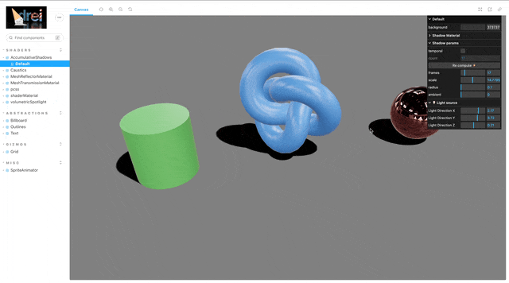

## 🎓 강의를 기반으로 학습하는 과정입니다

> R3F 에대한 강의로 3D 웹 개발에 대하여 입문과정을 알려준다

## 📔 Shadow 종류

| 명칭 | 모양 | 이미지 |
| :-- | :-- | :-- |
| [AccumulativeShadows](#📝-pointlightshadow) | 프레임 갯수만큼 별로 겹처 그리는 그림자 |  |
| [ContactShadows](#📝-directionallightshadow) | 평면으로 표현된 일반적인 그림자 입니다 |  |

> [!WARRING]  
> `Canvas`의 shadow 속성을 설정해주어야 한다

### 📝 AccumulativeShadows

PointLight에 대한 쉐도우

### 👀 Preview(AccumulativeShadows)

🔗 Link : <https://pmndrs.github.io/drei-vanilla/?path=/story/shaders-accumulativeshadows--acc-shadow-story>

### 📝 ContactShadows

DirectionalLight에 대한 쉐도우

### 👀 Preview(ContactShadows)

🔗 Link : <https://drei.pmnd.rs/?path=/docs/staging-contactshadows--docs>

◀️ 이전 글 : [🎓 강의 리뷰 Shadow 1](./RM_12.md)
---
▶️ 다음 글 : [🎓 강의 리뷰 3D model](./RM_14.md)
---
