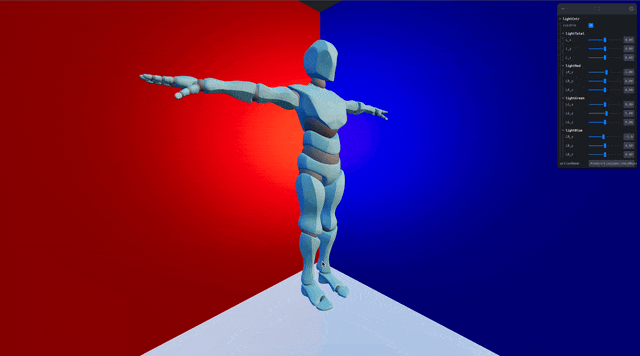
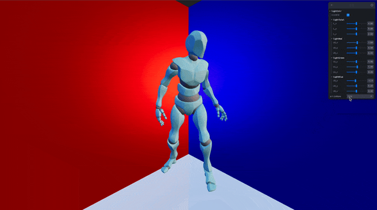

## 🎓 강의를 기반으로 학습하는 과정입니다

> R3F 에대한 강의로 3D 웹 개발에 대하여 입문과정을 알려준다

[](https://www.youtube.com/watch?v=Sg6OcVxe64k&list=PLe6NQuuFBu7HUeJkowKRkLWwkdOlhwrje&index=13)

## 📔 Model

### 📝 Model

외부에서 만든 모델을 가져오는 것  
모델을 만드는 프레임 워크로는 Blender를 추천한다  

### 👀 Preview(Model)



## 📔 Animation

### 📝 Animation

외부에서 정의된 모뎅릐 행동을 실행 시킨다  
대부분의 모델의 생성자에 의해 정의 되있음으로 모델 생성자와의 상의가 필요함

### 👀 Preview(Animation)



## 📌 체크 리스트

> 🗃️ 폴더 구조

```bash
app
├── README.md
├── index.html
├── package-lock.json
├── package.json
├── public
│   └── models
│       └── model.glb
├── src
│   ├── App.css
│   ├── App.jsx
│   ├── MyCamera.jsx
│   ├── MyElement3D.jsx
│   ├── MyLight.jsx
│   ├── MyShadow.jsx
│   ├── index.css
│   ├── main.jsx
│   └── shaders
└── vite.config.js
```

- [ ] 📋 파일 다운로드  
    🔗 Link : [Model.glb](https://drive.google.com/file/d/1lKzmK2y3VAZrFreaJA_eCX1CzbPgqqhB/view)

- [ ] ⚡️ `model` animation 실습

    <details>
    <summary>상세 보기</summary>
    <!-- summary 아래 한칸 공백 두어야함 -->

    1. `MyModel` 추가

        ```jsx
        function MyModel() {
            const model = useGLTF("./models/model.glb")
            const [height, setHeight] = useState(0);

            const animation = useAnimations(model.animations, model.scene)

            const { actionName } = useControls({
                actionName: {
                    value: animation.names[0],
                    options: animation.names
                }
            })

            useEffect(() => {
                const action = animation.actions[actionName]
                action.reset().fadeIn(0.5).play()

                return (() => {
                    action.fadeOut(0.5)
                })
            }, [actionName])

            useEffect(() => {
                let minY = Infinity
                let maxY = -Infinity

                model.scene.traverse((item) => {
                    if (item.isMesh) {
                        const geomBbox = item.geometry.boundingBox
                        console.log(geomBbox.min.y, minY)
                        if (minY > geomBbox.min.y) minY = geomBbox.min.y
                        if (maxY < geomBbox.max.y) maxY = geomBbox.max.y
                    }
                })
                setHeight(maxY - minY)
            }, [model.scene])

            // const h = maxY - minY

            return (
                <>
                    <primitive
                        scale={3}
                        object={model.scene}
                        position-y={-(height / 2) * 3}
                    />
                </>
            )
        }
        ```

    </details>

## 🍝 Code(종합 코드)

<details>
<summary>상세 보기</summary>
<!-- summary 아래 한칸 공백 두어야함 -->

```jsx
import * as THREE from 'three'
import { Environment, MeshReflectorMaterial, OrbitControls, useAnimations, useGLTF } from '@react-three/drei'

import { } from "@react-three/drei"
import { folder, useControls } from 'leva'
import { useEffect, useState } from 'react'

function MyRoom({ children }) {
    return (
        <mesh rotation={[THREE.MathUtils.degToRad(10), THREE.MathUtils.degToRad(45), 0]}>
            <mesh position={[0, -10, 0]}
                rotation={[THREE.MathUtils.degToRad(-90), 0, 0]}
                receiveShadow
                castShadow
            >
                <planeGeometry args={[20, 20]} />
                <MeshReflectorMaterial
                    side={THREE.DoubleSide}
                    color="#ffffff"
                    roughness={0.25}
                    metalness={1.0}
                />
            </mesh>
            <mesh
                castShadow
                receiveShadow
                position={[10, 0, 0]}
                rotation={[0, THREE.MathUtils.degToRad(-90), 0]}
            >
                <planeGeometry args={[20, 20]} />
                <meshPhongMaterial
                    side={THREE.DoubleSide}
                    color={0xFFF5E0}
                    specular={0xFFFFFF}
                    shininess={50.0}
                />
            </mesh>

            <mesh
                castShadow
                receiveShadow
                position={[0, 0, -10]}
                rotation={[0, 0, THREE.MathUtils.degToRad(-90)]}>
                <planeGeometry args={[20, 20]} />
                <meshPhongMaterial
                    side={THREE.DoubleSide}
                    color={0xFFF5E0}
                    specular={0xFFFFFF}
                    shininess={50.0}
                />
            </mesh>
            {children}
        </mesh>
    )
}

function MyLightControls() {
    const { visible, L_x, L_y, L_z, LR_x, LR_y, LR_z, LB_x, LB_y, LB_z, LG_x, LG_y, LG_z } = useControls({
        lightCntr: folder({
            visible: true,
            lightTotal: folder({
                L_x: { value: 0, min: -10, max: 10, step: 0.001 },
                L_y: { value: 0, min: -10, max: 10, step: 0.001 },
                L_z: { value: 0, min: -10, max: 10, step: 0.001 },
            }),
            lightRed: folder({
                LR_x: { value: 1, min: -10, max: 10, step: 0.001 },
                LR_y: { value: 0, min: -10, max: 10, step: 0.001 },
                LR_z: { value: 0, min: -10, max: 10, step: 0.001 },
            }),
            lightGreen: folder({
                LG_x: { value: 0, min: -10, max: 10, step: 0.001 },
                LG_y: { value: 1, min: -10, max: 10, step: 0.001 },
                LG_z: { value: 0, min: -10, max: 10, step: 0.001 }
            }),
            lightBlue: folder({
                LB_x: { value: -1, min: -10, max: 10, step: 0.001 },
                LB_y: { value: 0, min: -10, max: 10, step: 0.001 },
                LB_z: { value: 0, min: -10, max: 10, step: 0.001 },
            })
        })
    })

    return (
        <>
            <directionalLight visible={visible} color="red" position={[L_x + LR_x, L_y + LR_y, L_z + LR_z]} intensity={1.0} />
            <directionalLight visible={visible} color="green" position={[L_x + LG_x, L_y + LG_y, L_z + LG_z]} intensity={1.0} />
            <directionalLight visible={visible} color="blue" position={[L_x + LB_x, L_y + LB_y, L_z + LB_z]} intensity={1.0} />

        </>
    )
}

function MyModel() {
    const model = useGLTF("./models/model.glb")
    const [height, setHeight] = useState(0);

    const animation = useAnimations(model.animations, model.scene)

    const { actionName } = useControls({
        actionName: {
            value: animation.names[0],
            options: animation.names
        }
    })

    useEffect(() => {
        const action = animation.actions[actionName]
        action.reset().fadeIn(0.5).play()

        return (() => {
            action.fadeOut(0.5)
        })
    }, [actionName])

    useEffect(() => {
        let minY = Infinity
        let maxY = -Infinity

        model.scene.traverse((item) => {
            if (item.isMesh) {
                const geomBbox = item.geometry.boundingBox
                console.log(geomBbox.min.y, minY)
                if (minY > geomBbox.min.y) minY = geomBbox.min.y
                if (maxY < geomBbox.max.y) maxY = geomBbox.max.y
            }
        })
        setHeight(maxY - minY)
    }, [model.scene])

    // const h = maxY - minY

    return (
        <>
            <primitive
                scale={3}
                object={model.scene}
                position-y={-(height / 2) * 3}
            />
        </>
    )
}

function MyObject({ ...props }) {

    return (
        <>
            <Environment preset='sunset' />
            <MyModel />
        </>
    )
}

function MyElement3D() {
    return (
        <>
            <OrbitControls />
            <MyRoom>
                <MyObject />
            </MyRoom>
            <MyLightControls />
        </>
    )
}

export default MyElement3D
```

</details>
