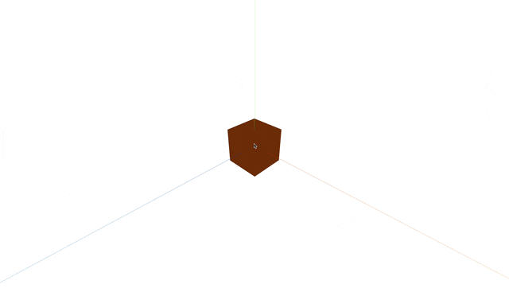
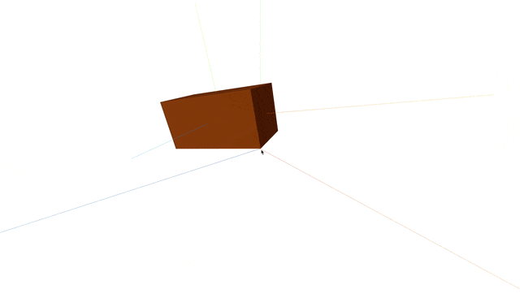
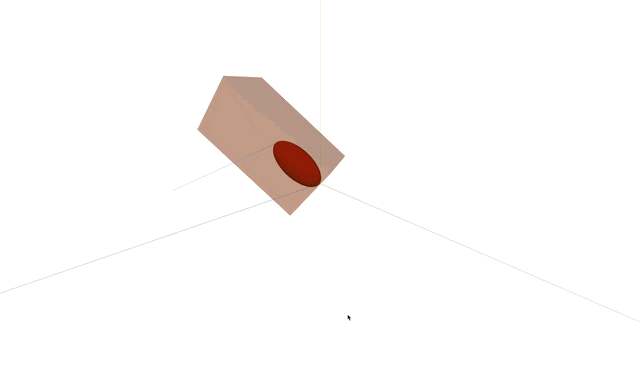

## 🎓 강의를 기반으로 학습하는 과정입니다

> R3F 에대한 강의로 3D 웹 개발에 대하여 입문과정을 알려준다

[](https://www.youtube.com/watch?v=Sg6OcVxe64k&list=PLe6NQuuFBu7HUeJkowKRkLWwkdOlhwrje&index=4)

## 🚀 참고 사이트

### Three metrial 테스트

[](https://threejs.org/docs/scenes/material-browser.html#MeshStandardMaterial)

🔗 링크 : <https://threejs.org/docs/scenes/material-browser.html#MeshStandardMaterial>

## 📔 좌표와 방향

### 🖼️ Example

[](https://r9w2ob.csb.app/)
🔗 링크 : <https://r9w2ob.csb.app/>

### 📝 축

| X 축 | Y 축 | Z 축 |
| :--: | :--: | :--: |
| 빨간선 | 노란선 | 파란선 |

### 📝 회전

> 회전 방향에 따른 값

| 단위 | 시계 방향 ↩️  | 반시계 반향 ↪️ |
| :--: | :--: | :--: |
| Radian | 📉 감소 | 📈 증가 |

## 📔 객체(Mesh)

### 📝 객체 요소

| Position | Rotation | Scale |
| :--: | :--: | :--: |
| 위치 | 회전 | 크기 |

## 📌 체크 리스트

> 🗃️ 폴더 구조

```bash
app
├── README.md↪️
├── index.html
├── package-lock.json
├── package.json
├── public
├── src
│   ├── App.css
│   ├── App.jsx
│   ├── MyElement3D.jsx
│   ├── assets
│   ├── index.css
│   └── main.jsx
└── vite.config.js
```

- [ ] 🌑 `@react-three/drei` 페키지 설치

    <details>
    <summary>상세 보기</summary>
    <!-- summary 아래 한칸 공백 두어야함 -->

    1. `@react-three/drei` 페키지 설치

        > 이동 변환 페키지

        ```bash
        app % npm install @react-three/drei
        ```

        > [!Warring] node_modules 에러
        >
        > `node_modules` 이 정상적이지 않다면 에러가 날 수 있습니다
        >
        > `console`을 확인한다음 정상적이지 않다면 `node_modules` 폴더를 삭제하고 다시 설치 하세요

    </details>

- [ ] ⚡️ `OrbitControls` 회전 페키지 실습

    <details>
    <summary>상세 보기</summary>
    <!-- summary 아래 한칸 공백 두어야함 -->

    1. `MyElement3D.jsx` 파일 수정

        ```jsx
        import React, { useRef } from 'react'
        import { OrbitControls } from '@react-three/drei'

        function MyElement3D() {
                const refMesh = useRef();
                return (
                    <>
                        <directionalLight position={[1, 1, 1]} />

                        <axesHelper scale={10} />

                        <OrbitControls />

                        <mesh ref={refMesh}>
                            <boxGeometry />
                            <meshStandardMaterial color="#e67e22"></meshStandardMaterial>
                        </mesh>
                    </>
                )
            }

        export default MyElement3D
        ```

        👀 미리보기

        

    </details>

- [ ] ⚡️ `Mesh` 객체 정보
    <details>
    <summary>상세 보기</summary>
    <!-- summary 아래 한칸 공백 두어야함 -->

    1. 이동

        ```jsx
        <>
            <mesh ref={refMesh} position={[0, 1, 1]}>
            </mesh> 
        </>
        ```

        | Props | X | Y | Z |
        | :-: | :-: | :-: | :-: |
        | 설명 | x 축 이동 | Y 축 이동 | Z 축 이동

    2. 회전

        ```jsx
        <>
            <mesh ref={refMesh} rotation={[0, 30 * Math.PI / 180, THREE.MathUtils.degToRad(10)]}>
            </mesh> 
        </>
        ```

        | Props | X | Y | Z |
        | :-: | :-: | :-: | :-: |
        | 설명 | x 축 회전 | Y 축 회전 | Z 축 회전
        > 계산 방식 : `<회전 값> * Math.PI / 180`
        >
        > THREE 방식 : `THREE.MathUtils.degToRad(<회전 값>)`
    3. 크기

        ```jsx
        <>
            <mesh ref={refMesh} scale={[2, 1, 1]} >
            </mesh> 
        </>
        ```

        | Props | X | Y | Z |
        | :-: | :-: | :-: | :-: |
        | 설명 | x 축 크기 | Y 축 크기 | Z 축 크기

    4. 종합 코드

        ```jsx
        import React, { useRef } from 'react'
        import { OrbitControls } from '@react-three/drei'
        import * as THREE from 'three'

        function MyElement3D() {
            const refMesh = useRef();
            return (
                <>
                    <directionalLight position={[1, 1, 1]} />

                    <axesHelper scale={10} />

                    <OrbitControls />

                    <mesh ref={refMesh}
                        position={[0, 1, 1]}
                        rotation={[0, 30 * Math.PI / 180, THREE.MathUtils.degToRad(10)]}
                        scale={[2, 1, 1]}
                    >
                        <boxGeometry />
                        <meshStandardMaterial color="#e67e22" />
                        <axesHelper scale={2} />
                    </mesh>
                </>
            )
        }

        export default MyElement3D
        ```

        👀 미리보기

        

    </details>

- [ ] ⚡️ `Meterial` 객체 속성

    <details>
    <summary>상세 보기</summary>
    <!-- summary 아래 한칸 공백 두어야함 -->

    1. `Material` 색 적용

        ```jsx
        <>
            <mesh>
                <meshStandardMaterial color="#000" />
            </mesh> 
        </>
        ```

    2. `Meterial` 투명도 적용

        ```jsx
        <>
            <mesh>
                <meshStandardMaterial transparent={true} opacity={0.5} />
            </mesh> 
        </>
        ```

        

        > 그외 상위 [Three meterial](#three-metrial-테스트) 참고

    </details>

- [ ] `Geometry` 객체 모양

    <details>
    <summary>상세 보기</summary>
    <!-- summary 아래 한칸 공백 두어야함 -->

    1. `Material` 박스 모양

        ```jsx
        <>
            <mesh>
                <boxGeometry />
            </mesh> 
        </>
        ```

    2. `Meterial` 원 모양

        ```jsx
        <>
            <mesh>
                <sphereGeometry />
            </mesh> 
        </>
        ```

    </details>

- [ ] ⚡️ `Mesh` 자식 객체

    <details>
    <summary>상세 보기</summary>
    <!-- summary 아래 한칸 공백 두어야함 -->

    1. 자식 객체

        ```jsx
        <>
            <mesh>
                <mech></mmesh>
            </mesh> 
        </>
        ```

        자식 객체는 부모의 위치와 방향을 기준으로 만들어 진다

        

    </details>

📌 `MyElement3D.jsx` 전체 코드

```jsx
import React, { useRef } from 'react'
import { OrbitControls } from '@react-three/drei'
import * as THREE from 'three'
import { useFrame } from '@react-three/fiber';

function MyElement3D() {
    const refMesh = useRef();
    useFrame((state, delta ) => {
        refMesh.current.rotation.z += delta;
    });
    
    return (
        <>
            <directionalLight position={[1, 1, 1]} />

            <axesHelper scale={10} />

            <OrbitControls />

            <mesh ref={refMesh}
                position={[0, 1, 1]}
                rotation={[0, 30 * Math.PI / 180, THREE.MathUtils.degToRad(10)]}
                scale={[2, 1, 1]}
            >
                <boxGeometry />
                <meshStandardMaterial
                    color="#e67e22"
                    transparent={true}
                    opacity={0.5}
                />

                <axesHelper scale={2} />
                <mesh
                    position={[0.25, 0, 0]}
                    scale={[0.25, 0.25, 0.25]}
                >
                    <sphereGeometry />
                    <meshStandardMaterial color="red" />
                <axesHelper scale={3} />
                </mesh>
            </mesh>
        </>
    )
}

export default MyElement3D
```
