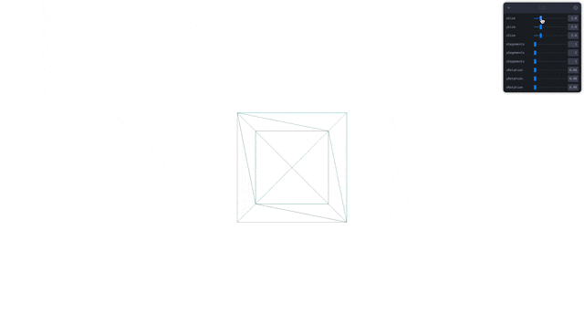
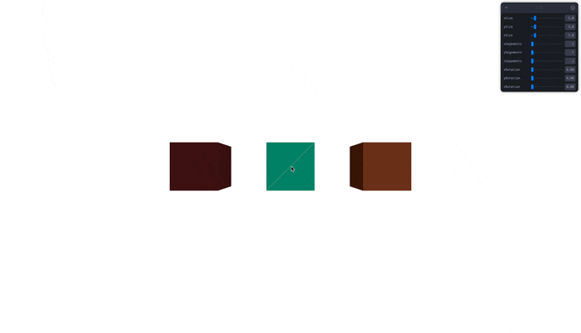

## 🎓 강의를 기반으로 학습하는 과정입니다

> R3F 에대한 강의로 3D 웹 개발에 대하여 입문과정을 알려준다

[](https://www.youtube.com/watch?v=Sg6OcVxe64k&list=PLe6NQuuFBu7HUeJkowKRkLWwkdOlhwrje&index=5)

## 📔 drei

### 📝 drei 란?
>
> drei은 여러가지 r3f에 기능을 좀더 편리하게 제공해주는 페키지이다

### ⚡️ 페키지(drei) 설치

```bash
app % npm install @react-three/drei
```

### ✏️ 사용법(drei)

#### ⚡️ Action Box
>
> mesh의 객체 박스 모형을 지정하지 않고 간편하게 테그로 모형을 생성할 수 있다

```jsx
import { Box } from '@react-three/drei'

function FT(){
    return (
        <Box position={[2, 0, 0]}>
            <meshStandardMaterial color="#a9613a" />
        </Box>
    )
}
export default FT
```

#### ⚡️ Action OrbitControls
>
> 카메라를 마우스로 손쉽게 움직일 수 있다

```jsx
import { OrbitControls } from '@react-three/drei'

function FT(){
    return (
        <OrbitControls />
    )
}
export default FT
```

## 📔 leva

### 📝 leva 란?
>
> leva 컨트롤러는 UI 적으로 컨트롤 r3f를 컨트롤 하기 쉽게 만들어주는 페키지이다

### ⚡️ 페키지(leva) 설치

```bash
app % npm install leva
```

### ✏️ 사용법(leva)

1. 컨트롤러 만들기

    ```jsx
    function FT() {
        const { 변수명 } = useControls({
            변수명: { value: 초기값, min: 최소값, max: 최대값, step: 단위 }
        });
        return (<></>)
    }
    export default FT
    ```

2. 원하는 객체에 변수를 할당 해준다.

#### 👀 Preview(leva)
>
> 오른쪽 상위 leva 컨트롤러가 보인다



#### 🍝 Code(leva)

```jsx
import { useControls } from 'leva'

function MyElement3D() {
    const { xSize, ySize, zSize, xSegements, ySegements, zSegements, xRotation, yRotation, zRotation } = useControls({
        xSize: { value: 2, min: 1, max: 10, step: 0.1 },
        ySize: { value: 2, min: 1, max: 10, step: 0.1 },
        zSize: { value: 2, min: 1, max: 10, step: 0.1 },
        xSegements: { value: 1, min: 1, max: 10, step: 1 },
        ySegements: { value: 1, min: 1, max: 10, step: 1 },
        zSegements: { value: 1, min: 1, max: 10, step: 1 },
        xRotation: { value: 0, min: 0, max: Math.PI * 2, step: 0.001 },
        yRotation: { value: 0, min: 0, max: Math.PI * 2, step: 0.001 },
        zRotation: { value: 0, min: 0, max: Math.PI * 2, step: 0.001 }
    });
    return (
        <>
            <ambientLight intensity={0.5} />
            <mesh rotation={[xRotation, yRotation, zRotation]}>
                <boxGeometry args={[xSize, ySize, zSize, xSegements, ySegements, zSegements]} />
                <meshStandardMaterial emissive="#000" wireframe={true} />
            </mesh>
        </>
    )
}

export default MyElement3D
```

## 📌 Check List

- [ ] 🌑 `@react-three/drei` 설치
- [ ] ⚡️ `drei` 박스 생성
- [ ] ⚡️ `drei` `OrbitControls` 사용
- [ ] 🌑 `leva` 설치
- [ ] ⚡️ `leva` `useControls()` 사용

### 📋 File(`MyElement3D.jsx`) 전체 코드

```jsx
import { useEffect, useRef } from 'react';
import { Box, OrbitControls } from '@react-three/drei'
import * as THREE from 'three'
import { useControls } from 'leva'
function MyBox(prop) {
    const geom = new THREE.BoxGeometry();
    return (
        <mesh {...prop} geometry={geom}>
        </mesh>)
}

function MyElement3D() {
    const refMash = useRef();
    const refWireMash = useRef();

    const { xSize, ySize, zSize, xSegements, ySegements, zSegements, xRotation, yRotation, zRotation } = useControls({
        xSize: { value: 1, min: 0.1, max: 10, step: 0.1 },
        ySize: { value: 1, min: 0.1, max: 10, step: 0.1 },
        zSize: { value: 1, min: 0.1, max: 10, step: 0.1 },
        xSegements: { value: 1, min: 1, max: 10, step: 1 },
        ySegements: { value: 1, min: 1, max: 10, step: 1 },
        zSegements: { value: 1, min: 1, max: 10, step: 1 },
        xRotation: { value: 0, min: 0, max: Math.PI * 2, step: 0.001 },
        yRotation: { value: 0, min: 0, max: Math.PI * 2, step: 0.001 },
        zRotation: { value: 0, min: 0, max: Math.PI * 2, step: 0.001 }
    });
    useEffect(() => {
        refWireMash.current.geometry = refMash.current.geometry;
    }, [xSize, ySize, zSize, xSegements, ySegements, zSegements, xRotation, yRotation, zRotation])
    return (
        <>
            <OrbitControls />

            <ambientLight intensity={0.5} />
            <directionalLight position={[2, 2, 3]} intensity={0.9} />

            <mesh ref={refMash} rotation={[xRotation, yRotation, zRotation]}>
                <boxGeometry args={[xSize, ySize, zSize, xSegements, ySegements, zSegements]} />
                <meshStandardMaterial color="#1abc9c" />
            </mesh>

            <mesh ref={refWireMash} rotation={[xRotation, yRotation, zRotation]}>
                <meshStandardMaterial emissive="#ffbe0b" wireframe={true} />
            </mesh>
            
            <Box position={[2, 0, 0]}>
                <meshStandardMaterial color="#a9613a" />
            </Box>

            <MyBox position={[-2, 0, 0]}>
                <meshStandardMaterial color="#79393a" />
            </MyBox>
        </>
    )
}

export default MyElement3D
```

### 👀 Preview



## 🚀 참고 사이트

### 📚 Three.js Doc

[](https://threejs.org/docs/index.html#api/en/core/BufferAttribute)

🔗 Link : <https://threejs.org/docs/index.html#api/en/core/BufferAttribute>

### 📚 Three Geometry Github

[](https://github.com/mrdoob/three.js/tree/dev/src/geometries)

🔗 Link : <https://github.com/mrdoob/three.js/tree/dev/src/geometries>
