## 🎓 강의를 기반으로 학습하는 과정입니다

> R3F 에대한 강의로 3D 웹 개발에 대하여 입문과정을 알려준다

[](https://www.youtube.com/watch?v=Sg6OcVxe64k&list=PLe6NQuuFBu7HUeJkowKRkLWwkdOlhwrje&index=5)

## 📔 Core

### 📝 BufferAttribute 란?

객체를 만들기 위해 필요한 정보가 담겨있는 구조체이다.

위치 정보, 면, 법선, 색깔, UV, ... 등 객체 생성에 필요한 정보를 가지고 있으며 `BufferGeometry`를 만드는데 효율적으로 한다

> [!WARNING]  
> Three js 는 지속적인 업데이트 중으로 해당 사항이 변할 수 있다  
> 작성일 : 2023.10.17

<details>
<summary>🚀 참고 사이트</summary>

---
| Three.js 공식 사이트 | Three.js 깃허브|
| :--: | :--: |
| [](https://threejs.org/docs/index.html#api/en/core/BufferAttribute) | [](https://github.com/mrdoob/three.js/blob/master/src/core/BufferAttribute.js) |
|🔗 Link : <https://threejs.org/docs/index.html#api/en/core/BufferAttribute> | 🔗 Link : <https://github.com/mrdoob/three.js/blob/master/src/core/BufferAttribute.js> |

</details>

### 📝 EventDispatcher

이벤트를 관리하는 용도로 사용된다

#### 🍝 Code(EventDispatcher)

```js
class EventDispatcher {

    addEventListener( type, listener ) { }

    hasEventListener( type, listener ) { }

    removeEventListener( type, listener ) { }

    dispatchEvent( event ) { }

}

export { EventDispatcher };
```

#### 🪄 Method(EventDispatcher)

| Method | Props | Return | Note |
| :-- | :-- | :-- | :-- |
| addEventListener | ( type : String, listener : Function ) | undefined | type - 리스닝할 이벤트의 타입입니다. listener - 이벤트가 작동하면 호출될 함수입니다. |
| hasEventListener | ( type : String, listener : Function ) | Boolean | type - 리스닝할 이벤트의 타입입니다. listener - 이벤트가 작동하면 호출될 함수입니다. |
| removeEventListener | ( type : String, listener : Function ) | undefined | type - 제거될 리스너의 타입입니다. listener - 제거될 리스너 함수입니다. |
| dispatchEvent | ( event : Object ) | undefined | event - 작동하는 이벤트입니다. |

<details>
<summary>🚀 참고 사이트</summary>

---

| Three.js 공식 사이트 | Three.js 깃허브|
| :--: | :--: |
| [](https://threejs.org/docs/index.html#api/en/core/EventDispatcher) | [](https://github.com/mrdoob/three.js/blob/master/src/core/EventDispatcher.js) |
|🔗 Link : <https://threejs.org/docs/index.html#api/en/core/EventDispatcher> | 🔗 Link : <https://github.com/mrdoob/three.js/blob/master/src/core/EventDispatcher.js> |

</details>

### 📝 BufferGeometry

mesh, 선, 점 기하학펴햔 등의 정보가 있는 구조체입니다.

#### 🍝 Code(BufferGeometry)

> 링크는 하위 `참고 사이트` 상세보기

```js
import { Vector3 } from '../math/Vector3.js';
import { Vector2 } from '../math/Vector2.js';
import { Box3 } from '../math/Box3.js';
import { EventDispatcher } from './EventDispatcher.js';
import { BufferAttribute, Float32BufferAttribute, Uint16BufferAttribute, Uint32BufferAttribute } from './BufferAttribute.js';
import { Sphere } from '../math/Sphere.js';
import { Object3D } from './Object3D.js';
import { Matrix4 } from '../math/Matrix4.js';
import { Matrix3 } from '../math/Matrix3.js';
import * as MathUtils from '../math/MathUtils.js';
import { arrayNeedsUint32 } from '../utils.js';

let _id = 0;

const _m1 = /*@__PURE__*/ new Matrix4();
const _obj = /*@__PURE__*/ new Object3D();
const _offset = /*@__PURE__*/ new Vector3();
const _box = /*@__PURE__*/ new Box3();
const _boxMorphTargets = /*@__PURE__*/ new Box3();
const _vector = /*@__PURE__*/ new Vector3();

class BufferGeometry extends EventDispatcher {
    
    constructor() {
        super();

        this.isBufferGeometry = true;

        Object.defineProperty( this, 'id', { value: _id ++ } );

        this.uuid = MathUtils.generateUUID();

        this.name = '';
        this.type = 'BufferGeometry';

        this.index = null;
        this.attributes = {};

        this.morphAttributes = {};
        this.morphTargetsRelative = false;

        this.groups = [];

        this.boundingBox = null;
        this.boundingSphere = null;

        this.drawRange = { start: 0, count: Infinity };

        this.userData = {};
    }

    getIndex() { }
    setIndex( index ) { }
    getAttribute( name ) { }
    setAttribute( name, attribute ) { }
    deleteAttribute( name ) { }
    hasAttribute( name ) { }
    addGroup( start, count, materialIndex = 0 ) { }
    clearGroups() { }
    setDrawRange( start, count ) { }
    applyMatrix4( matrix ) { }
    applyQuaternion( q ) { }
    rotateX( angle ) { }
    rotateY( angle ) { }
    rotateZ( angle ) { }
    translate( x, y, z ) { }
    scale( x, y, z ) { }
    lookAt( vector ) { }
    center() { }
    setFromPoints( points ) { }
    computeBoundingBox() { }
    computeBoundingSphere() { }
    computeTangents() { }
    computeVertexNormals() { }
    normalizeNormals() { }
    toNonIndexed() { }
    toJSON() { }
    clone() { }
    copy( source ) { }
    dispose() { }

}

export { BufferGeometry };
```

#### 🎩 Properties(BufferGeometry)

| Property | Type | Note |
| :-- | :-- | :-- |
| id | Integer | 인스턴스의 고유한 번호입니다. |
| isBufferGeometry | Boolean | 주어진 객체가 BufferGeometry 유형인지 확인하는 읽기 전용 플래그입니다. |
| uuid | String | 객체 인스턴스의 UUID입니다. 자동으로 할당되며 수정할 수 없습니다. |
| name | String | 인스턴스의 임의 이름입니다. 기본값은 빈 문자열입니다. |
| type | String | 'BufferGeometry' 타입이 써져있다 |
| index | BufferAttribute | 꼭짓점을 여러 개의 삼각형으로 재 사용할 수 있게 해줍니다; 이를 "indexed triangles"를 사용한다고 합니다. 각각의 삼각형은 세 꼭짓점의 인덱스와 연관되어 있습니다. 이 속성은 따라서 각 삼각형 면의 각 꼭짓점의 인덱스를 저장하고 있습니다. 이 속성이 설정되어 있지 않다면, renderer는 세 연속된 위치가 단일 삼각형을 나타낸다고 추정합니다. 기본값은 null 입니다. |
| attributes | Object | 이 해시맵은 설정될 속성의 이름을 id로 가지고 있으며 설정해야 할 buffer 값을 value로 가지고 있습니다. 프로퍼티에 직접 접근하기보다, .setAttribute 및 .getAttribute를 통해 이 기하학 속성에 접근하세요. |
| morphAttributes | Object | BufferAttribute의 해쉬맵은 기하학의 모프 타겟에 대한 세부정보를 담고 있습니다. Note: Once the geometry has been rendered, the morph attribute data cannot be changed. You will have to call .dispose(), and create a new instance of BufferGeometry. |
| morphTargetsRelative | Boolean | 모프 타겟의 행동을 컨트롤하는데에 사용됩니다; true로 설정하면, 모프 타겟 데이터는 absolute positions/normals 대신 relative offsets으로 취급됩니다. 기본값은 false 입니다. |
| groups | Array | 기하학을 그룹으로 나누며 각자의 WebGL 그리기 요청을 통해 렌더링 됩니다. bufferGeometry와 함께 사용되는 재질의 배열을 허용합니다.. |
| boundingBox | Box3 | bufferGeometry의 바운딩 박스이며 .computeBoundingBox()로 계산할 수 있습니다. 기본값은 null입니다. |
| boundingSphere | Sphere | bufferGeometry의 바운딩 스피어이며 .computeBoundingSphere()로 계산할 수 있습니다. 기본값은 null입니다. |
| drawRange | Object | 렌더링할 기하학의 부분을 정의합니다. 직접 설정하면 안되며 .setDrawRange를 사용해야 합니다. 기본 값은 다음과 같습니다. { start: 0, count: Infinity }인덱스가 없는 BufferGeometry의 경우, count는 렌더링할 꼭짓점들의 갯수입니다. 인덱스가 있는 BufferGeometry의 경우, count는 렌더링할 인덱스의 갯수입니다. |
| userData | Object | BufferGeometry에 관한 커스텀 데이터를 저장하는데에 사용될 수 있는 객체입니다. 이 속성은 복제되지 않기 때문에 기능에 대한 참조를 포함하고 있어서는 안됩니다. |

#### 🪄 Method(BufferGeometry)

| Method | Props | Return | Note |
| :-- | :-- | :-- | :-- |
| .getIndex | ( ) | BufferAttribute | .index 버퍼를 리턴 |
| .setIndex | (  index : BufferAttribute ) | this |.index 버퍼를 설정 |
| .getAttribute | (  name : String ) | BufferAttribute | attribute를 특정 이름과 함께 리턴 |
| .setAttribute | ( name: string, attribute : BufferAttribute ) | this | 기하학에 대한속성 설정 |
| .deleteAttribute | (  name : String ) | BufferAttribute | 특정 이름의 attribute를 전부 삭제 |
| .hasAttribute | (  name : String ) | Boolean | 특정 이름의 속성이 존재하면 true를 리턴 |
| .addGroup | ( start : Integer, count : Integer, materialIndex : Integer ) | undefined | 기하학에 그룹을 추가 |
| .clearGroups | (  ) | undefined | 모든 그룹을 제거
| .setDrawRange | (  start : Integer, count : Integer ) | undefined | .drawRange 프로퍼티를 설정 |
| .applyMatrix4 | ( matrix : Matrix4 ) | this | 꼭짓점 좌표로 매트릭스 변형 |
| .applyQuaternion | ( quaternion : Quaternion ) : this | 꼭짓점 좌표로 쿼터니언 변형 |
| .rotateX | (  radians : Float ) | this | X 축의 기하학을 회전 |
| .rotateY | (  radians : Float ) | this | Y 축의 기하학을 회전 |
| .rotateZ | (  radians : Float ) | this | Z 축의 기하학을 회전 |
| .translate | (  x : Float, y : Float, z : Float ) | this | 기하학을 이동합니다. |
| .scale | (  x : Float, y : Float, z : Float ) | this | 기하학 데이터를 확대/축소 |
| .lookAt | (  vector : Vector3 ) | this | 시점의 월드 벡터 공간의 점을 기준으로 기하학을 면을 회전 |
| .center | ( ) | this | 바운딩 박스를 기준 중앙정렬 |
| .setFromPoints | (  points : Array ) | this | 점 배열로부터 BufferGeometry의 속성을 설정 |
| .computeBoundingBox | ( ) | undefined | 기하학의 바운딩 박스를 계산하고 .boundingBox 속성을 업데이트합니다. |
| .computeBoundingSphere | ( ) | undefined | 기하학의 바운딩 스피어를 계산하고 .boundingSphere 속성을 업데이트합니다. |
| .computeTangents | ( ) | undefined |기하학에 탄젠트 속성을 계산하고 추가합니다. 이 계산은 인덱스가 있는 기하학에만 지원되며 위치, 법선, uv 속성이 정의되어야 합니다. |
| .computeVertexNormals | ( ) | undefined | 면의 법선 평균값을 통해 꼭짓점 법선을 계산 |
| .normalizeNormals | ( ) | undefined | 기하학의 모든 법선 벡터는 1의 크기로 정규화 |
| .toNonIndexed | ( ) | BufferGeometry | 인덱스가 있는 BufferGeometry의 인덱스가 없는 버전을 리턴 |
| .toJSON | ( ) | Object | 버퍼 기하학을 three.js JSON Object/Scene format로 변환 |
| .clone | ( ) | BufferGeometry | 복사본을 생성 |
| .copy | (  bufferGeometry : BufferGeometry ) | this | 대입 복사 |
| .dispose | ( ) | undefined | 메모리에서 객체를 정리합니다. 앱이 동작중인데 BufferGeometry를 삭제하고 싶을 때 호출 |

> [!WARNING]  
> `BufferGeometry` 메서드는  
> 일반적으로 한 구간에서만 사용되며 루프 구간에서 사용되지 않습니다.  
> 일반적인 리얼타임 메쉬 이동은 Object3D.position 를 사용하세요.

<details>
<summary>🚀 참고 사이트</summary>

---

| Three.js 공식 사이트 | Three.js 깃허브|
| :--: | :--: |
| [](https://threejs.org/docs/index.html#api/en/core/BufferGeometry) | [](https://github.com/mrdoob/three.js/blob/master/src/core/BufferGeometry.js) |
|🔗 Link : <https://threejs.org/docs/index.html#api/en/core/BufferGeometry> | 🔗 Link : <https://github.com/mrdoob/three.js/blob/master/src/core/BufferGeometry.js> |

</details>

## 📔 Geometry 종류

| 명칭 | 모양 | 이미지 |
| :-- | :-- | :-- |
| [BoxGeometry](#📝-boxgeometry) | 큐브 박스 모형 | 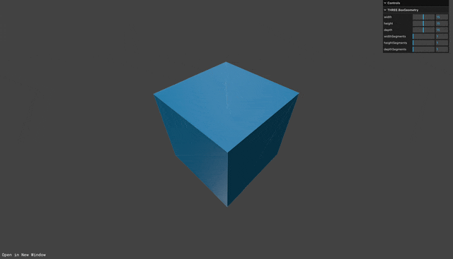 |
| [CapsuleGeometry](#📝-capsulegeometry) | 캡슐 모형 | 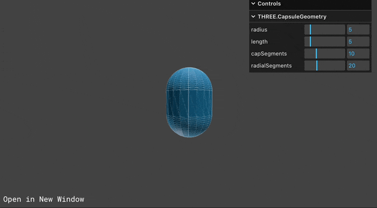 |
| [CircleGeometry](#📝-circlegeometry) | 원판 모형 | 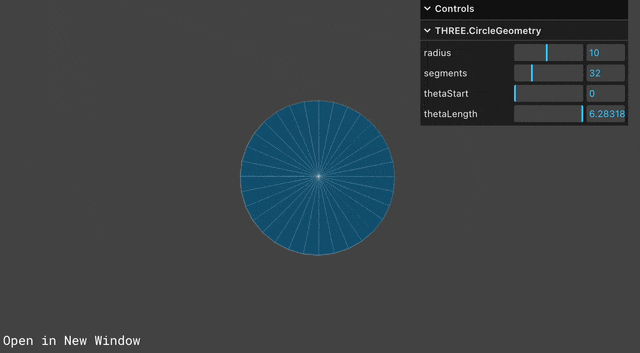 |
| [ConeGeometry](#📝-conegeometry) | 콘 모형 |  |
| [CylinderGeometry](#📝-cylindergeometry) | 원기둥 모형 | 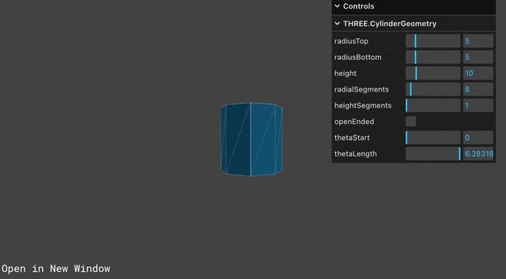 |
| [DodecahedronGeometry](#📝-dodecahedrongeometry) | 12면체 모형 | 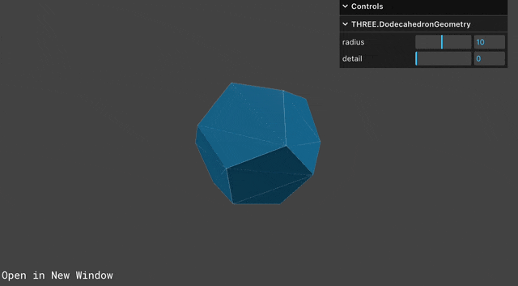 |
| [EdgesGeometry](#📝-edgesgeometry) | 모서리 모형 |  |
| [ExtrudeGeometry](#📝-ExtrudeGeometry) | 블록 모형 | 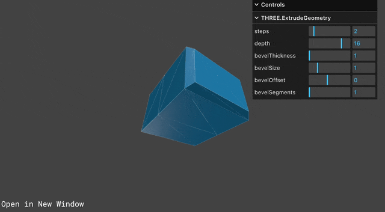 |
| [IcosahedronGeometry](#📝-icosahedrongeometry) | 20면체 모형 | 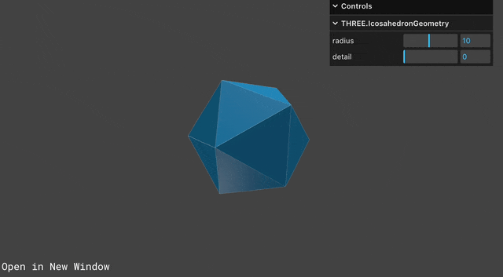 |
| [LatheGeometry](#📝-lathegeometry) | 꽃병 모형 |  |
| [OctahedronGeometry](#📝-octahedrongeometry) | 팔면체 모형 | 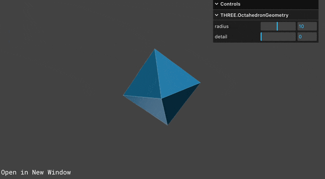 |
| [PlaneGeometry](#📝-planegeometry) | 평면 모형 | 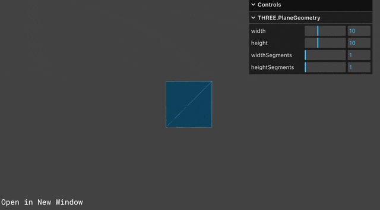 |
| [PolyhedronGeometry](#📝-polyhedrongeometry) | 폴리곤 모형 | 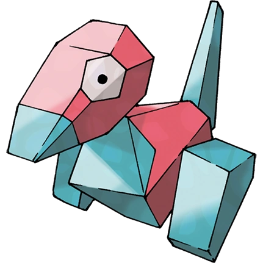|
| [RingGeometry](#📝-RingGeometry) | 링 모형 |  |
| [ShapeGeometry](#📝-shapegeometry) | 하트 모형 | 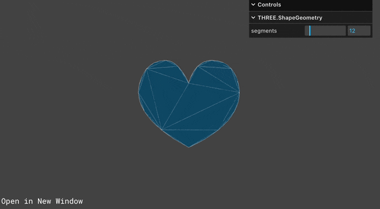 |
| [SphereGeometry](#📝-spheregeometry) | 구 모형 |  |
| [TetrahedronGeometry](#📝-tetrahedrongeometry) | 사면체 모형 | 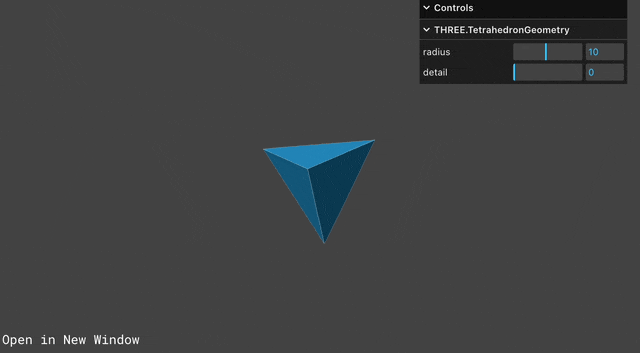 |
| [TorusGeometry](#📝-torusgeometry) | 도넛 모형 |  |
| [TorusKnotGeometry](#📝-torusknotgeometry) | 뫼비우스의 도넛 모형 |  |
| [TubeGeometry](#📝-tubegeometry) | 튜브 모형 | 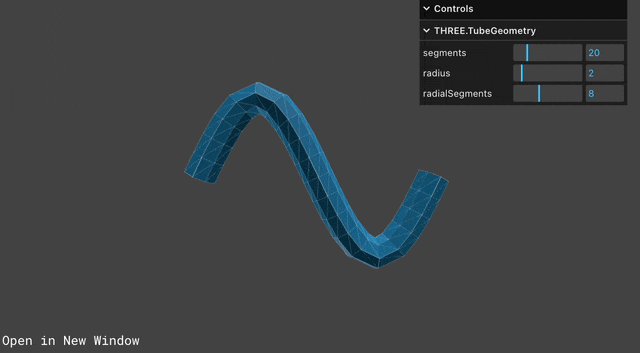 |
| [WireframeGeometry](#📝-wireframegeometry) | 접선 모형 | 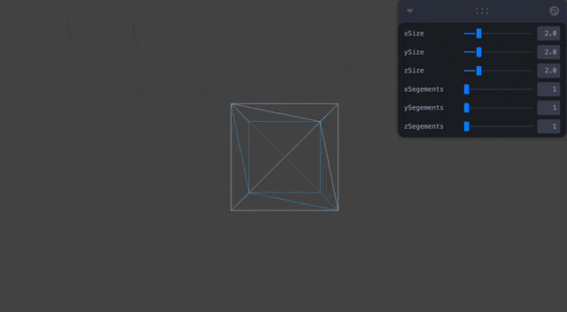 |
| [ConvexGeometry](#📝-convexgeometry) | 볼록 모형? |  |
| [DecalGeometry](#📝-decalgeometry) | 데칼 모형? |  |
| [ParametricGeometry](#📝-parametricgeometry) | 파라메트릭 모형 | 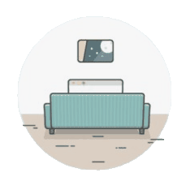 |
| [TextGeometry](#📝-textgeometry) | 텍스트 모형 |  |

### 📝 BoxGeometry
>
> 큐브 박스 모형

### 👀 Preview(BoxGeometry)


#### ✨ Constructor(BoxGeometry)

| Parameter | Type | Note |
| :-- | :-- | :-- |
| width | Float | 너비, 즉 X축에 평행한 모서리의 길이입니다. Optional; 기본값은 1 입니다. |
| height | Float | 높이, 즉 Y축에 평행한 가장자리의 길이입니다. Optional; 기본값은 1 입니다. |
| depth | Float | 깊이, 즉 Z축에 평행한 가장자리의 길이입니다. Optional; 기본값은 1 입니다. |
| widthSegments | Integer | 변의 폭을 따라 분할된 직사각형 면의 수입니다. Optional; 기본값은 1 입니다. |
| heightSegments | Integer | 변의 높이를 따라 분할된 직사각형 면의 수입니다. Optional; 기본값은 1 입니다. |
| depthSegments | Integer | 변의 깊이를 따라 분할된 직사각형 면의 수입니다. Optional; 기본값은 1 입니다. |

### 📝 CapsuleGeometry
>
> 캡슐 모형

### 👀 Preview(CapsuleGeometry)


#### ✨ Constructor(CapsuleGeometry)

| Parameter | Type | Note |
| :-- | :-- | :-- |
| radius | Float | 캡슐의 반경입니다. Optional |
| length | Float | 중간 구역의 길이입니다. Optional |
| capSegments | Integer | 캡을 구성하는 데 사용된 곡선 면의 수입니다. Optional |
| radialSegments | Integer | 캡슐 둘레 주변의 분할된 면의 수입니다. Optional |

### 📝 CircleGeometry
>
> 원판 모형

### 👀 Preview(CircleGeometry)


#### ✨ Constructor(CircleGeometry)

| Parameter | Type | Note |
| :-- | :-- | :-- |
| radius | Float | 원의 반지름, 기본값 = 1. |
| segments | Integer | 세그먼트 수(삼각형), 최소값 = 3, 기본값 = 32. |
| thetaStart | Float | 첫 세그먼트의 각도 시작, 기본값 = 0 (3시 위치). |
| thetaLength | Float | 원형 섹터의 중심 각도(흔히 세타라고 함)입니다. 기본값은 완전한 원을 만드는 2*Pi 입니다. |

### 📝 ConeGeometry
>
> 콘 모형

### 👀 Preview(ConeGeometry)


#### ✨ Constructor(ConeGeometry)

| Parameter | Type | Note |
| :-- | :-- | :-- |
| radius | Float | 원뿔 밑면의 반지름입니다. 기본값은 1 입니다. |
| height | Float | 원뿔의 높이입니다. 기본값은 1 입니다. |
| radialSegments | Integer | 원뿔 둘레 주변의 분할된 면의 수입니다. 기본값은 32 입니다. |
| heightSegments | Integer | 원뿔 높이를 따라 있는 면의 행 수입니다. 기본값은 1 입니다. |
| openEnded | Boolean | 원뿔의 밑면이 열려 있는지 닫혀 있는지를 나타내는 부울입니다. 기본값은 닫힘을 의미하는 false 입니다. |
| thetaStart | Float | 첫 번째 세그먼트의 시작 각도, 기본값은 0 입니다 (3시 위치). |
| thetaLength | Float | 원형 섹터의 중심 각도(흔히 세타라고 함)입니다. 기본값은 완전한 원을 만드는 2*Pi 입니다. |

### 📝 CylinderGeometry
>
> 원기둥 모형

### 👀 Preview(CylinderGeometry)


#### ✨ Constructor(CylinderGeometry)

| Parameter | Type | Note |
| :-- | :-- | :-- |
| radiusTop | Float | 상단에서 원통의 반지름입니다. 기본값은 1 입니다. |
| radiusBottom | Float | 바닥에서 원통의 반지름입니다. 기본값은 1 입니다. |
| height | Float | 실린더의 높이입니다. 기본값은 1 입니다. |
| radialSegments | Integer | 실린더 원주 주위의 분할된 면의 수입니다. 기본값은 32 입니다. |
| heightSegments | Integer | 원통 높이를 따라 있는 면의 행 수입니다. 기본값은 1 입니다. |
| openEnded | Boolean | 원뿔의 끝이 열려 있는지 닫혀 있는지를 나타내는 부울입니다. 기본값은 닫힘을 의미하는 false 입니다. |
| thetaStart | Float | 첫 번째 세그먼트의 시작 각도, 기본값은 0 입니다 (3시 위치). |
| thetaLength | Float | 원형 섹터의 중심 각도(흔히 세타라고 함)입니다. 기본값은 완전한 실린더를 만드는 2*Pi 입니다. |

### 📝 DodecahedronGeometry
>
> 12면체 모형

### 👀 Preview(DodecahedronGeometry)


#### ✨ Constructor(DodecahedronGeometry)

| Parameter | Type | Note |
| :-- | :-- | :-- |
| radius | Float | 12면체의 반지름입니다. 기본값은 1입니다. |
| detail | Integer | 기본값은 0 입니다. 이 값을 0보다 큰 값으로 설정하면 정점이 추가되어 더 이상 12면체가 아닙니다. |

### 📝 EdgesGeometry
>
> 모서리 모형

### 👀 Preview(EdgesGeometry)


#### ✨ Constructor(EdgesGeometry)

| Parameter | Type | Note |
| :-- | :-- | :-- |
| geometry | BufferGeometry | 모든 기하학 객체. |
| thresholdAngle | Integer | 인접한 면의 면 법선 사이의 각도 (단위는 도)가 이 값을 초과하는 경우에만 가장자리가 렌더링됩니다. 기본값 = 1도. |

### 📝 ExtrudeGeometry
>
> 블록 모형

### 👀 Preview(ExtrudeGeometry)


#### ✨ Constructor(ExtrudeGeometry)

| Parameter | Type | Note |
| :-- | :-- | :-- |
| shapes | Array | 모양 또는 모양의 배열입니다. |
| options | Object | 다음 매개변수를 포함할 수 있는 객체입니다. |

##### ✨ Constructor(ExtrudeGeometry.options)

| Parameter | Type | Note |
| :-- | :-- | :-- |
| curveSegments |  int | 곡선의 점 수. 기본값은 12 입니다. |
| steps | int | 돌출된 스플라인의 깊이를 따라 세그먼트를 세분화하는 데 사용되는 점 수입니다. 기본값은 1 입니다. |
| depth | float | 모양을 돌출시킬 깊이입니다. 기본값은 1 입니다. |
| bevelEnabled | bool | 모양에 베벨링을 적용합니다. 기본값은 true 입니다. |
| bevelThickness | float | 베벨이 원래 모양으로 들어가는 깊이입니다. 기본값은 0.2 입니다. |
| bevelSize | float | 베벨이 확장되는 모양 윤곽선으로부터의 거리입니다. 기본값은 bevelThickness - 0.1 입니다. |
| bevelOffset | float | 경사가 시작되는 모양 윤곽선으로부터의 거리입니다. 기본값은 0 입니다. |
| bevelSegments | int | 베벨 레이어 수. 기본값은 3 입니다. |
| extrudePath | THREE.Curve | 모양이 돌출되어야 하는 3D 스플라인 경로입니다. 경로 돌출에는 베벨이 지원되지 않습니다. |
| UVGenerator | Object | UV 제너레이터 기능을 제공하는 객체 |

### 📝 IcosahedronGeometry
>
> 20면체 모형

### 👀 Preview(IcosahedronGeometry)


#### ✨ Constructor(IcosahedronGeometry)

| Parameter | Type | Note |
| :-- | :-- | :-- |
| radius | Float | 기본값은 1 입니다. |
| detail | Integer | 기본값은 0 입니다. 이 값을 0보다 큰 값으로 설정하면 정점이 더 추가되어 더 이상 20면체가 아닙니다. 디테일이 1보다 크면 사실상 구체입니다. |

### 📝 LatheGeometry
>
> 꽃병 모형

### 👀 Preview(LatheGeometry)


#### ✨ Constructor(LatheGeometry)

| Parameter | Type | Note |
| :-- | :-- | :-- |
| points | Array | Vector2의 배열. 각 점의 x 좌표는 0보다 커야 합니다. 기본값은 단순한 다이아몬드 모양을 만드는 (0,-0.5), (0.5,0) 및 (0,0.5)의 배열입니다. |
| segments | Integer | 생성할 원주 세그먼트의 수입니다. 기본값은 12 입니다. |
| phiStart | Float | 시작 각도(라디안 단위). 기본값은 0 입니다. |
| phiLength | Float | 선반 섹션의 라디안(0 ~ 2PI) 범위 2PI는 닫힌 선반이고, 2PI 미만이 한 부분입니다. 기본값은 2PI 입니다. |

### 📝 OctahedronGeometry
>
> 팔면체 모형

### 👀 Preview(OctahedronGeometry)


#### ✨ Constructor(OctahedronGeometry)

| Parameter | Type | Note |
| :-- | :-- | :-- |
| radius | Float | 팔면체의 반지름. 기본값은 1 입니다. |
| detail | Integer | 기본값은 0 입니다. 이 값을 0보다 큰 값으로 설정하면 정점이 더 이상 팔면체가 아닙니다. |

### 📝 PlaneGeometry
>
> 평면 모형

### 👀 Preview(PlaneGeometry)


#### ✨ Constructor(PlaneGeometry)

| Parameter | Type | Note |
| :-- | :-- | :-- |
| width | Float | X축의 너비입니다. 기본값은 1 입니다. |
| height | Float | Y축의 높이입니다. 기본값은 1 입니다. |
| widthSegments | Integer | Optional. 기본값은 1 입니다. |
| heightSegments | Integer | Optional. 기본값은 1 입니다. |

### 📝 PolyhedronGeometry
>
> 폴리곤 모형

### 👀 Preview(PolyhedronGeometry)


#### ✨ Constructor(PolyhedronGeometry)

| Parameter | Type | Note |
| :-- | :-- | :-- |
| vertices | Array | 다음과 같은 형태의 점 Array [1,1,1, -1,-1,-1, ... ] |
| indices | Array | 다음과 같은 형식의 면을 구성하는 인덱스들의 Array [0,1,2, 2,3,0, ... ] |
| radius | Float | Float - 최종 모양의 반지름 |
| detail | Integer | Integer - 지오메트리를 세분화할 레벨 수. 디테일이 많을수록 모양이 부드러워집니다. |

### 📝 RingGeometry
>
> 링 모형

### 👀 Preview(RingGeometry)


#### ✨ Constructor(RingGeometry)

| Parameter | Type | Note |
| :-- | :-- | :-- |
| innerRadius | Float | 기본값은 0.5 입니다. |
| outerRadius | Float | 기본값은 1 입니다. |
| thetaSegments | Integer | 세그먼트 수. 숫자가 높을수록 링이 더 둥글다는 의미입니다. 최소값은 3 입니다. 기본값은 32 입니다. |
| phiSegments | Integer | 최소값은 1 입니다. 기본값은 1 입니다. |
| thetaStart | Float | 시작 각도입니다. 기본값은 0 입니다. |
| thetaLength | Float | 중심 각도입니다. 기본값은 Math.PI * 2 입니다. |

### 📝 ShapeGeometry
>
> 하트 모형

### 👀 Preview(ShapeGeometry)


#### ✨ Constructor(ShapeGeometry)

| Parameter | Type | Note |
| :-- | :-- | :-- |
| shapes | Array | 모양의 Array 또는 단일 shape. 기본값은 단일 삼각형 모양입니다. |
| curveSegments | Integer |

### 📝 SphereGeometry
>
> 구 모형

### 👀 Preview(SphereGeometry)


#### ✨ Constructor(SphereGeometry)

| Parameter | Type | Note |
| :-- | :-- | :-- |
| radius | Float | 구 반지름. Default is 1. |
| widthSegments | Integer | 수평 세그먼트의 수입니다. 최소값은 3 입니다, 그리고 기본값은 32 입니다. |
| heightSegments | Integer | 수직 세그먼트의 수입니다. 최소값은 2 입니다, 그리고 기본값은 16 입니다. |
| phiStart | Float | 수평 시작 각도를 지정합니다. 기본값은 0 입니다. |
| phiLength | Float | 수평 스위프 각도 크기를 지정합니다. 기본값은 Math.PI * 2 입니다. |
| thetaStart | Float | 수직 시작 각도를 지정합니다. 기본값은 0 입니다. |
| thetaLength | Float | 수직 스위프 각도 크기를 지정합니다. 기본값은 Math.PI 입니다. |

### 📝 TetrahedronGeometry
>
> 사면체 모형

### 👀 Preview(TetrahedronGeometry)


#### ✨ Constructor(TetrahedronGeometry)

| Parameter | Type | Note |
| :-- | :-- | :-- |
| radius | Float | 사면체의 반지름. 기본값은 1 입니다. |
| detail | Integer | 기본값은 0 입니다. 이 값을 0보다 큰 값으로 설정하면 정점이 추가되어 더 이상 사면체가 아닙니다. |

### 📝 TorusGeometry
>
> 도넛 모형

### 👀 Preview(TorusGeometry)


#### ✨ Constructor(TorusGeometry)

| Parameter | Type | Note |
| :-- | :-- | :-- |
| radius | Float |
| tube | Float | 튜브의 반경입니다. 기본값은 0.4 입니다. |
| radialSegments | Integer | 기본값은 12 입니다. |
| tubularSegments | Integer | 기본값은 48 입니다. |
| arc | Float | 중심 각도입니다. 기본값은 Math.PI * 2 입니다. |

### 📝 TorusKnotGeometry
>
> 뫼비우스의 도넛 모형

### 👀 Preview(TorusKnotGeometry)


#### ✨ Constructor(TorusKnotGeometry)

| Parameter | Type | Note |
| :-- | :-- | :-- |
| radius | Float |
| tube | Float | 큐브의 반경. 기본값은 0.4 입니다. |
| tubularSegments | Integer | 기본값은 64 입니다. |
| radialSegments | Integer | 기본값은 8 입니다. |
| p | Integer | 이 값은 형상이 회전 대칭 축 주위를 감는 횟수를 결정합니다. 기본값은 2 입니다. |
| q | Integer | 이 값은 형상이 도넛 모양 내부의 원 주위를 감는 횟수를 결정합니다. 기본값은 3 입니다. |

### 📝 TubeGeometry
>
> 튜브 모형

### 👀 Preview(TubeGeometry)


#### ✨ Constructor(TubeGeometry)

| Parameter | Type | Note |
| :-- | :-- | :-- |
| path | Curve | Curve - Curve 기본 클래스 에서 상속되는 3D 경로입니다. 기본값은 2차 베지어 곡선입니다. |
| tubularSegments | Integer | Integer - 튜브를 구성하는 세그먼트 수입니다. 기본값은 64 입니다. |
| radius | Float | Float - 튜브의 반지름입니다. 기본값은 1 입니다. |
| radialSegments | Integer | Integer - 횡단면을 구성하는 세그먼트의 수입니다. 기본값은 8 입니다. |
| closed | Boolean | Boolean 튜브가 열려 있거나 닫혀 있는지 여부입니다. 기본값은 false 입니다. |

### 📝 WireframeGeometry
>
> 접선 모형

### 👀 Preview(WireframeGeometry)


#### ✨ Constructor(WireframeGeometry)

| Parameter | Type | Note |
| :-- | :-- | :-- |
| geometry | BufferGeometry | any geometry object. |

## 📔 Geometry 종류 (Addons)

### 📝 ConvexGeometry
>
> 볼록 모형?

### 👀 Preview(ConvexGeometry)


#### ✨ Constructor(ConvexGeometry)

| Parameter | Type | Note |
| :-- | :-- | :-- |
| points | Array | Array of Vector3s that the resulting convex hull will contain. |

### 📝 DecalGeometry
>
> 데칼 모형?

### 👀 Preview(DecalGeometry)


#### ✨ Constructor(DecalGeometry)

| Parameter | Type | Note |
| :-- | :-- | :-- |
| mesh | Mesh | Any mesh object. |
| position | Vector | Position of the decal projector. |
| orientation | Euler | Orientation of the decal projector. |
| size | Vector | Size of the decal projector. |

### 📝 ParametricGeometry
>
> 파라메트릭 모형

### 👀 Preview(ParametricGeometry)


#### ✨ Constructor(ParametricGeometry)

| Parameter | Type | Note |
| :-- | :-- | :-- |
| func | Function | A function that takes in a u and v value each between 0 and 1 and modifies a third Vector3 argument. Default is a function that generates a curved plane surface. |
| slices | Integer | The count of slices to use for the parametric function. Default is 8. |
| stacks | Integer | The count of stacks to use for the parametric function. Default is 8. |

### 📝 TextGeometry
>
> 텍스트 모형

### 👀 Preview(TextGeometry)


#### ✨ Constructor(TextGeometry)

| Parameter | Type | Note |
| :-- | :-- | :-- |
| text | String | The text that needs to be shown. |
| parameters | Object | Object that can contains the following parameters. |

##### ✨ Constructor(TextGeometry.parameters)

| Parameter | Type | Note |
| :-- | :-- | :-- |
|font | an |instance of THREE.Font. |
|size | Float | Size of the text. Default is 100. |
|height | Float | Thickness to extrude text. Default is 50. |
|curveSegments | Integer | Number of points on the curves. Default is 12. |
|bevelEnabled | Boolean | Turn on bevel. Default is False. |
|bevelThickness | Float | How deep into text bevel goes. Default is 10. |
|bevelSize | Float | How far from text outline is bevel. Default is 8. |
|bevelOffset | Float | How far from text outline bevel starts. Default is 0. |
|bevelSegments | Integer | Number of bevel segments. Default is 3. |

###### ✨ Constructor(TextGeometry.parameters.font)

| Font | Weight | Style | File Path |
| :-- | :-- | :-- | :-- |
| helvetiker | normal | normal | /examples/fonts/helvetiker_regular.typeface.json |
| helvetiker | bold | normal | /examples/fonts/helvetiker_bold.typeface.json |
| optimer | normal | normal | /examples/fonts/optimer_regular.typeface.json |
| optimer | bold | normal | /examples/fonts/optimer_bold.typeface.json |
| gentilis | normal | normal | /examples/fonts/gentilis_regular.typeface.json |
| gentilis | bold | normal | /examples/fonts/gentilis_bold.typeface.json |
| droid sans | normal | normal | /examples/fonts/droid/droid_sans_regular.typeface.json |
| droid sans | bold | normal | /examples/fonts/droid/droid_sans_bold.typeface.json |
| droid serif | normal | normal | /examples/fonts/droid/droid_serif_regular.typeface.json |
| droid serif | bold | normal | /examples/fonts/droid/droid_serif_bold.typeface.json |

◀️ 이전 글 : [🎓 강의 리뷰 Geometry 1](./RM_5.md)
---
▶️ 다음 글 : [🎓 강의 리뷰 Material three](./RM_7.md)
---
