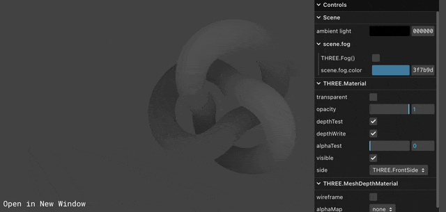
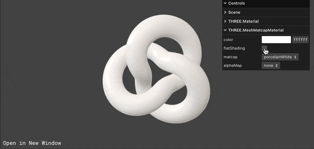
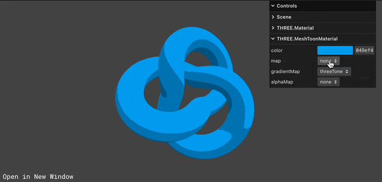

## 🎓 강의를 기반으로 학습하는 과정입니다

> R3F 에대한 강의로 3D 웹 개발에 대하여 입문과정을 알려준다

[](https://www.youtube.com/watch?v=Sg6OcVxe64k&list=PLe6NQuuFBu7HUeJkowKRkLWwkdOlhwrje&index=7)

## 📔 Core

### 📝 EventDispatcher

이벤트를 관리하는 용도로 사용된다

#### 🍝 Code(EventDispatcher)

```js
class EventDispatcher {

    addEventListener( type, listener ) { }

    hasEventListener( type, listener ) { }

    removeEventListener( type, listener ) { }

    dispatchEvent( event ) { }

}

export { EventDispatcher };
```

#### 🪄 Method(EventDispatcher)

| Method | Props | Return | Note |
| :-- | :-- | :-- | :-- |
| addEventListener | ( type : String, listener : Function ) | undefined | type - 리스닝할 이벤트의 타입입니다. listener - 이벤트가 작동하면 호출될 함수입니다. |
| hasEventListener | ( type : String, listener : Function ) | Boolean | type - 리스닝할 이벤트의 타입입니다. listener - 이벤트가 작동하면 호출될 함수입니다. |
| removeEventListener | ( type : String, listener : Function ) | undefined | type - 제거될 리스너의 타입입니다. listener - 제거될 리스너 함수입니다. |
| dispatchEvent | ( event : Object ) | undefined | event - 작동하는 이벤트입니다. |

<details>
<summary>🚀 참고 사이트</summary>

---

| Three.js 공식 사이트 | Three.js 깃허브|
| :--: | :--: |
| [](https://threejs.org/docs/index.html#api/en/core/EventDispatcher) | [](https://github.com/mrdoob/three.js/blob/master/src/core/EventDispatcher.js) |
|🔗 Link : <https://threejs.org/docs/index.html#api/en/core/EventDispatcher> | 🔗 Link : <https://github.com/mrdoob/three.js/blob/master/src/core/EventDispatcher.js> |

</details>

### 📝 Material

> [!NOTE]  
> 모든 Material에 부모클레스로 존제한다.  
> 통합적인 Material를 관리하는 용도로 사용된다.

#### 🍝 Code(Material)

```js
import { EventDispatcher } from '../core/EventDispatcher.js';
import { FrontSide, NormalBlending, LessEqualDepth, AddEquation, OneMinusSrcAlphaFactor, SrcAlphaFactor, AlwaysStencilFunc, KeepStencilOp } from '../constants.js';
import * as MathUtils from '../math/MathUtils.js';

let _materialId = 0;

class Material extends EventDispatcher {

    constructor() {

        super();

        this.isMaterial = true;

        Object.defineProperty( this, 'id', { value: _materialId ++ } );

        this.uuid = MathUtils.generateUUID();

        this.name = '';
        this.type = 'Material';

        this.blending = NormalBlending;
        this.side = FrontSide;
        this.vertexColors = false;

        this.opacity = 1;
        this.transparent = false;
        this.alphaHash = false;

        this.blendSrc = SrcAlphaFactor;
        this.blendDst = OneMinusSrcAlphaFactor;
        this.blendEquation = AddEquation;
        this.blendSrcAlpha = null;
        this.blendDstAlpha = null;
        this.blendEquationAlpha = null;

        this.depthFunc = LessEqualDepth;
        this.depthTest = true;
        this.depthWrite = true;

        this.stencilWriteMask = 0xff;
        this.stencilFunc = AlwaysStencilFunc;
        this.stencilRef = 0;
        this.stencilFuncMask = 0xff;
        this.stencilFail = KeepStencilOp;
        this.stencilZFail = KeepStencilOp;
        this.stencilZPass = KeepStencilOp;
        this.stencilWrite = false;

        this.clippingPlanes = null;
        this.clipIntersection = false;
        this.clipShadows = false;

        this.shadowSide = null;

        this.colorWrite = true;

        this.precision = null; // override the renderer's default precision for this material

        this.polygonOffset = false;
        this.polygonOffsetFactor = 0;
        this.polygonOffsetUnits = 0;

        this.dithering = false;

        this.alphaToCoverage = false;
        this.premultipliedAlpha = false;
        this.forceSinglePass = false;

        this.visible = true;

        this.toneMapped = true;

        this.userData = {};

        this.version = 0;

        this._alphaTest = 0;

    }

    get alphaTest() { }
    set alphaTest( value ) { }
    onBuild( /* shaderobject, renderer */ ) { }
    onBeforeRender( /* renderer, scene, camera, geometry, object, group */ ) { }
    onBeforeCompile( /* shaderobject, renderer */ ) { }
    customProgramCacheKey() { }
    setValues( values ) { }
    toJSON( meta ) { }
    clone() { }
    copy( source ) { }
    dispose() { }
    set needsUpdate( value ) { }
}

export { Material };
```

#### 🎩 Properties(Material)

| Property | Type | Note |
| :-- | :-- | :-- |
| alphaHash | Boolean | .transparent 또는 .alphaTest 대신 알파 해시 투명도를 활성화합니다. 불투명도가 임의 임계값보다 낮으면 재질이 렌더링되지 않습니다. 무작위화에서는 약간의 입자나 노이즈가 발생하지만 관련 정렬 문제 없이 알파 블렌딩에 근접합니다. TAARenderPass를 사용하면 노이즈를 줄일 수 있습니다. |
| alphaTest | Float | 알파 테스트를 실행할 때 사용할 알파 값을 설정합니다.불투명도가 이 값보다 낮으면 재질이 렌더링되지 않습니다. 기본값은 0 입니다. |
| alphaToCoverage | Boolean | 적용 범위에 대한 알파를 활성화합니다. MSAA-enabled 컨텍스트에서만 사용 가능 합니다 (antialias 파라미터를 true 상태로 renderer가 생성되었을 때를 의미합니다). 기본값은 false 입니다. |
| blendDst | Integer | 블렌딩 대상. 기본값은 OneMinusSrcAlphaFactor입니다. 가능한 모든 값에 대한 대상 요소 상수를 참조하세요. 효과가 있으려면 재질의 블렌딩을 CustomBlending으로 설정해야 합니다. |
| blendDstAlpha | Integer | .blendDst의 투명도입니다. null인 경우 .blendDst 값을 사용합니다. 기본값은 null입니다. |
| blendEquation | Integer | 블렌딩을 적용할 때 사용할 블렌딩 방정식입니다. 기본값은 AddEquation입니다. 가능한 모든 값은 혼합 방정식 상수를 참조하세요.효과가 있으려면 재질의 블렌딩을 CustomBlending으로 설정해야 합니다. |
| blendEquationAlpha | Integer | .blendEquation의 투명성입니다. null인 경우 .blendEquation 값을 그대로 사용합니다. 기본값은 null입니다.|
| blending | Blending | 이 재질로 개체를 표시할 때 사용할 혼합입니다. 사용자 정의 blendSrc, blendDst 또는 blendEquation를 사용하려면 CustomBlending을 설정해야 합니다. 가능한 모든 값은 혼합 모드 상수를 참조하세요. 기본값은 NormalBlending입니다. |
| blendSrc | Integer | 소스 통합. 기본값은 SrcAlphaFactor입니다. 가능한 모든 값에 대해서는 참조된 소스 상수를 참조하세요. 효과가 있으려면 재질의 블렌딩을 CustomBlending으로 설정해야 합니다. |
| blendSrcAlpha | Integer | .blendSrc의 투명도입니다. null인 경우 .blendSrc 값을 사용합니다. 기본값은 null입니다. |
| clipIntersection | Boolean | 합집합이 아닌 교차점만 잘리도록 평면 자르기의 동작을 변경합니다. 기본값은 false입니다. |
| clippingPlanes | Array | 월드 좌표공간에서 THREE.Plane 객체로 지정된 사용자 정의 클리핑 평면.이러한 평면은 이 재질이 부착된 객체에 적용됩니다. 평면까지의 부호 있는 거리가 음수인 공간의 점은 잘립니다 (렌더링되지 않음). WebGLRenderer가 필요합니다.localClippingEnabled가 true로 설정되었습니다. WebGL / clipping /intersection 예제를 참조하세요. 기본값은 null입니다. |
| clipShadows | Boolean | 이 재질에 지정된 클리핑 평면에 따라 그림자를 클리핑할지 여부를 정의합니다. 기본값은 false입니다. |
| colorWrite | Boolean |재질의 색상을 렌더링할지 여부입니다. 이는 메쉬의 renderOrder 속성과 함께 사용되어 다른 개체를 가리는 보이지 않는 개체를 만들 수 있습니다. 기본값은 true입니다. |
| defines | Object | shader가 defines에 적용되도록 커스텀 합니다. 이는 키/값 쌍과 함께 고정 객체 형태로 전달됩니다. { MY_CUSTOM_DEFINE: '' , PI2: Math.PI * 2 }.  쌍은 vertex 와 fragment shaders 모두에게 정의됩니다. 기본값은 정의되지 않았습니다. |
| depthFunc | Integer | 어떤 depth 함수를 사용할지. 기본값은 LessEqualDepth입니다. 가능한 모든 값은 depth mode 상수를 참조하세요.. |
| depthTest | Boolean | 이 머티리얼을 렌더링할 때 depth 테스트를 활성화할지 여부입니다. 기본값은 true입니다. |
| depthWrite | Boolean | 이 재질을 렌더링하는 것이 깊이 버퍼에 영향을 미치는지 여부. 기본값은 true입니다. |
| forceSinglePass | Boolean | 양면 투명 개체를 단일 패스로 렌더링해야 하는지 여부. 기본값은 false입니다. |
| isMaterial | Boolean | 주어진 객체가 Material 유형인지 확인하는 읽기 전용 플래그입니다. |
| stencilWrite | Boolean | 스텐실(생성 틀) 버퍼에 대해 스텐실 작업이 수행되는지 여부입니다. 스텐실 버퍼에 대해 쓰기 또는 비교를 수행하려면 이 값이 true여야 합니다. 기본값은 false입니다. |
| stencilWriteMask | Integer | 스텐실 버퍼에 쓸 때 사용할 비트 마스크입니다. 기본값은 0xFF입니다. |
| stencilFunc | Integer | 사용할 스텐실 비교 기능입니다. 기본값은 AlwaysStencilFunc입니다. 가능한 모든 값은 스텐실 함수 상수를 참조하세요. |
| stencilRef | Integer | 스텐실 비교 또는 스텐실 작업을 수행할 때 사용할 값입니다. 기본값은 0입니다. |
| stencilFuncMask | Integer | 스텐실 버퍼와 비교할 때 사용할 비트 마스크입니다. 기본값은 0xFF입니다. |
| stencilFail | Integer | 비교 함수가 false를 반환할 때 수행할 스텐실 작업입니다. 기본값은 KeepStencilOp입니다. 가능한 모든 값은 스텐실 작업 상수를 참조하세요. |
| stencilZFail | Integer | 비교 함수가 true를 반환하지만 깊이 테스트가 실패하는 경우 수행할 스텐실 작업입니다. 기본값은 KeepStencilOp입니다. 가능한 모든 값은 스텐실 작업 상수를 참조하세요. |
| stencilZPass | Integer | 비교 함수가 true를 반환하고 깊이 테스트가 통과할 때 수행할 스텐실 작업입니다. 기본값은 KeepStencilOp입니다. 가능한 모든 값은 스텐실 작업 상수를 참조하세요. |
| id | Integer | 이 머티리얼 인스턴스의 고유 번호입니다.|
| name | String | 개체의 선택적 이름입니다(고유할 필요는 없음). 기본값은 빈 문자열입니다. |
| needsUpdate | Boolean | 재질을 다시 컴파일해야 함을 지정합니다. |
| opacity | Float | 재질의 투명도를 나타내는 0.0 - 1.0 범위의 부동 소수점입니다. 값이 0.0이면 완전히 투명하고, 1.0이면 완전히 불투명합니다. 제질의 transparent가 true로 설정되지 않은 경우, 재질은 완전히 불투명한 상태로 유지되며 이 값은 색상에만 영향을 미칩니다. 기본값은 1.0입니다. |
| polygonOffset | Boolean | 폴리곤 오프셋 사용 여부. 기본값은 false입니다. 이는 GL_POLYGON_OFFSET_FILL WebGL 기능에 해당합니다. |
| polygonOffsetFactor | Integer | 폴리곤 오프셋 계수를 설정합니다. 기본값은 0입니다. |
| polygonOffsetUnits | Integer | 폴리곤 오프셋 단위를 설정합니다. 기본값은 0입니다. |
| precision | String | 이 재질에 대한 렌더러의 기본 정밀도를 재정의합니다. "높음", "중간" 또는 "낮음"일 수 있습니다. 기본값은 null입니다. |
| premultipliedAlpha | Boolean | 알파(투명도) 값을 미리 곱할지 여부입니다. 차이점의 예는 WebGL / Materials / Physical / Transmission을 참조하세요. 기본값은 false입니다. |
| dithering | Boolean | 밴딩 모양을 제거하기 위해 색상에 디더링을 적용할지 여부입니다. 기본값은 false입니다. |
| shadowSide | Integer | 그림자를 투사하는 면의 측면을 정의합니다. 설정되면 THREE.FrontSide, THREE.BackSide 또는 THREE.DoubleSide가 될 수 있습니다. 기본값은 null입니다. null 인 경우 측면 투사 그림자는 다음과 같이 결정됩니다.  { Material.side, Side casting shadows } = { THREE.FrontSide : back side, THREE.BackSide : front side, THREE.DoubleSide : both sides} |
 side | Integer | front, back 또는 둘 다 중 렌더링할 면을 정의합니다. 기본값은 THREE.FrontSide 입니다. 다른 옵션은 THREE.BackSide 또는 THREE.DoubleSide 입니다. |
| toneMapped | Boolean | 렌더러의 톤 매핑 설정에 따라 이 재질이 톤 매핑되는지 여부를 정의합니다. 기본값은 true입니다. |
| transparent | Boolean | 이 재질이 투명한지 여부를 정의합니다. 투명 객체는 특별한 처리가 필요하고 불투명 객체 다음에 렌더링되므로 이는 렌더링에 영향을 미칩니다. true로 설정하면 불투명도 속성을 설정하여 재질이 투명한 정도가 제어됩니다. 기본값은 false입니다. |
| type | String | 값은 'Material' 문자열입니다. 이는 변경되어서는 안 되며 장면에서 이 유형의 모든 개체를 찾는 데 사용할 수 있습니다. |
| uuid | String | 이 머티리얼 인스턴스의 UUID입니다. 자동으로 할당되므로 편집하면 안 됩니다. |
| version | Integer | 이는 0부터 시작하여 .needsUpdate가 true로 설정된 횟수를 계산합니다. |
| vertexColors | Boolean | 정점 색상 지정이 사용되는지 여부를 정의합니다. 기본값은 false입니다. 엔진은 3개(RGB) 또는 4개(RGBA) 구성요소 색상 버퍼 속성이 사용되는지 여부에 따라 RGB 및 RGBA 정점 색상을 지원합니다. |
| visible | Boolean | 이 재질이 표시되는지 여부를 정의합니다. 기본값은 true입니다. |
| userData | Object | 머티리얼에 대한 사용자 정의 데이터를 저장하는 데 사용할 수 있는 객체입니다. 함수는 복제되지 않으므로 함수에 대한 참조를 보유하면 안 됩니다. 기본값은 빈 Object {}입니다. |

#### 🪄 Method(Material)

| Method | Props | Return | Note |
| :-- | :-- | :-- | :-- |
| clone | ( ) | Material | 이 재질과 동일한 매개변수를 가진 새 재질을 반환합니다. |
| copy | ( material : material ) | this | 전달된 material의 매개변수를 이 material에 복사합니다. |
| dispose | ( ) | undefined | 이 인스턴스에서 할당한 GPU 관련 리소스를 해제합니다. 이 인스턴스가 앱에서 더 이상 사용되지 않을 때마다 이 메서드를 호출하세요. 머티리얼 텍스처는 Texture의 dispose() 메서드를 통해 삭제해야 합니다. |
| onBeforeCompile | ( shader : Shader, renderer : WebGLRenderer ) | undefined | shader 프로그램이 컴파일되기 직전에 실행되는 선택적 콜백입니다. 이 함수는 shader 소스 코드를 매개변수로 사용하여 호출됩니다. 내장된 재질을 수정하는 데 유용합니다. 속성과 달리 콜백은 .clone(), .copy() 및 .toJSON()에서 지원되지 않습니다. |
| customProgramCacheKey | ( ) | String | onBeforeCompile을 사용하는 경우 이 콜백을 사용하여 onBeforeCompile에 사용된 설정 값을 식별할 수 있으므로 three.js는 필요에 따라 캐시된 shader를 재사용하거나 이 자료에 대한 shader를 다시 컴파일할 수 있습니다. 속성과 달리 콜백은 .clone(), .copy() 및 .toJSON()에서 지원되지 않습니다. |
| setValues | ( values : Object ) | undefined | 값 - 매개변수가 포함된 컨테이너입니다. 값을 기반으로 속성을 설정합니다. |

<details>
<summary>🚀 참고 사이트</summary>

---

| Three.js 공식 사이트 | Three.js 깃허브|
| :--: | :--: |
| [](https://threejs.org/docs/#api/en/materials/Material) | [](https://github.com/mrdoob/three.js/blob/master/src/materials/Material.js) |
|🔗 Link : <https://threejs.org/docs/#api/en/materials/Material> | 🔗 Link : <https://github.com/mrdoob/three.js/blob/master/src/materials/Material.js> |

</details>

## 📔 Material 종류

| 명칭 | 모양 | 이미지 |
| :-- | :-- | :-- |
| [LineBasicMaterial](#📝-linebasicmaterial) | 라인 베이직 물체(제질) |  |
| [LineDashedMaterial](#📝-linedashedmaterial) | 라인 Dashed 물체(제질) |  |
| [MeshBasicMaterial](#📝-meshbasicmaterial) | 기본 물체(제질) |  |
| [MeshDepthMaterial](#📝-meshdepthmaterial) | 깊이에 따른 물체(제질) |  |
| [MeshDistanceMaterial](#📝-meshdistancematerial) | 투영 물체(제질) |  |
| [MeshLambertMaterial](#📝-meshlambertmaterial) | 각도에 따른 빛 난반사 표현 물체(제질) |  |
| [MeshMatcapMaterial](#📝-meshmatcapmaterial) | Material Capture 물체(제질) |  |
| [MeshNormalMaterial](#📝-meshnormalmaterial) | 기본 특징 물체(제질) |  |
| [MeshPhongMaterial](#📝-meshphongmaterial) | 빛 반사 표현의 물체(제질) |  |
| [MeshPhysicalMaterial](#📝-meshphysicalmaterial) | 전문가용 제질 물체(제질) |  |
| [MeshStandardMaterial](#📝-meshstandardmaterial) | 기본적 기능의 물체(제질) |  |
| [MeshToonMaterial](#📝-meshtoonmaterial) | 툰 느낌 물체(제질) |  |
| [PointsMaterial](#📝-pointsmaterial) | 꼭지점 물체(제질) |  |
| [RawShaderMaterial](#📝-rawshadermaterial) | 아직 밝혀지지 않음 물체(제질) |  |
| [ShaderMaterial](#📝-shadermaterial) | 쉐이더에 따라만드는? 물체(제질) |  |
| [ShadowMaterial](#📝-shadowmaterial) | 그림자 물체(제질)  |  |
| [SpriteMaterial](#📝-spritematerial) | 사이다? 물체(제질)  |  |

> [!NOTE]  
> 생성자 parameters의 경우 동일하게 Material를 따른다.

### 📝 LineBasicMaterial
>
> 라인 베이직 물체(제질)

### 👀 Preview(LineBasicMaterial)


#### 🎩 Properties(LineBasicMaterial)

| Property | Type | Note |
| :-- | :-- | :-- |
| color | Color | 재질의 색상은 기본적으로 흰색(0xffffff)으로 설정됩니다. |
| fog | Boolean | 재질이 안개의 영향을 받는지 여부입니다. 기본값은 true입니다. |
| linewidth | Float | 선 두께를 제어합니다. 기본값은 1입니다. (대부분의 플랫폼에서 WebGL 렌더러를 사용하는 OpenGL Core Profile의 제한으로 인해 선폭은 설정된 값에 관계없이 항상 1입니다.) |
| linecap | String | 선 끝의 모양을 정의합니다. 가능한 값은 'butt', 'round', 'square'입니다. 기본값은 'round'입니다. (이는 2D 캔버스 lineCap 속성에 해당하며 WebGL 렌더러에서는 무시됩니다.) |
| linejoin | String | 라인 조인트의 모양을 정의합니다. 가능한 값은 'round', 'bevel' 및 'miter'입니다. 기본값은 'round'입니다. (이는 2D Canvas lineJoin 속성에 해당하며 WebGL 렌더러에서는 무시됩니다.) |
| map | Texture | 텍스처의 데이터를 사용하여 선의 색상을 설정합니다. |

### 📝 LineDashedMaterial
>
> 라인 Dashed 물체(제질)

### 👀 Preview(LineDashedMaterial)


#### 🎩 Properties(LineDashedMaterial)

| Property | Type | Note |
| :-- | :-- | :-- |
| dashSize | number | 대시의 크기입니다. 이것은 스트로크와의 간격입니다. 기본값은 3입니다. |
| gapSize | number | 간격의 크기. 기본값은 1입니다.|
| isLineDashedMaterial | Boolean | 주어진 객체가 LineDashedMaterial 유형인지 확인하는 읽기 전용 플래그입니다. |
| scale | number | 선의 점선 부분의 크기입니다. 기본값은 1입니다. |

### 📝 MeshBasicMaterial
>
> 기본 물체(제질)

### 👀 Preview(MeshBasicMaterial)


#### 🎩 Properties(MeshBasicMaterial)

| Property | Type | Note |
| :-- | :-- | :-- |
| alphaMap | Texture | 알파 맵은 표면 전체의 불투명도를 제어하는 ​​회색조 텍스처입니다. (black: 완전히 투명; white: 완전 불투명). 기본값은 null입니다. |
| aoMap | Texture | 이 텍스처의 빨간색 채널은 주변 폐색 맵으로 사용됩니다. 기본값은 null입니다. aoMap에는 두 번째 UVs 세트가 필요합니다. |
| aoMapIntensity | Float | 주변 폐색 효과의 강도입니다. 기본값은 1입니다. 0은 폐색 효과가 없음을 의미합니다. |
| color | Color | 재질의 색상은 기본적으로 흰색(0xffffff)으로 설정됩니다. |
| combine | Integer | 표면 색상의 결과를 환경 맵과 결합하는 방법, 결합할 수 있는 경우. 옵션은 THREE.MultiplyOperation(기본값), THREE.MixOperation, THREE.AddOperation입니다. 혼합을 선택한 경우 .reflectivity를 사용하여 두 색상을 혼합합니다. |
| envMap | Texture | 환경 맵입니다. 기본값은 null입니다. |
| fog | Boolean | 재질이 안개의 영향을 받는지 여부입니다. 기본값은 true입니다. |
| lightMap | Texture | 라이트맵입니다. 기본값은 null입니다. lightMap에는 두 번째 UVs 세트가 필요합니다. |
| lightMapIntensity | Float | 빛 영향의 세기? 기본값은 1입니다. |
| map | Texture | 컬러맵입니다. 일반적으로 .transparent 또는 .alphaTest와 결합된 알파 채널을 선택적으로 포함할 수 있습니다. 기본값은 null입니다. |
| reflectivity | Float | 환경 맵이 표면에 얼마나 영향을 미치는지 그리고 .combine 도 확인한다. 기본값은 1이고 유효한 범위는 0(반사 없음)과 1(완전 반사) 사이입니다. |
| refractionRatio | Float | 공기의 굴절률(IOR)(약 1)을 물체의 굴절률로 나눈 값입니다. 환경 매핑 모드 THREE.CubeRefractionMapping 및 THREE.EquirectangularRefractionMapping과 함께 사용됩니다. 굴절률은 1을 초과하면 안 됩니다. 기본값은 0.98입니다. |
| specularMap | Texture | 재질에 사용되는 반사 맵입니다. 기본값은 null입니다. |
| wireframe | Boolean | 형상을 wireframe으로 렌더링합니다. 기본값은 false입니다(즉, 직선의 다각형으로 렌더링). |
| wireframeLinecap | String | 선 끝의 모양을 정의합니다. 가능한 값은 'butt', 'round', 'square'입니다. 기본값은 'round'입니다. (이는 2D 캔버스 lineCap 속성에 해당하며 WebGL 렌더러에서는 무시됩니다.) |
| wireframeLinejoin | String | 라인 조인트의 모양을 정의합니다. 가능한 값은 "round", "bevel" 및 "miter"입니다. 기본값은 'round'입니다. (이는 2D Canvas lineJoin 속성에 해당하며 WebGL 렌더러에서는 무시됩니다.) |
| wireframeLinewidth | Float | wireframe 두께를 제어합니다. 기본값은 1입니다. (대부분의 플랫폼에서 WebGL 렌더러를 사용하는 OpenGL Core Profile의 제한으로 인해 선폭은 설정된 값에 관계없이 항상 1입니다.) |

### 📝 MeshDepthMaterial
>
> 깊이에 따른 물체(제질)

### 👀 Preview(test)


#### 🎩 Properties(MeshDepthMaterial)

| Property | Type | Note |
| :-- | :-- | :-- |
| alphaMap | Texture | 알파 맵은 표면 전체의 불투명도를 제어하는 ​​회색조 텍스처입니다. (black: 완전히 투명; white: 완전 불투명). 기본값은 null입니다. |
| depthPacking | Constant | 깊이 상호작용을 위한 유형입니다. 기본값은 BasicDepthPacking입니다. |
| displacementMap | Texture | displacement map은 메시의 최대치 위치에 영향을 미칩니다. 재질의 명암에만 영향을 미치는 다른 맵과 달리 재배치된 최대치는 그림자를 투사하고 다른 객체를 차단하며 실제 형상처럼 작동할 수 있습니다. 변위 텍스처는 각 픽셀의 값(흰색이 가장 높음)이 메시의 최대치에 매핑되고 위치가 변경되는 이미지입니다. |
| displacementScale | Float | displacement map이 메시에 미치는 영향 (검은색은 변위가 없으며 흰색은 최대 변위입니다). 변위맵을 설정하지 않은 경우에는 이 값이 적용되지 않습니다. 기본값은 1입니다.|
| displacementBias | Float | 메쉬 최대치에 대한 displacement map 값의 오프셋입니다. displacement map을 설정하지 않은 경우에는 이 값이 적용되지 않습니다. 기본값은 0입니다. |
| fog | Boolean | 재질이 안개의 영향을 받는지 여부입니다. 기본값은 false입니다. |
| map | Texture | 컬러맵입니다. 일반적으로 .transparent 또는 .alphaTest와 결합된 알파 채널을 선택적으로 포함할 수 있습니다. 기본값은 null입니다. |
| wireframe | Boolean | 형상을 wireframe으로 렌더링합니다. 기본값은 false입니다(즉, 직선의 다각형으로 렌더링). |
| wireframeLinewidth | Float | wireframe 두께를 제어합니다. 기본값은 1입니다. (대부분의 플랫폼에서 WebGL 렌더러를 사용하는 OpenGL Core Profile의 제한으로 인해 선폭은 설정된 값에 관계없이 항상 1입니다.) |

### 📝 MeshDistanceMaterial
>
> 투영 물체(제질)

### 👀 Preview(MeshDistanceMaterial)


#### 🎩 Properties(MeshDistanceMaterial)

| Property | Type | Note |
| :-- | :-- | :-- |
| alphaMap | Texture | 알파 맵은 표면 전체의 불투명도를 제어하는 ​​회색조 텍스처입니다. (black: 완전히 투명; white: 완전 불투명). 기본값은 null입니다. |
| displacementMap | Texture | displacement map은 메시의 최대치 위치에 영향을 미칩니다. 재질의 명암에만 영향을 미치는 다른 맵과 달리 재배치된 최대치는 그림자를 투사하고 다른 객체를 차단하며 실제 형상처럼 작동할 수 있습니다. 변위 텍스처는 각 픽셀의 값(흰색이 가장 높음)이 메시의 최대치에 매핑되고 위치가 변경되는 이미지입니다. |
| displacementScale | Float | displacement map이 메시에 미치는 영향 (검은색은 변위가 없으며 흰색은 최대 변위입니다). 변위맵을 설정하지 않은 경우에는 이 값이 적용되지 않습니다. 기본값은 1입니다. |
| displacementBias | Float | 메쉬 최대치에 대한 displacement map 값의 오프셋입니다. displacement map을 설정하지 않은 경우에는 이 값이 적용되지 않습니다. 기본값은 0입니다. |
| fog | Boolean | 재질이 안개의 영향을 받는지 여부입니다. 기본값은 false입니다. |
| map | Texture | 컬러맵입니다. 일반적으로 .transparent 또는 .alphaTest와 결합된 알파 채널을 선택적으로 포함할 수 있습니다. 기본값은 null입니다. |

### 📝 MeshLambertMaterial
>
> 각도에 따른 빛 표현 물체(제질)

### 👀 Preview(MeshLambertMaterial)


#### 🎩 Properties(MeshLambertMaterial)

| Property | Type | Note |
| :-- | :-- | :-- |
| alphaMap | Texture | 알파 맵은 표면 전체의 불투명도를 제어하는 ​​회색조 텍스처입니다. (black: 완전히 투명; white: 완전 불투명). 기본값은 null입니다. |
| aoMap | Texture | 이 텍스처의 빨간색 채널은 주변 폐색 맵으로 사용됩니다. 기본값은 null입니다. aoMap에는 두 번째 UVs 세트가 필요합니다. |
| aoMapIntensity | Float | 주변 폐색 효과의 강도입니다. 기본값은 1입니다. 0은 폐색 효과가 없음을 의미합니다. |
| bumpMap | Texture | 범프 맵을 생성하는 텍스처입니다. 흑백 값은 조명과 관련하여 인지된 깊이에 매핑됩니다. 범프는 실제로 물체의 형상에는 영향을 주지 않고 조명에만 영향을 미칩니다. normal map에 정의된 경우 이는 무시됩니다. |
| bumpScale | Float | 범프 맵이 물체에 얼마나 영향을 미치는지. 일반적인 범위는 0-1입니다. 기본값은 1입니다. |
| color | Color | 재질의 색상은 기본적으로 흰색(0xffffff)으로 설정됩니다. |
| combine | Integer | 표면 색상의 결과를 환경 맵과 결합하는 방법, 결합할 수 있는 경우 옵션은 THREE.MultiplyOperation(기본값), THREE.MixOperation, THREE.AddOperation입니다. 혼합을 선택하면 .reflectivity가 두 색상을 혼합하는 데 사용됩니다. |
| displacementMap | Texture | displacement map은 메시의 최대치 위치에 영향을 미칩니다. 재질의 명암에만 영향을 미치는 다른 맵과 달리 재배치된 최대치는 그림자를 투사하고 다른 객체를 차단하며 실제 형상처럼 작동할 수 있습니다. 변위 텍스처는 각 픽셀의 값(흰색이 가장 높음)이 메시의 최대치에 매핑되고 위치가 변경되는 이미지입니다. |
| displacementScale | Float | displacement map이 메시에 미치는 영향 (검은색은 변위가 없으며 흰색은 최대 변위입니다). 변위맵을 설정하지 않은 경우에는 이 값이 적용되지 않습니다. 기본값은 1입니다. |
| displacementBias | Float | 메쉬 최대치에 대한 displacement map 값의 오프셋입니다. displacement map을 설정하지 않은 경우에는 이 값이 적용되지 않습니다. 기본값은 0입니다. |
| emissive | Color | 물체의 발광(빛) 색상으로, 본질적으로 다른 조명의 영향을 받지 않는 단색입니다. 기본값은 black입니다. |
| emissiveMap | Texture | 발광 맵 설정. 기본값은 null입니다. 발광 맵 색상은 발광 색상과 발광 강도에 따라 조정됩니다. 발광 맵이 있는 경우 발광 색상을 검정색이 아닌 다른 색상으로 설정해야 합니다. |
| emissiveIntensity | Float | 발광의 강도. 방출 색상을 조절합니다. 기본값은 1입니다. |
| envMap | Texture | 환경 맵입니다. 기본값은 null입니다. |
| flatShading | Boolean | 물체가 평면 음영 처리로 렌더링되는지 여부를 정의합니다. 기본값은 false입니다. |
| fog | Boolean | 재질이 안개의 영향을 받는지 여부입니다. 기본값은 true입니다. |
| lightMap | Texture | 라이트맵입니다. 기본값은 null입니다. lightMap에는 두 번째 UVs 세트가 필요합니다. |
| lightMapIntensity | Float | 빛 영향의 세기? 기본값은 1입니다. |
| map | Texture | 컬러맵입니다. 일반적으로 .transparent 또는 .alphaTest와 결합된 알파 채널을 선택적으로 포함할 수 있습니다. 기본값은 null입니다. |
| normalMap | Texture | 노멀맵을 생성하기 위한 텍스처입니다. RGB 값은 각 픽셀 조각의 표면 법선에 영향을 미치고 색상이 켜지는 방식을 변경합니다. 노멀 맵은 표면의 실제 모양을 변경하지 않고 조명만 변경합니다. 머티리얼에 왼손 규칙을 사용하여 작성된 노멀 맵이 있는 경우, 다른 방향성을 보상하기 위해 NormalScale의 y 구성요소를 무효화해야 합니다. |
| normalMapType | Integer | 노멀맵의 종류. 옵션은 THREE.TangentSpaceNormalMap(기본값) 및 THREE.ObjectSpaceNormalMap입니다. |
| normalScale | Vector2 | 노멀 맵이 물체에 얼마나 영향을 미치는지입니다. 일반적인 범위는 0-1입니다. 기본값은 Vector2 (1,1) 입니다 |
| reflectivity | Float | 환경 맵이 표면에 얼마나 영향을 미치는지; .combine도 확인한다. |
| refractionRatio | Float | 공기의 굴절률(IOR)(약 1)을 물체의 굴절률로 나눈 값입니다. 환경 매핑 모드 THREE.CubeRefractionMapping 및 THREE.EquirectangularRefractionMapping과 함께 사용됩니다. 굴절률은 1을 초과하면 안 됩니다. 기본값은 0.98입니다. |
| specularMap | Texture | 물체에 사용되는 반사 맵입니다. 기본값은 null입니다. |
| wireframe | Boolean | 형상을 wireframe으로 렌더링합니다. 기본값은 false입니다(즉, 직선의 다각형으로 렌더링). |
| wireframeLinecap | String | 선 끝의 모양을 정의합니다. 가능한 값은 'butt', 'round', 'square'입니다. 기본값은 'round'입니다. (이는 2D 캔버스 lineCap 속성에 해당하며 WebGL 렌더러에서는 무시됩니다.) |
| wireframeLinejoin | String | 라인 조인트의 모양을 정의합니다. 가능한 값은 "round", "bevel" 및 "miter"입니다. 기본값은 'round'입니다. (이는 2D Canvas lineJoin 속성에 해당하며 WebGL 렌더러에서는 무시됩니다.) |
| wireframeLinewidth | Float | wireframe 두께를 제어합니다. 기본값은 1입니다. (대부분의 플랫폼에서 WebGL 렌더러를 사용하는 OpenGL Core Profile의 제한으로 인해 선폭은 설정된 값에 관계없이 항상 1입니다.) |

### 📝 MeshMatcapMaterial
>
> Material Capture 물체(제질)

### 🚀 유용한 링크

| 이름 | 링크 | 미리보기 |
| :-- | :-- | :-- |
| Matcaps github | <https://github.com/nidorx/matcaps> | [](https://github.com/nidorx/matcaps) |

### 👀 Preview(MeshMatcapMaterial)


#### 🎩 Properties(MeshMatcapMaterial)

| Property | Type | Note |
| :-- | :-- | :-- |
| alphaMap | Texture | 알파 맵은 표면 전체의 불투명도를 제어하는 ​​회색조 텍스처입니다. (black: 완전히 투명; white: 완전 불투명). 기본값은 null입니다. |
| bumpMap | Texture | 범프 맵을 생성하는 텍스처입니다. 흑백 값은 조명과 관련하여 인지된 깊이에 매핑됩니다. 범프는 실제로 물체의 형상에는 영향을 주지 않고 조명에만 영향을 미칩니다. normal map에 정의된 경우 이는 무시됩니다. |
| bumpScale | Float | 범프 맵이 물체에 얼마나 영향을 미치는지. 일반적인 범위는 0-1입니다. 기본값은 1입니다. |
| color | Color | 재질의 색상은 기본적으로 흰색(0xffffff)으로 설정됩니다. |
| displacementMap | Texture | displacement map은 메시의 최대치 위치에 영향을 미칩니다. 재질의 명암에만 영향을 미치는 다른 맵과 달리 재배치된 최대치는 그림자를 투사하고 다른 객체를 차단하며 실제 형상처럼 작동할 수 있습니다. 변위 텍스처는 각 픽셀의 값(흰색이 가장 높음)이 메시의 최대치에 매핑되고 위치가 변경되는 이미지입니다. |
| displacementScale | Float | displacement map이 메시에 미치는 영향 (검은색은 변위가 없으며 흰색은 최대 변위입니다). 변위맵을 설정하지 않은 경우에는 이 값이 적용되지 않습니다. 기본값은 1입니다. |
| displacementBias | Float | 메쉬 최대치에 대한 displacement map 값의 오프셋입니다. displacement map을 설정하지 않은 경우에는 이 값이 적용되지 않습니다. 기본값은 0입니다. |
| flatShading | Boolean | 물체가 평면 음영 처리로 렌더링되는지 여부를 정의합니다. 기본값은 false입니다. |
| fog | Boolean | 재질이 안개의 영향을 받는지 여부입니다. 기본값은 true입니다. |
| map | Texture | 컬러맵입니다. 일반적으로 .transparent 또는 .alphaTest와 결합된 알파 채널을 선택적으로 포함할 수 있습니다. 기본값은 null입니다. 텍스처 맵 색상은 확산 색상에 의해 변조됩니다. |
| matcap | Texture | The matcap map. Default is null. |
| normalMap | Texture | 노멀맵을 생성하기 위한 텍스처입니다. RGB 값은 각 픽셀 조각의 표면 법선에 영향을 미치고 색상이 켜지는 방식을 변경합니다. 노멀 맵은 표면의 실제 모양을 변경하지 않고 조명만 변경합니다. 머티리얼에 왼손 규칙을 사용하여 작성된 노멀 맵이 있는 경우, 다른 방향성을 보상하기 위해 NormalScale의 y 구성요소를 무효화해야 합니다. |
| normalMapType | Integer | 노멀맵의 종류. 옵션은 THREE.TangentSpaceNormalMap(기본값) 및 THREE.ObjectSpaceNormalMap입니다. |
| normalScale | Vector2 | 노멀 맵이 material에 얼마나 영향을 미치는지입니다. 일반적인 범위는 0-1입니다. 기본값은 Vector2 (1,1) 입니다 |

### 📝 MeshNormalMaterial
>
> 기본 특징 물체(제질)

### 👀 Preview(MeshNormalMaterial)


#### 🎩 Properties(MeshNormalMaterial)

| Property | Type | Note |
| :-- | :-- | :-- |
| bumpMap | Texture | 범프 맵을 생성하는 텍스처입니다. 흑백 값은 조명과 관련하여 인지된 깊이에 매핑됩니다. 범프는 실제로 물체의 형상에는 영향을 주지 않고 조명에만 영향을 미칩니다. normal map에 정의된 경우 이는 무시됩니다. |
| bumpScale | Float | 범프 맵이 물체에 얼마나 영향을 미치는지. 일반적인 범위는 0-1입니다. 기본값은 1입니다. |
| displacementMap | Texture | displacement map은 메시의 최대치 위치에 영향을 미칩니다. 재질의 명암에만 영향을 미치는 다른 맵과 달리 재배치된 최대치는 그림자를 투사하고 다른 객체를 차단하며 실제 형상처럼 작동할 수 있습니다. 변위 텍스처는 각 픽셀의 값(흰색이 가장 높음)이 메시의 최대치에 매핑되고 위치가 변경되는 이미지입니다. |
| displacementScale | Float | displacement map이 메시에 미치는 영향 (검은색은 변위가 없으며 흰색은 최대 변위입니다). 변위맵을 설정하지 않은 경우에는 이 값이 적용되지 않습니다. 기본값은 1입니다. |
| displacementBias | Float | 메쉬 최대치에 대한 displacement map 값의 오프셋입니다. displacement map을 설정하지 않은 경우에는 이 값이 적용되지 않습니다. 기본값은 0입니다. |
| flatShading | Boolean | 물체가 평면 음영 처리로 렌더링되는지 여부를 정의합니다. 기본값은 false입니다. |
| fog | Boolean | 재질이 안개의 영향을 받는지 여부입니다. 기본값은 false입니다. |
| normalMap | Texture | 노멀맵을 생성하기 위한 텍스처입니다. RGB 값은 각 픽셀 조각의 표면 법선에 영향을 미치고 색상이 켜지는 방식을 변경합니다. 노멀 맵은 표면의 실제 모양을 변경하지 않고 조명만 변경합니다. 머티리얼에 왼손 규칙을 사용하여 작성된 노멀 맵이 있는 경우, 다른 방향성을 보상하기 위해 NormalScale의 y 구성요소를 무효화해야 합니다. |
| normalMapType | Integer | 노멀맵의 종류. 옵션은 THREE.TangentSpaceNormalMap(기본값) 및 THREE.ObjectSpaceNormalMap입니다. |
| normalScale | Vector2 | 노멀 맵이 material에 얼마나 영향을 미치는지입니다. 일반적인 범위는 0-1입니다. 기본값은 Vector2 (1,1) 입니다 |
| wireframe | Boolean | 형상을 wireframe으로 렌더링합니다. 기본값은 false입니다(즉, 직선의 다각형으로 렌더링). |
| wireframeLinewidth | Float | wireframe 두께를 제어합니다. 기본값은 1입니다. (대부분의 플랫폼에서 WebGL 렌더러를 사용하는 OpenGL Core Profile의 제한으로 인해 선폭은 설정된 값에 관계없이 항상 1입니다.) |

### 📝 MeshPhongMaterial
>
> 빛 반사 표현의 물체(제질)
> 반사 방법은 Global Illumination 방식을 사용한다

### 👀 Preview(MeshPhongMaterial)


#### 🎩 Properties(MeshPhongMaterial)

| Property | Type | Note |
| :-- | :-- | :-- |
| alphaMap | Texture | 알파 맵은 표면 전체의 불투명도를 제어하는 ​​회색조 텍스처입니다. (black: 완전히 투명; white: 완전 불투명). 기본값은 null입니다. |
| aoMap | Texture | 이 텍스처의 빨간색 채널은 주변 폐색 맵으로 사용됩니다. 기본값은 null입니다. aoMap에는 두 번째 UVs 세트가 필요합니다. |
| aoMapIntensity | Float | 주변 폐색 효과의 강도입니다. 기본값은 1입니다. 0은 폐색 효과가 없음을 의미합니다. |
| bumpMap | Texture | 범프 맵을 생성하는 텍스처입니다. 흑백 값은 조명과 관련하여 인지된 깊이에 매핑됩니다. 범프는 실제로 물체의 형상에는 영향을 주지 않고 조명에만 영향을 미칩니다. normal map에 정의된 경우 이는 무시됩니다. |
| bumpScale | Float | 범프 맵이 물체에 얼마나 영향을 미치는지. 일반적인 범위는 0-1입니다. 기본값은 1입니다. |
| color | Color | 재질의 색상은 기본적으로 흰색(0xffffff)으로 설정됩니다. |
| combine | Integer | 표면 색상의 결과를 환경 맵과 결합하는 방법, 결합할 수 있는 경우. 옵션은 THREE.MultiplyOperation(기본값), THREE.MixOperation, THREE.AddOperation입니다. 혼합을 선택한 경우 .reflectivity를 사용하여 두 색상을 혼합합니다. |
| displacementMap | Texture | displacement map은 메시의 최대치 위치에 영향을 미칩니다. 재질의 명암에만 영향을 미치는 다른 맵과 달리 재배치된 최대치는 그림자를 투사하고 다른 객체를 차단하며 실제 형상처럼 작동할 수 있습니다. 변위 텍스처는 각 픽셀의 값(흰색이 가장 높음)이 메시의 최대치에 매핑되고 위치가 변경되는 이미지입니다. |
| displacementScale | Float | displacement map이 메시에 미치는 영향 (검은색은 변위가 없으며 흰색은 최대 변위입니다). 변위맵을 설정하지 않은 경우에는 이 값이 적용되지 않습니다. 기본값은 1입니다. |
| displacementBias | Float | 메쉬 최대치에 대한 displacement map 값의 오프셋입니다. displacement map을 설정하지 않은 경우에는 이 값이 적용되지 않습니다. 기본값은 0입니다. |
| emissive | Color | 물체의 발광(빛) 색상으로, 본질적으로 다른 조명의 영향을 받지 않는 단색입니다. 기본값은 black입니다. |
| emissiveMap | Texture | 발광 맵 설정. 기본값은 null입니다. 발광 맵 색상은 발광 색상과 발광 강도에 따라 조정됩니다. 발광 맵이 있는 경우 발광 색상을 검정색이 아닌 다른 색상으로 설정해야 합니다. |
| emissiveIntensity | Float | 발광의 강도. 방출 색상을 조절합니다. 기본값은 1입니다. |
| envMap | Texture | 환경 맵입니다. 기본값은 null입니다. |
| flatShading | Boolean | 물체가 평면 음영 처리로 렌더링되는지 여부를 정의합니다. 기본값은 false입니다. |
| fog | Boolean | 재질이 안개의 영향을 받는지 여부입니다. 기본값은 true입니다. |
| lightMap | Texture | 라이트맵입니다. 기본값은 null입니다. lightMap에는 두 번째 UVs 세트가 필요합니다. |
| lightMapIntensity | Float | 빛 영향의 세기? 기본값은 1입니다. |
| map | Texture |컬러맵입니다. 일반적으로 .transparent 또는 .alphaTest와 결합된 알파 채널을 선택적으로 포함할 수 있습니다. 기본값은 null입니다. 텍스처 맵 색상은 확산 색상에 의해 변조됩니다. |
| normalMap | Texture | 노멀맵을 생성하기 위한 텍스처입니다. RGB 값은 각 픽셀 조각의 표면 법선에 영향을 미치고 색상이 켜지는 방식을 변경합니다. 노멀 맵은 표면의 실제 모양을 변경하지 않고 조명만 변경합니다. 머티리얼에 왼손 규칙을 사용하여 작성된 노멀 맵이 있는 경우, 다른 방향성을 보상하기 위해 NormalScale의 y 구성요소를 무효화해야 합니다. |
| normalMapType | Integer | 노멀맵의 종류. 옵션은 THREE.TangentSpaceNormalMap(기본값) 및 THREE.ObjectSpaceNormalMap입니다. |
| normalScale | Vector2 | 노멀 맵이 material에 얼마나 영향을 미치는지입니다. 일반적인 범위는 0-1입니다. 기본값은 Vector2 (1,1) 입니다 |
| reflectivity | Float | 환경 맵이 표면에 얼마나 영향을 미치는지 그리고 .combine 도 확인한다. 기본값은 1이고 유효한 범위는 0(반사 없음)과 1(완전 반사) 사이입니다. |
| refractionRatio | Float | 공기의 굴절률(IOR)(약 1)을 물체의 굴절률로 나눈 값입니다. 환경 매핑 모드 THREE.CubeRefractionMapping 및 THREE.EquirectangularRefractionMapping과 함께 사용됩니다. 굴절률은 1을 초과하면 안 됩니다. 기본값은 0.98입니다. |
| shininess | Float | How shiny the .specular highlight is; a higher value gives a sharper highlight. Default is 30. |
| specular | Color | 물체의 반사광 색상. 기본값은 0x111111로 설정된 색상입니다. (아주 어두운 회색). 이는 재료의 광택 정도와 광택 색상을 정의합니다. |
| specularMap | Texture | 반사 맵 값은 반사 표면 하이라이트가 기여하는 정도와 환경 맵이 표면에 영향을 미치는 정도 모두에 영향을 줍니다. 기본값은 null입니다. |
| wireframe | Boolean | 형상을 wireframe으로 렌더링합니다. 기본값은 false입니다(즉, 직선의 다각형으로 렌더링). |
| wireframeLinecap | String | 선 끝의 모양을 정의합니다. 가능한 값은 'butt', 'round', 'square'입니다. 기본값은 'round'입니다. (이는 2D 캔버스 lineCap 속성에 해당하며 WebGL 렌더러에서는 무시됩니다.) |
| wireframeLinejoin | String | 라인 조인트의 모양을 정의합니다. 가능한 값은 "round", "bevel" 및 "miter"입니다. 기본값은 'round'입니다. (이는 2D Canvas lineJoin 속성에 해당하며 WebGL 렌더러에서는 무시됩니다.) |
| wireframeLinewidth | Float | wireframe 두께를 제어합니다. 기본값은 1입니다. (대부분의 플랫폼에서 WebGL 렌더러를 사용하는 OpenGL Core Profile의 제한으로 인해 선폭은 설정된 값에 관계없이 항상 1입니다.) |

### 📝 MeshPhysicalMaterial
>
> 전문가용 제질 물체(제질)
> 다향한 표현을 할 수 있다

### 👀 Preview(MeshPhysicalMaterial)


#### 🎩 Properties(MeshPhysicalMaterial)

| Property | Type | Note |
| :-- | :-- | :-- |
| attenuationColor | Color | 감소 거리에 도달하면 흰색 빛이 흡수되어 변하는 색상입니다. 기본값은 흰색(0xffffff)입니다. |
| attenuationDistance | Float | 빛이 입자와 상호작용하기 전에 매질 내에서 이동하는 평균 거리로 주어진 매질의 밀도입니다. 값은 월드 공간 단위로 제공되며 0보다 커야 합니다. 기본값은 무한대입니다. |
| clearcoat | Float | 코팅 강도를 0.0에서 1.0까지 나타냅니다. 코팅 관련 속성을 사용하면 기본 레이어 위에 얇은 반투명 레이어가 있는 다층 물체를 활성화할 수 있습니다. 기본값은 0.0입니다. |
| clearcoatMap | Texture | 이 텍스처의 The red channel? 은 코팅 강도에 대한 픽셀별 제어를 위해 .clearcoat에 곱해집니다. 기본값은 null입니다. |
| clearcoatNormalMap | Texture | 코팅 레이어에 대해 독립적인 법선을 활성화하는 데 사용할 수 있습니다. 기본값은 null입니다. |
| clearcoatNormalScale | Vector2 | .clearcoatNormalMap이 (0,0)에서 (1,1)까지 코팅 레이어에 영향을 미치는 정도입니다. 기본값은 (1,1)입니다. |
| clearcoatRoughness | Float | 코팅 레이어의 거칠기(0.0~1.0) 기본값은 0.0입니다. |
| clearcoatRoughnessMap | Texture | 코팅의 거칠기에 대한 픽셀별 제어를 위해 이 텍스처의 The green channel?을 .clearcoatRoughness에 곱합니다. 기본값은 null입니다. |
| defines | Object | { 'STANDARD': '', 'PHYSICAL': '' } 형식의 객체입니다. 이는 셰이더를 선택하기 위해 WebGLRenderer에서 사용됩니다. |
| ior | Float | 비금속 재료의 굴절률은 1.0에서 2.333입니다. 기본값은 1.5입니다. |
| reflectivity | Float | 반사도는 0.0에서 1.0까지입니다. 기본값은 0.5이며 이는 굴절률 1.5에 해당합니다. 이는 비금속 재료의 반사율을 모델링합니다. metalness이 1.0이면 효과가 없습니다. |
| iridescence | Float | 표면과 관찰자 사이의 각도에 따라 RGB 색상 변화를 시뮬레이션하는 무지개빛 레이어의 강도(0.0~1.0)입니다. 기본값은 0.0입니다. |
| iridescenceMap | Texture | 이 텍스처의 빨간색 채널은 무지개빛에 대한 픽셀별 제어를 위해 .iridescent에 곱해집니다. 기본값은 null입니다. |
| iridescenceIOR | Float | 굴절률로 표현되는 무지갯빛 RGB 색상 변화 효과의 강도입니다. 1.0에서 2.333 사이. 기본값은 1.3입니다. |
| iridescenceThicknessRange | Array | 무지개 빛깔 레이어의 최소 및 최대 두께를 지정하는 정확히 2개의 요소 배열입니다.무지개 빛깔 레이어의 두께는 .thickness가 .ior에 미치는 것과 동일한 효과를 갖습니다. 기본값은 [100, 400]입니다.iridescentThicknessMap이 정의되지 않은 경우 무지개빛 두께는 지정된 배열의 두 번째 요소만 사용합니다. |
| iridescenceThicknessMap | Texture | the green channel?에 저장된 무지개빛 레이어의 두께를 정의하는 텍스처입니다. 두께의 최소값과 최대값은 .iridescentThicknessRange 배열로 정의됩니다. {the green channel?에서 0.0이면 두께가 배열의 첫 번째 요소와 동일해집니다, the green channel?의 값이 1.0이면 두께가 배열의 두 번째 요소와 동일해집니다, 사이의 값은 배열 요소 사이를 선형으로 보관합니다.} 기본값은 null입니다. |
| sheen | Float | 광택 레이어의 강도(0.0~1.0)입니다. 기본값은 0.0입니다. |
| sheenRoughness | Float | 광택 레이어의 거칠기(0.0~1.0) 기본값은 1.0입니다. |
| sheenRoughnessMap | Texture | 광택 거칠기를 픽셀별로 제어하기 위해 이 텍스처의 알파 채널을 .sheenRoughness에 곱합니다. 기본값은 null입니다. |
| sheenColor | Color | 광택 색조입니다. 기본값은 0x000000, 검정색입니다. |
| sheenColorMap | Texture | 이 텍스처의 RGB 채널은 광택 색조에 대한 픽셀별 제어를 위해 .sheenColor에 대해 곱해집니다. 기본값은 null입니다. |
| specularIntensity | Float | 비금속에 대해서만 정반사의 양을 조정하는 float입니다. 0으로 설정하면 모델은 사실상 Lambertian이 됩니다. 0.0에서 1.0까지. 기본값은 1.0입니다. |
| specularIntensityMap | Texture | 이 텍스처의 알파 채널은 반사 강도에 대한 픽셀별 제어를 위해 .specularIntensity에 대해 곱해집니다. 기본값은 null입니다. |
| specularColor | Color | 비금속에 대해서만 수직 입사 시 정반사에 색조를 주는 색상입니다. 기본값은 0xffffff, 흰색입니다. |
| specularColorMap | Texture | 이 텍스처의 RGB 채널은 반사 색상에 대한 픽셀별 제어를 위해 .specularColor에 대해 곱해집니다. 기본값은 null입니다. |
| thickness | Float | 표면 안쪽의 두께입니다. 값은 메쉬의 좌표 공간에 제공됩니다. 값이 0이면 재료의 벽이 얇습니다. 그렇지 않으면 물체는 값의 두께입니다. 기본값은 0입니다. |
| thicknessMap | Texture | the green channel에 저장된 두께를 정의하는 텍스처입니다. 여기에 .thickness가 곱해집니다. 기본값은 null입니다. |
| transmission | Float | 투광 정도?(또는 광학적 투명성), 0.0에서 1.0까지. 기본값은 0.0입니다. 얇고 투명하거나 반투명한 플라스틱 또는 유리 소재는 완전히 투과하더라도 대부분 반사 상태를 유지합니다. 투과 특성을 사용하여 이러한 재료를 모델링할 수 있습니다. 전송이 0이 아닌 경우 불투명도는 0으로 설정되어야 합니다. |
| transmissionMap | Texture | 이 텍스처의The red channel?은 광학적 투명도에 대한 픽셀별 제어를 위해 .transmission에 곱해집니다. 기본값은 null입니다. |

### 📝 MeshStandardMaterial
>
> 기본적 기능의 물체(제질)

### 👀 Preview(MeshStandardMaterial)


#### 🎩 Properties(MeshStandardMaterial)

| Property | Type | Note |
| :-- | :-- | :-- |
| alphaMap | Texture | 알파 맵은 표면 전체의 불투명도를 제어하는 ​​회색조 텍스처입니다. (black: 완전히 투명; white: 완전 불투명). 기본값은 null입니다. |
| aoMap | Texture | 이 텍스처의 빨간색 채널은 주변 폐색 맵으로 사용됩니다. 기본값은 null입니다. aoMap에는 두 번째 UVs 세트가 필요합니다. |
| aoMapIntensity | Float | 주변 폐색 효과의 강도입니다. 기본값은 1입니다. 0은 폐색 효과가 없음을 의미합니다. |
| bumpMap | Texture | 범프 맵을 생성하는 텍스처입니다. 흑백 값은 조명과 관련하여 인지된 깊이에 매핑됩니다. 범프는 실제로 물체의 형상에는 영향을 주지 않고 조명에만 영향을 미칩니다. normal map에 정의된 경우 이는 무시됩니다. |
| bumpScale | Float | 범프 맵이 물체에 얼마나 영향을 미치는지. 일반적인 범위는 0-1입니다. 기본값은 1입니다. |
| color | Color | 재질의 색상은 기본적으로 흰색(0xffffff)으로 설정됩니다. |
| defines | Object | An object of the form|  | { 'STANDARD': '' }; This is used by the WebGLRenderer for selecting shaders. |
| displacementMap | Texture | displacement map은 메시의 최대치 위치에 영향을 미칩니다. 재질의 명암에만 영향을 미치는 다른 맵과 달리 재배치된 최대치는 그림자를 투사하고 다른 객체를 차단하며 실제 형상처럼 작동할 수 있습니다. 변위 텍스처는 각 픽셀의 값(흰색이 가장 높음)이 메시의 최대치에 매핑되고 위치가 변경되는 이미지입니다. |
| displacementScale | Float | displacement map이 메시에 미치는 영향 (검은색은 변위가 없으며 흰색은 최대 변위입니다). 변위맵을 설정하지 않은 경우에는 이 값이 적용되지 않습니다. 기본값은 1입니다. |
| displacementBias | Float | 메쉬 최대치에 대한 displacement map 값의 오프셋입니다. displacement map을 설정하지 않은 경우에는 이 값이 적용되지 않습니다. 기본값은 0입니다. |
| emissive | Color | 물체의 발광(빛) 색상으로, 본질적으로 다른 조명의 영향을 받지 않는 단색입니다. 기본값은 black입니다. |
| emissiveMap | Texture | 발광 맵 설정. 기본값은 null입니다. 발광 맵 색상은 발광 색상과 발광 강도에 따라 조정됩니다. 발광 맵이 있는 경우 발광 색상을 검정색이 아닌 다른 색상으로 설정해야 합니다. |
| emissiveIntensity | Float | 발광의 강도. 방출 색상을 조절합니다. 기본값은 1입니다. |
| envMap | Texture | 환경 지도입니다. 물리적으로 올바른 렌더링을 보장하려면 PMREMGenerator에서 전처리된 환경 맵만 추가해야 합니다. 기본값은 null입니다. |
| envMapIntensity | Float | 색상을 곱하여 환경 맵의 효과 크기를 조정합니다. |
| flatShading | Boolean | 물체가 평면 음영 처리로 렌더링되는지 여부를 정의합니다. 기본값은 false입니다. |
| fog | Boolean | 재질이 안개의 영향을 받는지 여부입니다. 기본값은 true입니다. |
| isMeshStandardMaterial | Boolean | 주어진 객체가 MeshStandardMaterial 유형인지 확인하는 읽기 전용 플래그입니다. |
| lightMap | Texture | 라이트맵입니다. 기본값은 null입니다. lightMap에는 두 번째 UVs 세트가 필요합니다. |
| lightMapIntensity | Float | 빛 영향의 세기? 기본값은 1입니다. |
| map | Texture |컬러맵입니다. 일반적으로 .transparent 또는 .alphaTest와 결합된 알파 채널을 선택적으로 포함할 수 있습니다. 기본값은 null입니다. 텍스처 맵 색상은 확산 색상에 의해 변조됩니다. |
| metalness | Float | 물체가 금속과 얼마나 유사한지. 나무나 돌과 같은 비금속 재료는 0.0, 금속은 1.0을 사용하며 (보통) 그 사이에는 특별히 사용하지 않습니다. 기본값은 0.0입니다. 녹슨 금속 느낌을 내기 위해 0.0에서 1.0 사이의 값을 사용할 수 있습니다. metalnessMap도 제공되면 두 값이 모두 곱해집니다. |
| metalnessMap | Texture | The blue channel of ?? 이 텍스처는 재료의 금속성을 변경하는 데 사용됩니다. |
| normalMap | Texture | 노멀맵을 생성하기 위한 텍스처입니다. RGB 값은 각 픽셀 조각의 표면 법선에 영향을 미치고 색상이 켜지는 방식을 변경합니다. 노멀 맵은 표면의 실제 모양을 변경하지 않고 조명만 변경합니다. 머티리얼에 왼손 규칙을 사용하여 작성된 노멀 맵이 있는 경우, 다른 방향성을 보상하기 위해 NormalScale의 y 구성요소를 무효화해야 합니다. |
| normalMapType | Integer | 노멀맵의 종류. 옵션은 THREE.TangentSpaceNormalMap(기본값) 및 THREE.ObjectSpaceNormalMap입니다. |
| normalScale | Vector2 | 노멀 맵이 material에 얼마나 영향을 미치는지입니다. 일반적인 범위는 0-1입니다. 기본값은 Vector2 (1,1) 입니다 |
| roughness | Float | 물체가 얼마나 거칠게 나타나는지. 0.0은 매끄러운 거울 반사를 의미하고, 1.0은 완전히 확산됨을 의미합니다. 기본값은 1.0입니다. roughnessMap도 제공되면 두 값이 모두 곱해집니다. |
| roughnessMap | Texture | The green channel of this texture is used to alter the roughness of the material. |
| wireframe | Boolean | 형상을 wireframe으로 렌더링합니다. 기본값은 false입니다(즉, 직선의 다각형으로 렌더링). |
| wireframeLinecap | String | 선 끝의 모양을 정의합니다. 가능한 값은 'butt', 'round', 'square'입니다. 기본값은 'round'입니다. (이는 2D 캔버스 lineCap 속성에 해당하며 WebGL 렌더러에서는 무시됩니다.) |
| wireframeLinejoin | String | 라인 조인트의 모양을 정의합니다. 가능한 값은 "round", "bevel" 및 "miter"입니다. 기본값은 'round'입니다. (이는 2D Canvas lineJoin 속성에 해당하며 WebGL 렌더러에서는 무시됩니다.) |
| wireframeLinewidth | Float | wireframe 두께를 제어합니다. 기본값은 1입니다. (대부분의 플랫폼에서 WebGL 렌더러를 사용하는 OpenGL Core Profile의 제한으로 인해 선폭은 설정된 값에 관계없이 항상 1입니다.) |

### 📝 MeshToonMaterial
>
> 툰 느낌 물체(제질)

### 👀 Preview(MeshToonMaterial)


#### 🎩 Properties(MeshToonMaterial)

| Property | Type | Note |
| :-- | :-- | :-- |
| alphaMap | Texture | 알파 맵은 표면 전체의 불투명도를 제어하는 ​​회색조 텍스처입니다. (black: 완전히 투명; white: 완전 불투명). 기본값은 null입니다. |
| aoMap | Texture | 이 텍스처의 빨간색 채널은 주변 폐색 맵으로 사용됩니다. 기본값은 null입니다. aoMap에는 두 번째 UVs 세트가 필요합니다. |
| aoMapIntensity | Float | 주변 폐색 효과의 강도입니다. 기본값은 1입니다. 0은 폐색 효과가 없음을 의미합니다. |
| bumpMap | Texture | 범프 맵을 생성하는 텍스처입니다. 흑백 값은 조명과 관련하여 인지된 깊이에 매핑됩니다. 범프는 실제로 물체의 형상에는 영향을 주지 않고 조명에만 영향을 미칩니다. normal map에 정의된 경우 이는 무시됩니다. |
| bumpScale | Float | 범프 맵이 물체에 얼마나 영향을 미치는지. 일반적인 범위는 0-1입니다. 기본값은 1입니다. |
| color | Color | 재질의 색상은 기본적으로 흰색(0xffffff)으로 설정됩니다. |
| displacementMap | Texture | displacement map은 메시의 최대치 위치에 영향을 미칩니다. 재질의 명암에만 영향을 미치는 다른 맵과 달리 재배치된 최대치는 그림자를 투사하고 다른 객체를 차단하며 실제 형상처럼 작동할 수 있습니다. 변위 텍스처는 각 픽셀의 값(흰색이 가장 높음)이 메시의 최대치에 매핑되고 위치가 변경되는 이미지입니다. |
| displacementScale | Float | displacement map이 메시에 미치는 영향 (검은색은 변위가 없으며 흰색은 최대 변위입니다). 변위맵을 설정하지 않은 경우에는 이 값이 적용되지 않습니다. 기본값은 1입니다. |
| displacementBias | Float | 메쉬 최대치에 대한 displacement map 값의 오프셋입니다. displacement map을 설정하지 않은 경우에는 이 값이 적용되지 않습니다. 기본값은 0입니다. |
| emissive | Color | 물체의 발광(빛) 색상으로, 본질적으로 다른 조명의 영향을 받지 않는 단색입니다. 기본값은 black입니다. |
| emissiveMap | Texture | 발광 맵 설정. 기본값은 null입니다. 발광 맵 색상은 발광 색상과 발광 강도에 따라 조정됩니다. 발광 맵이 있는 경우 발광 색상을 검정색이 아닌 다른 색상으로 설정해야 합니다. |
| emissiveIntensity | Float | 발광의 강도. 방출 색상을 조절합니다. 기본값은 1입니다. |
| fog | Boolean | 재질이 안개의 영향을 받는지 여부입니다. 기본값은 true입니다. |
| gradientMap | Texture | 툰 셰이딩을 위한 그라디언트 맵입니다. 이러한 유형의 텍스처를 사용할 때는 Texture.minFilter 및 Texture.magFilter를 THREE.NearestFilter로 설정해야 합니다. 기본값은 null입니다. |
| lightMap | Texture | 라이트맵입니다. 기본값은 null입니다. lightMap에는 두 번째 UVs 세트가 필요합니다. |
| lightMapIntensity | Float | 빛 영향의 세기? 기본값은 1입니다. |
| map | Texture |컬러맵입니다. 일반적으로 .transparent 또는 .alphaTest와 결합된 알파 채널을 선택적으로 포함할 수 있습니다. 기본값은 null입니다. 텍스처 맵 색상은 확산 색상에 의해 변조됩니다. |
| normalMap | Texture | 노멀맵을 생성하기 위한 텍스처입니다. RGB 값은 각 픽셀 조각의 표면 법선에 영향을 미치고 색상이 켜지는 방식을 변경합니다. 노멀 맵은 표면의 실제 모양을 변경하지 않고 조명만 변경합니다. 머티리얼에 왼손 규칙을 사용하여 작성된 노멀 맵이 있는 경우, 다른 방향성을 보상하기 위해 NormalScale의 y 구성요소를 무효화해야 합니다. |
| normalMapType | Integer | 노멀맵의 종류. 옵션은 THREE.TangentSpaceNormalMap(기본값) 및 THREE.ObjectSpaceNormalMap입니다. |
| normalScale | Vector2 | 노멀 맵이 material에 얼마나 영향을 미치는지입니다. 일반적인 범위는 0-1입니다. 기본값은 Vector2 (1,1) 입니다 |
| wireframe | Boolean | 형상을 wireframe으로 렌더링합니다. 기본값은 false입니다(즉, 직선의 다각형으로 렌더링). |
| wireframeLinecap | String | 선 끝의 모양을 정의합니다. 가능한 값은 'butt', 'round', 'square'입니다. 기본값은 'round'입니다. (이는 2D 캔버스 lineCap 속성에 해당하며 WebGL 렌더러에서는 무시됩니다.) |
| wireframeLinejoin | String | 라인 조인트의 모양을 정의합니다. 가능한 값은 "round", "bevel" 및 "miter"입니다. 기본값은 'round'입니다. (이는 2D Canvas lineJoin 속성에 해당하며 WebGL 렌더러에서는 무시됩니다.) |
| wireframeLinewidth | Float | wireframe 두께를 제어합니다. 기본값은 1입니다. (대부분의 플랫폼에서 WebGL 렌더러를 사용하는 OpenGL Core Profile의 제한으로 인해 선폭은 설정된 값에 관계없이 항상 1입니다.) |

### 📝 PointsMaterial
>
> 꼭지점 물체(제질)

### 👀 Preview(PointsMaterial)


#### 🎩 Properties(PointsMaterial)

| Property | Type | Note |
| :-- | :-- | :-- |
| alphaMap | Texture | 알파 맵은 표면 전체의 불투명도를 제어하는 ​​회색조 텍스처입니다. (black: 완전히 투명; white: 완전 불투명). 기본값은 null입니다. |
| color | Color | 재질의 색상은 기본적으로 흰색(0xffffff)으로 설정됩니다. |
| fog | Boolean | 재질이 안개의 영향을 받는지 여부입니다. 기본값은 true입니다. |
| map | Texture | 텍스처의 데이터를 사용하여 포인트의 색상을 설정합니다. 일반적으로 .transparent 또는 .alphaTest와 결합된 알파 채널을 선택적으로 포함할 수 있습니다. |
| size | Number | 포인트의 크기를 픽셀 단위로 정의합니다. 기본값은 1.0입니다. 하드웨어 종속 매개변수 gl을 초과하는 경우 제한됩니다.ALIASED_POINT_SIZE_RANGE. |
| sizeAttenuation | Boolean | 포인트의 크기가 카메라 깊이에 의해 감쇠되는지 여부를 지정합니다. (Perspective camera 전용) 기본값은 true입니다. |

### 📝 RawShaderMaterial
>
> 아직 밝혀지지 않음 물체(제질)

### 👀 Preview(RawShaderMaterial)


#### 🎩 Properties(RawShaderMaterial)

>[!WARRING]  
> 공통 속성은 기본 Material 및 ShaderMaterial 클래스를 참조하세요.

### 📝 ShaderMaterial
>
> 쉐이더에 따라만드는? 물체(제질)

### 👀 Preview(ShaderMaterial)


#### 🎩 Properties(ShaderMaterial)

| Property | Type | Note |
| :-- | :-- | :-- |
| clipping | Boolean | 이 재질이 clipping을 지원하는지 여부를 정의합니다. 렌더러가 ClippingPlanes 유니폼을 전달하도록 하려면 true입니다. 기본값은 false입니다. |
| defaultAttributeValues | Object | 렌더링된 형상에는 이러한 속성이 포함되어 있지 않지만 재료에는 포함된 경우 이러한 기본값이 셰이더에 전달됩니다. 이렇게 하면 버퍼 데이터가 누락되었을 때 발생하는 오류를 방지할 수 있습니다. <br>---<br>`this.defaultAttributeValues` = {<br> 'color': [ 1, 1, 1 ],<br>'uv': [ 0, 0 ],<br>'uv1': [ 0, 0 ]<br>};
| defines | Object | `#define` 최대갯수 셰이더와 조각 셰이더 모두에 대해 GLSL 코드 내의 지시문을 사용하여 사용자 정의 상수를 정의합니다. 각 키/값 쌍은 또 다른 지시문을 생성합니다. GLSL 코드의 행을 생성합니다. ?? |
| extensions | Object | 다음 속성을 가진 객체 <br>---<br>`this.extensions` = {<br>derivatives: false, // set to use derivatives <br>fragDepth: false, // set to use fragment depth values<br>drawBuffers: false, // set to use draw buffers<br>shaderTextureLOD: false // set to use<br>shader texture LOD  };
| fog | Boolean | 재료 색상이 전역 안개 설정의 영향을 받는지 여부를 정의합니다. 안개 유니폼을 셰이더에 전달하려면 true입니다. 기본값은 false입니다. |
| fragmentShader | String | 조각 셰이더 GLSL 코드. 이것은 셰이더의 실제 코드입니다. 위의 예에서 vertexShader 및fragmentShader 코드는 DOM에서 추출됩니다. 문자열로 직접 전달하거나 대신 AJAX를 통해 로드할 수 있습니다. |
| glslVersion | String | 사용자 정의 셰이더 코드의 GLSL 버전을 정의합니다. GLSL 3.0 지정 여부를 정의하기 위해 WebGL 2에만 관련됩니다. 유효한 값은 THREE.GLSL1 또는 THREE.GLSL3입니다. 기본값은 null입니다. |
.index0AttributeName | String | 설정된 경우 gl.bindAttribLocation을 호출하여 일반 정점 인덱스를 속성 변수에 바인딩합니다. 기본값은 정의되지 않았습니다. |
| isShaderMaterial | Boolean | 주어진 객체가 ShaderMaterial 유형인지 확인하는 읽기 전용 플래그입니다. |
| lights | Boolean | 이 재질이 조명을 사용하는지 여부를 정의합니다. 조명과 관련된 균일한 데이터를 이 셰이더에 전달하려면 true입니다. 기본값은 false입니다. |
| linewidth | Float | wireframe 두께를 제어합니다. 기본값은 1입니다. ( 대부분의 플랫폼에서 WebGL 렌더러를 사용하는 OpenGL Core Profile의 제한으로 인해 선폭은 설정된 값에 관계없이 항상 1입니다. ) |
| flatShading | Boolean | 물체가 평면 음영 처리로 렌더링되는지 여부를 정의합니다. 기본값은 false입니다. |
| uniforms | Object | 다음의 객체를 가진다 <br> {<br>"uniform1": { value: 1.0 } <br> "uniform2": { value: 2 }<br>}<br>자세한 사항은 [여기](https://threejs.org/docs/#api/en/materials/ShaderMaterial.uniforms)를 참조한다 |
| uniformsNeedUpdate | Boolean | Object3D.onBeforeRender()에서 유니폼을 변경하는 동안 강제로 유니폼 업데이트를 수행하는 데 사용할 수 있습니다. 기본값은 false입니다. |
| vertexColors | Boolean | 꼭지점에 색을 사용할지 정합니다. 기본값은 false입니다. |
| vertexShader | String | 꼭지점 shader GLSL 코드. 이것은 shader의 실제 코드입니다. 위의 예시에서???(예시가 없는데?) vertexShader 및fragmentShader 코드는 DOM에서 추출됩니다. 문자열로 직접 전달하거나 대신 AJAX를 통해 로드할 수 있습니다. |
| wireframe | Boolean | 형상을 wireframe으로 렌더링합니다. 기본값은 false입니다(즉, 직선의 다각형으로 렌더링). |
| wireframeLinewidth | Float | wireframe 두께를 제어합니다. 기본값은 1입니다. (대부분의 플랫폼에서 WebGL 렌더러를 사용하는 OpenGL Core Profile의 제한으로 인해 선폭은 설정된 값에 관계없이 항상 1입니다.) |

### 📝 ShadowMaterial
>
> 그림자 물체(제질)

### 👀 Preview(ShadowMaterial)


#### 🎩 Properties(ShadowMaterial)

| Property | Type | Note |
| :-- | :-- | :-- |
| color | Color | 재질의 색상은 기본적으로 검정색(0x000000)으로 설정됩니다. |
| fog | Boolean | 재질이 안개의 영향을 받는지 여부입니다. 기본값은 true입니다. |
| transparent | Boolean | 이 물체가 투명한지 여부를 정의합니다. 기본값은 true입니다. |

### 📝 SpriteMaterial
>
> 사이다? 물체(제질)

### 👀 Preview(SpriteMaterial)


#### 🎩 Properties(SpriteMaterial)

| Property | Type | Note |
| :-- | :-- | :-- |
| alphaMap | Texture | 알파 맵은 표면 전체의 불투명도를 제어하는 ​​회색조 텍스처입니다. (black: 완전히 투명; white: 완전 불투명). 기본값은 null입니다. |
| color | Color | 재질의 색상은 기본적으로 흰색(0xffffff)으로 설정됩니다. The .map is multiplied by the color. |
| fog | Boolean | 재질이 안개의 영향을 받는지 여부입니다. 기본값은 true입니다. |
| isSpriteMaterial | Boolean | 주어진 객체가 SpriteMaterial 유형인지 확인하는 읽기 전용 플래그입니다. |
| map | Texture | 컬러맵입니다. 일반적으로 .transparent 또는 .alphaTest와 결합된 알파 채널을 선택적으로 포함할 수 있습니다. 기본값은 null입니다. |
| rotation | Radians | 라디안 단위의 sprite 회전입니다. 기본값은 0입니다. |
| sizeAttenuation | Boolean | sprite의 크기가 카메라 깊이에 따라 감쇠되는지 여부입니다. (Perspective camera 만) 기본값은 true입니다. |
| transparent | Boolean | 이 물체가 투명한지 여부를 정의합니다. 기본값은 true입니다. |

◀️ 이전 글 : [🎓 강의 리뷰 Geometry 2](./RM_6.md)
---
▶️ 다음 글 : [🎓 강의 리뷰 Material r3f](./RM_8.md)
---
