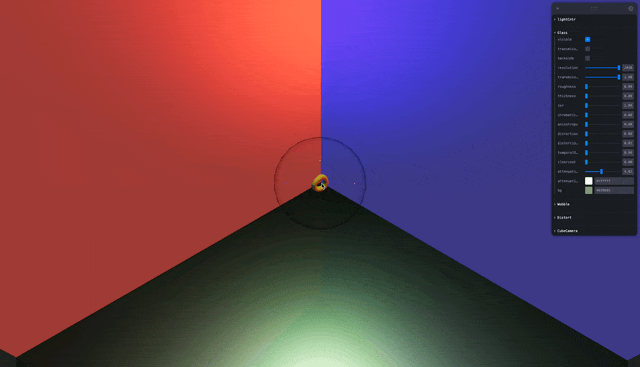
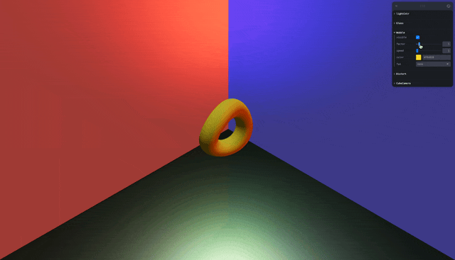
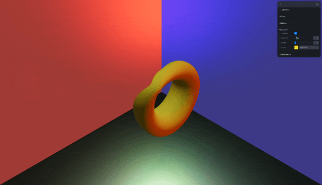

## 🎓 강의를 기반으로 학습하는 과정입니다

> R3F 에대한 강의로 3D 웹 개발에 대하여 입문과정을 알려준다

[](https://www.youtube.com/watch?v=Sg6OcVxe64k&list=PLe6NQuuFBu7HUeJkowKRkLWwkdOlhwrje&index=8)

## 📔 실습 Drei

## 📔 Material 종류

| 명칭 | 모양 | 이미지 |
| :-- | :-- | :-- |
| [MeshReflectorMaterial](#📝-meshreflectormaterial) | 거울 물체(제질) |  |
| [MeshTransmissionMaterial](#📝-meshtransmissionmaterial) | 유리 물체(제질) |  |
| [MeshWobbleMaterial](#📝-meshwobblematerial) | 와블 음직이는 물체(제질) |  |
| [MeshDistortMaterial](#📝-meshdistortmaterial) | 디스톨 움직이는 물체(제질) |  |

### 📝 MeshReflectorMaterial
>
> 거울 물체(제질)

### 👀 Preview(MeshReflectorMaterial)


### 🍝 Code(MeshReflectorMaterial)
>
> `hdr` 파일의 경우 [polyhaven](../README.md#🚀-polyhaven) 사이트를 참조 한다

```jsx
function MyCubeCamera() {
    const texture = useLoader(RGBELoader, './images/hdr/cayley_interior_4k.hdr')
    // const texture = useLoader(RGBELoader, './images/hdr/studio_small_09_4k.hdr')

    const config = useControls({
        CubeCamera: folder({
            visible: false,
            transparent: true,
            roughness: { value: 0.0, min: 0, max: 1, step: 0.01 },
            metalness: { value: 1.0, min: 0, max: 1, step: 0.01 },
            opacity: { value: 0.8, min: 0, max: 1, step: 0.01 },
            toneMapped: true
        })
    })
    return (
        <>
            <directionalLight position={[0, 1, 0]} />
            <CubeCamera resolution={1024} frames={1} envMap={texture}>
                {(texture) => (
                    <mesh>
                        <dodecahedronGeometry />
                        <MeshReflectorMaterial {...config}
                            envMap={texture}
                        />
                    </mesh>
                )}
            </CubeCamera>
        </>
    )
}
```

### 📝 MeshTransmissionMaterial
>
> 유리 물체(제질)

### 👀 Preview(MeshTransmissionMaterial)


### 🍝 Code(MeshTransmissionMaterial)

```jsx
function MyGlass() {
    const config = useControls({
        Glass: folder({
            visible: false,
            transmissionSampler: false,
            backside: false,
            resolution: { value: 2048, min: 256, max: 2048, step: 256 },
            transmission: { value: 1, min: 0, max: 1 },
            roughness: { value: 0.0, min: 0, max: 1, step: 0.01 },
            thickness: { value: 3.5, min: 0, max: 10, step: 0.01 },
            ior: { value: 1.5, min: 1, max: 5, step: 0.01 },
            chromaticAberration: { value: 0.06, min: 0, max: 1 },
            anisotropy: { value: 0.1, min: 0, max: 1, step: 0.01 },
            distortion: { value: 0.0, min: 0, max: 1, step: 0.01 },
            distortionScale: { value: 0.3, min: 0.01, max: 1, step: 0.01 },
            temporalDistortion: { value: 0.5, min: 0, max: 1, step: 0.01 },
            clearcoat: { value: 1, min: 0, max: 1 },
            attenuationDistance: { value: 0.5, min: 0, max: 10, step: 0.01 },
            attenuationcolor: '#ffffff',
            bg: '#839681'
        })
    })
    return (
        <>
            <mesh>
                <sphereGeometry />
                <MeshTransmissionMaterial {...config} background={new THREE.Color(config.bg)} />
            </mesh>

        </>
    )
}
```

### 📝 MeshWobbleMaterial
>
> 와블 음직이는 물체(제질)

### 👀 Preview(MeshWobbleMaterial)


### 🍝 Code(MeshWobbleMaterial)

```jsx

function MyWobble() {
    const config = useControls({
        Wobble: folder({
            visible: true,
            factor: { value: 1, min: 0, max: 10, step: 1 },
            speed: { value: 1, min: 0, max: 100, step: 1 },
            color: "#F8D628",
            foo: { options: { none: '', notting: '', test: '' } }
        })
    })
    return (
        <>
            <mesh scale={0.3}>
                <torusGeometry args={[0.5, 0.2, 32]} />
                <MeshWobbleMaterial
                    {...config}
                />
            </mesh>
        </>
    )
}
```

### 📝 MeshDistortMaterial
>
> 디스톨 움직이는 물체(제질)

### 👀 Preview(MeshDistortMaterial)


### 🍝 Code(MeshDistortMaterial)

```jsx
function MyDistort() {

    const config = useControls({
        Distort: folder({
            visible: true,
            distort: { value: 1, min: 0, max: 10, step: 1 },
            speed: { value: 1, min: 0, max: 100, step: 1 },
            color: "#F8D628"
        })
    })
    return (
        <>
            <mesh scale={0.7}>
                <torusGeometry args={[0.5, 0.2, 32]} />
                <MeshDistortMaterial
                    {...config}
                />
            </mesh>
        </>
    )
}
```
