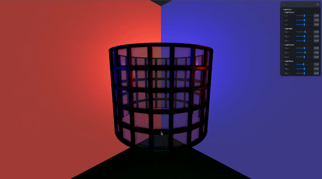

## 🎓 강의를 기반으로 학습하는 과정입니다

> R3F 에대한 강의로 3D 웹 개발에 대하여 입문과정을 알려준다

[](https://www.youtube.com/watch?v=Sg6OcVxe64k&list=PLe6NQuuFBu7HUeJkowKRkLWwkdOlhwrje&index=9)

## 📔 실습 TexterMap

### 🚀 3dtextures-glass-window

[](https://3dtextures.me/2020/07/15/glass-window-002/)

🔗 링크 : [3dtextures](https://3dtextures.me/2020/07/15/glass-window-002/)

### 🗃️ glass_window

```Bash
.
├── ambientOcclusion.jpg
├── basecolor.jpg
├── height.png
├── material.jpg
├── metallic.jpg
├── normal.jpg
├── opacity.jpg
└── roughness.jpg
```

| 파일 | 설명 |
| :-- | :-- |
| basecolor.jpg | 기본 배경 정보 |
| roughness.jpg | 표면제질의 정보 |
| metallic.jpg | 매탈부분 정보 |
| normal.jpg | 표면 외적 방향 백터 정보 |
| height.png | 표면 높이 정보 |
| ambientOcclusion.jpg | 기초 그림자 정보 |
| opacity.jpg | 투명 부분 정보 |

### 📝 TexterMap 란?
>
> 이미지를 활용해서 Material을 표연하는 방식이다.  

### ✏️ 사용법 및 특성

> [!NOTE]  
> 자세한 특성 및 정보는 이전 강의를 참조 하세요

### 👀 Preview(MeshMatcapMaterial)



### 🍝 Code(MeshTransmissionMaterial)

```jsx
function MyObject({ ...props }) {
    const raidus = 3;
    const textures = useTexture({
        basecolor: "./images/glass_window/basecolor.jpg",
        roughness: "./images/glass_window/roughness.jpg",
        metallic: "./images/glass_window/metallic.jpg",
        normal: "./images/glass_window/normal.jpg",
        height: "./images/glass_window/height.png",
        ao: "./images/glass_window/ambientOcclusion.jpg",
        opacity: "./images/glass_window/opacity.jpg",
    });

    const glass_window = useRef()

    useEffect(() => {
        textures.basecolor.repeat.x = textures.height.repeat.x = 
        textures.ao.repeat.x = textures.roughness.repeat.x =
        textures.metallic.repeat.x = textures.normal.repeat.x = 
        textures.opacity.repeat.x = 4

        textures.basecolor.wrapS = textures.height.wrapS = 
        textures.ao.wrapS = textures.roughness.wrapS =
        textures.metallic.wrapS = textures.normal.wrapS = 
        textures.opacity.wrapS = THREE.MirroredRepeatWrapping
        
        textures.basecolor.needsUpdate = textures.height.needsUpdate = 
        textures.ao.needsUpdate = textures.roughness.needsUpdate =
        textures.metallic.needsUpdate = textures.normal.needsUpdate = 
        textures.opacity.needsUpdate = true

        glass_window.current.geometry.setAttribute("uv2", 
            new THREE.BufferAttribute(glass_window.current.geometry.attributes.uv.array, 2)
        )

    }, [])
    return (
        <>
            <mesh ref={glass_window} rotation={[0,DEG2RAD * -90, 0]}>
                <cylinderGeometry args={[2, 2, 3, 256, 256, true]} />
                <meshStandardMaterial
                    side={THREE.DoubleSide}

                    map={textures.basecolor}

                    roughnessMap={textures.roughness}
                    roughnessMap-colorSpace={THREE.NoColorSpace}
                    metalnessMap={textures.metallic}

                    metalness={0.5}
                    metalnessMap-colorSpace={THREE.NoColorSpace}
        
                    normalMap={textures.normal}
                    normalMap-colorSpace={THREE.NoColorSpace}
                    normalScale={5}

                    displacementMap={textures.height}
                    displacementMap-colorSpace={THREE.NoColorSpace}
                    displacementScale={0.2}
                    displacementBias={-0.2}

                    aoMap={textures.ao}

                    alphaMap={textures.opacity}
                    
                    transparent
                />

            </mesh>
        </>
    )
}
```
